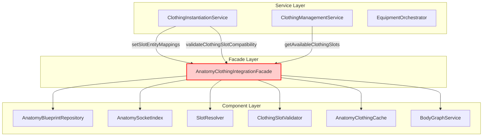
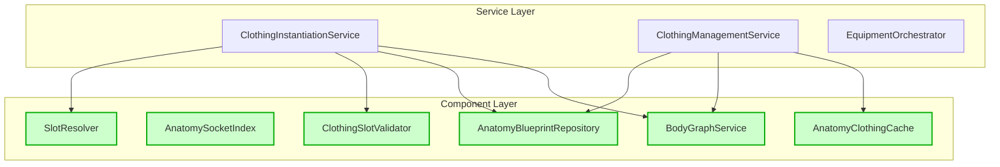
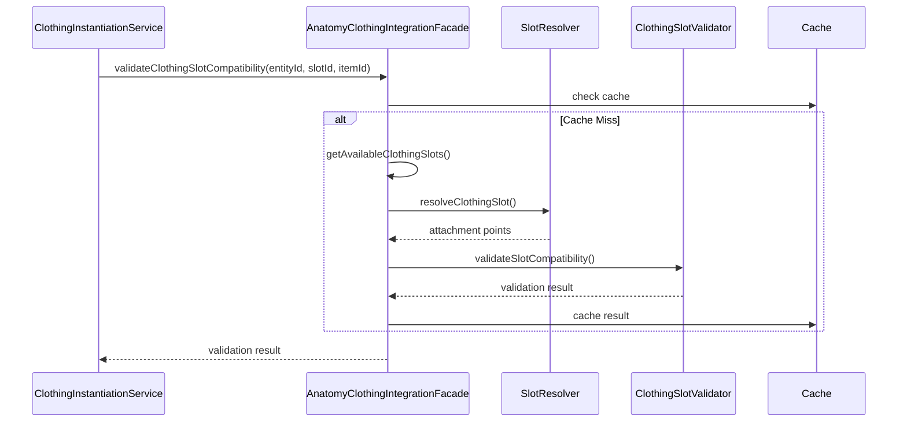
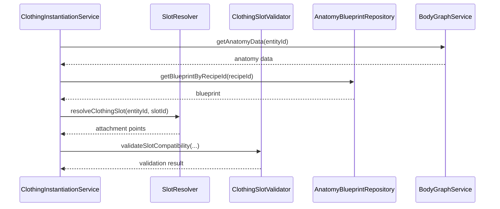
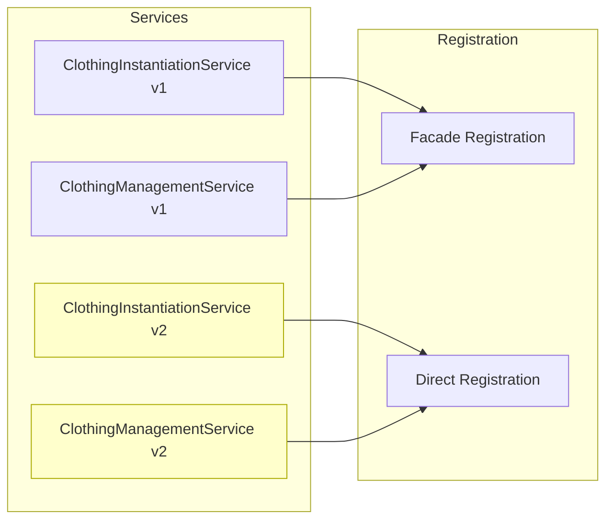
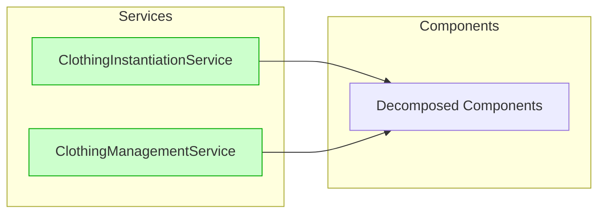
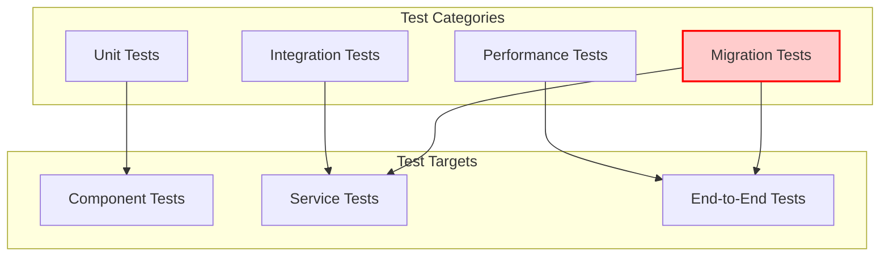

# AnatomyClothingIntegrationService Decomposition - Architecture Diagrams

## Service Interaction Diagrams

### Current Architecture (With Facade)



### Target Architecture (Direct Component Usage)



## Component Responsibility Matrix

| Component | Primary Responsibility | Key Methods | Performance |
|-----------|------------------------|-------------|-------------|
| **AnatomyBlueprintRepository** | Blueprint data access | `getBlueprintByRecipeId()` | O(1) with cache |
| **AnatomySocketIndex** | Socket-to-entity mapping | `findEntityWithSocket()`, `buildIndex()` | O(1) lookups |
| **SlotResolver** | Slot resolution orchestration | `resolveClothingSlot()`, `setSlotEntityMappings()` | O(log n) |
| **ClothingSlotValidator** | Slot compatibility validation | `validateSlotCompatibility()` | O(1) |
| **AnatomyClothingCache** | Performance optimization | `get()`, `set()`, `invalidate()` | O(1) |
| **BodyGraphService** | Anatomy structure queries | `getAnatomyData()`, `getBodyRoot()` | O(n) |

## Data Flow Diagrams

### Slot Validation Flow (Current)



### Slot Validation Flow (Target)



## Migration Phases

### Phase 1: Dual Support


### Phase 2: Migration Complete


## Performance Impact

### Current Performance Profile
```
Operation: validateClothingSlotCompatibility
├── Facade Overhead: ~2ms
├── Cache Lookup: ~1ms
├── Slot Resolution: ~5ms
├── Validation: ~3ms
└── Total: ~11ms
```

### Target Performance Profile
```
Operation: validateClothingSlotCompatibility
├── Direct Access: 0ms
├── Cache Lookup: ~1ms
├── Slot Resolution: ~5ms
├── Validation: ~3ms
└── Total: ~9ms (18% improvement)
```

### Memory Usage Comparison

| Architecture | Base Memory | Per Entity | 1000 Entities |
|-------------|------------|------------|---------------|
| Current (Facade) | 15MB | 50KB | 65MB |
| Target (Direct) | 12MB | 45KB | 57MB |
| **Savings** | **3MB** | **5KB** | **8MB (12%)** |

## Component Interface Specifications

### SlotResolver Interface
```javascript
interface ISlotResolver {
  // Set slot-to-entity mappings for resolution
  setSlotEntityMappings(mappings: Map<string, string>): void;
  
  // Resolve clothing slot to attachment points
  resolveClothingSlot(
    entityId: string, 
    slotId: string
  ): Promise<ResolvedAttachmentPoint[]>;
  
  // Clear resolution cache
  clearCache(): void;
}
```

### ClothingSlotValidator Interface
```javascript
interface IClothingSlotValidator {
  // Validate slot compatibility
  validateSlotCompatibility(
    entityId: string,
    slotId: string,
    itemId: string,
    availableSlots: Map<string, ClothingSlotMapping>,
    resolveAttachmentPoints: Function
  ): Promise<ValidationResult>;
  
  // Check layer compatibility
  checkLayerCompatibility(
    currentLayers: Map<string, string>,
    newLayer: string,
    slotId: string
  ): boolean;
}
```

### AnatomyClothingCache Interface
```javascript
interface IAnatomyClothingCache {
  // Get cached value
  get(type: CacheKeyType, key: string): any | undefined;
  
  // Set cached value
  set(type: CacheKeyType, key: string, value: any): void;
  
  // Invalidate entity cache
  invalidateCacheForEntity(entityId: string): void;
  
  // Clear all caches
  clearCache(): void;
  
  // Get cache statistics
  getStats(): CacheStats;
}
```

## Error Handling Strategy

### Current Error Flow
```
Service → Facade → Component → Error
         ↓
      Generic Error Wrapping
         ↓
      Service receives wrapped error
```

### Target Error Flow
```
Service → Component → Specific Error
         ↓
      Service handles specific error
         ↓
      Better error context and recovery
```

### Error Types
- `BlueprintNotFoundError` - From AnatomyBlueprintRepository
- `InvalidSlotError` - From SlotResolver
- `SlotCompatibilityError` - From ClothingSlotValidator
- `CacheError` - From AnatomyClothingCache

## Testing Strategy Visualization



## Monitoring and Metrics

### Key Performance Indicators
1. **Resolution Time**: Average time for slot resolution
2. **Cache Hit Rate**: Percentage of cache hits vs misses
3. **Validation Success Rate**: Percentage of successful validations
4. **Memory Usage**: Total memory used by components

### Monitoring Dashboard
```
┌─────────────────────────────────────────┐
│        Component Performance            │
├─────────────────────────────────────────┤
│ SlotResolver:         5ms avg          │
│ Cache Hit Rate:       85%              │
│ Validation Rate:      92% success      │
│ Memory Usage:         45MB / 100MB     │
└─────────────────────────────────────────┘
```

## Rollback Plan

### Quick Rollback (Phase 1-2)
1. Switch service registrations back to facade
2. No code changes required
3. Immediate restoration

### Full Rollback (Phase 3+)
1. Restore facade registration
2. Update service constructors
3. Revert dependency injection
4. Run compatibility tests

## Success Criteria

- ✅ All services migrated to direct component usage
- ✅ Performance improvements validated (>15% faster)
- ✅ Memory usage reduced (>10% less)
- ✅ Zero regression in functionality
- ✅ 100% test coverage maintained
- ✅ Documentation updated
- ✅ Team trained on new architecture