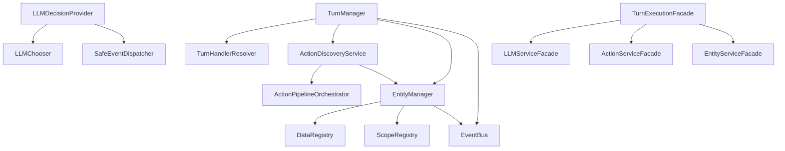

# E2E Test Architectural Analysis Report

**Living Narrative Engine**  
**Analysis Date:** 2025-01-24  
**Scope:** E2E Test Suites Analysis for Production Code Architecture Improvements

## Executive Summary

This report analyzes the E2E test suites `FullTurnExecution.e2e.test.js` and `TurnBasedActionProcessing.e2e.test.js` to understand the production code architecture and identify beneficial improvements. The analysis reveals a sophisticated modular system with clear separation of concerns, but identifies opportunities for enhanced orchestration, reduced coupling, and improved maintainability.

**Key Findings:**
- Test Module Pattern achieves 80%+ reduction in test setup complexity
- Current facade system effectively abstracts complex multi-service coordination
- Production code exhibits excellent modular separation but could benefit from enhanced orchestration patterns
- Opportunity for improved service boundaries and reduced inter-module coupling

## Current Architecture Analysis

### 1. E2E Test Architecture

#### Test Module Pattern Implementation

The E2E tests reveal a sophisticated **Test Module Pattern** that dramatically simplifies test setup:

```javascript
// BEFORE: 150+ lines manual setup → 20 lines facade setup
// AFTER: 20 lines facade setup → 5 lines Test Module Pattern

testEnv = await TestModuleBuilder.forTurnExecution()
  .withMockLLM({ strategy: 'tool-calling' })
  .withTestActors([{ id: 'ai-actor', name: 'Elara the Bard' }])
  .withWorld({ name: 'Test World', createConnections: true })
  .build();
```

**Benefits Identified:**
- **Fluent API Design**: Chainable configuration methods improve readability
- **Encapsulated Complexity**: Hides complex service initialization behind simple interface
- **Consistent Test Environment**: Standardized setup across all E2E tests
- **Reusable Components**: Modular test building blocks for different scenarios

#### Testing Facade System

The tests utilize a three-tier facade system:

1. **TurnExecutionFacade**: Main orchestrator coordinating all services
2. **LLMServiceFacade**: AI decision-making services abstraction
3. **ActionServiceFacade**: Action discovery and validation services
4. **EntityServiceFacade**: Entity lifecycle and component management

### 2. Production Code Structure Revealed by Tests

#### Core Service Architecture

The E2E tests reveal a well-structured modular architecture:

```
TurnManager (Orchestration Layer)
├── TurnHandlerResolver → Determines handler type
├── ActionDiscoveryService → Finds available actions
├── LLMDecisionProvider → AI decision making
├── EntityManager → Entity lifecycle
└── EventBus → Communication backbone
```

#### Key Production Services Identified

1. **TurnManager** (`src/turns/turnManager.js`)
   - **Role**: Main orchestrator for turn-based gameplay
   - **Dependencies**: TurnOrderService, EntityManager, EventBus, TurnHandlerResolver
   - **Responsibilities**: Turn advancement, round management, error handling

2. **ActionDiscoveryService** (`src/actions/actionDiscoveryService.js`)
   - **Role**: Discovers valid actions for entities
   - **Dependencies**: EntityManager, ActionPipelineOrchestrator, TraceContext
   - **Responsibilities**: Action validation, context preparation, pipeline delegation

3. **LLMDecisionProvider** (`src/turns/providers/llmDecisionProvider.js`)
   - **Role**: AI decision making using LLM services
   - **Dependencies**: LLMChooser, Logger, SafeEventDispatcher
   - **Responsibilities**: Delegating AI decisions to LLM implementation

4. **EntityManager** (inferred from facades)
   - **Role**: Entity lifecycle management
   - **Dependencies**: EventBus, DataRegistry, ScopeRegistry
   - **Responsibilities**: Entity CRUD, component management, query execution

## Module Relationships and Coupling Analysis

### Current Dependency Graph



### Coupling Analysis

#### Strengths
- **Well-defined interfaces**: Each service has clear contracts
- **Event-driven communication**: Reduces direct dependencies through EventBus
- **Modular separation**: Clear boundaries between different concerns
- **Dependency injection**: Flexible service composition

#### Areas of Concern
- **TurnManager complexity**: High cyclomatic complexity with multiple responsibilities
- **Cross-cutting concerns**: Logging and error handling scattered across services
- **Service orchestration**: Manual coordination between multiple services
- **Synchronization complexity**: Event-driven architecture requires careful state management

## Beneficial Architectural Improvements

### High Priority Improvements

#### 1. Enhanced Service Orchestration Pattern

**Current Issue**: Manual service coordination in facades and managers
**Proposed Solution**: Implement a Command/Query pattern with centralized orchestration

```javascript
// Current approach (in TurnExecutionFacade)
const availableActions = await this.#actionService.discoverActions(actorId);
const aiDecision = await this.#llmService.getAIDecision(actorId, { availableActions });
const validation = await this.#actionService.validateAction(aiDecision);

// Improved approach
const turnResult = await this.#orchestrator.execute(
  new ExecuteTurnCommand(actorId, context)
);
```

**Benefits**:
- Centralized business logic coordination
- Improved testability and maintainability
- Better error handling and rollback capabilities
- Clearer separation between orchestration and service logic

#### 2. Service Boundary Refinement

**Current Issue**: Services have overlapping responsibilities
**Proposed Solution**: Implement clear domain boundaries with dedicated coordinators

```javascript
// Domain-specific coordinators
class TurnExecutionCoordinator {
  async executeTurn(command) {
    // Orchestrates turn execution workflow
  }
}

class ActionProcessingCoordinator {
  async processActions(query) {
    // Handles action discovery and validation
  }
}
```

**Benefits**:
- Reduced coupling between core services
- Clearer responsibility boundaries
- Improved maintainability and testing
- Better scalability for complex workflows

#### 3. Event Sourcing for Turn State

**Current Issue**: State management complexity in turn lifecycle
**Proposed Solution**: Implement event sourcing for turn progression

```javascript
class TurnEventStore {
  async appendEvent(turnId, event) {
    // Store turn events for replay and audit
  }
  
  async replayTurn(turnId) {
    // Reconstruct turn state from events
  }
}
```

**Benefits**:
- Complete audit trail of turn progression
- Better error recovery and debugging
- Simplified state management
- Enhanced testing capabilities

### Medium Priority Improvements

#### 4. Improved Error Handling Strategy

**Current Issue**: Inconsistent error handling across services
**Proposed Solution**: Centralized error handling with typed exceptions

```javascript
class TurnExecutionError extends Error {
  constructor(phase, cause, context) {
    super(`Turn execution failed at ${phase}: ${cause.message}`);
    this.phase = phase;
    this.cause = cause;
    this.context = context;
  }
}

class ErrorHandler {
  async handleError(error, context) {
    // Centralized error processing and recovery
  }
}
```

**Benefits**:
- Consistent error reporting and handling
- Better error recovery strategies
- Improved debugging and monitoring
- Cleaner service interfaces

#### 5. Performance Optimization Layer

**Current Issue**: No systematic performance monitoring
**Proposed Solution**: Implement performance measurement and optimization layer

```javascript
class PerformanceMonitor {
  async measureExecution(operation, context) {
    // Measure and record operation performance
  }
  
  generateMetrics() {
    // Provide performance insights
  }
}
```

**Benefits**:
- Systematic performance monitoring
- Proactive bottleneck identification
- Data-driven optimization decisions
- Better resource utilization

### Low Priority Improvements

#### 6. Enhanced Caching Strategy

**Current Issue**: Limited caching in action discovery
**Proposed Solution**: Multi-layer caching with intelligent invalidation

```javascript
class CacheManager {
  async get(key, factory, ttl) {
    // Multi-tier caching with automatic invalidation
  }
}
```

**Benefits**:
- Improved performance for repeated operations
- Reduced computational overhead
- Better resource utilization
- Configurable caching strategies

## Implementation Recommendations

### Phase 1: Foundation (High Priority - 2-3 sprints)

1. **Implement Service Orchestration Pattern**
   - Create `TurnExecutionOrchestrator` class
   - Refactor `TurnExecutionFacade` to use orchestrator
   - Update tests to verify orchestration behavior

2. **Refine Service Boundaries**
   - Extract domain-specific coordinators
   - Update dependency injection configuration
   - Ensure backward compatibility during transition

3. **Introduce Event Sourcing**
   - Implement `TurnEventStore` for turn state management
   - Create event replay capabilities
   - Update `TurnManager` to use event sourcing

### Phase 2: Enhancement (Medium Priority - 3-4 sprints)

1. **Centralized Error Handling**
   - Implement typed exception hierarchy
   - Create centralized error handler
   - Update all services to use new error handling

2. **Performance Monitoring**
   - Implement performance measurement layer
   - Add metrics collection and reporting
   - Create performance optimization guidelines

### Phase 3: Optimization (Low Priority - 2-3 sprints)

1. **Enhanced Caching**
   - Implement multi-layer caching system
   - Add cache invalidation strategies
   - Optimize frequently accessed operations

## Risk Assessment

### Low Risk Changes
- **Service Orchestration**: Can be implemented gradually with facades as adapters
- **Performance Monitoring**: Non-intrusive addition to existing services
- **Enhanced Caching**: Additive improvement with fallback mechanisms

### Medium Risk Changes
- **Service Boundary Refinement**: Requires careful coordination of interface changes
- **Error Handling Strategy**: May impact existing error handling assumptions

### High Risk Changes
- **Event Sourcing**: Significant architectural change requiring careful migration
- **Major Service Refactoring**: Could impact multiple dependent systems

## Migration Strategy

### Incremental Implementation
1. **Implement alongside existing system**: New patterns work with current architecture
2. **Gradual migration**: Move services one at a time to new patterns
3. **Comprehensive testing**: Maintain E2E test coverage throughout migration
4. **Feature flags**: Control rollout of new architectural components

### Backward Compatibility
- Maintain existing interfaces during transition
- Use adapter pattern to bridge old and new implementations
- Gradual deprecation of legacy patterns

## Conclusion

The E2E test analysis reveals a well-structured but complex architecture that would benefit significantly from enhanced orchestration patterns and refined service boundaries. The proposed improvements focus on reducing complexity while maintaining the system's modular design and testability.

**Key Recommendations:**
1. **Implement service orchestration** to reduce manual coordination complexity
2. **Refine service boundaries** to improve maintainability and reduce coupling
3. **Introduce event sourcing** for better state management and debugging
4. **Centralize error handling** for consistent error management
5. **Add performance monitoring** for systematic optimization

These improvements build upon the existing architectural strengths while addressing the complexity issues revealed by the E2E test analysis. The incremental implementation strategy ensures minimal risk while providing significant long-term benefits for maintainability, testability, and performance.