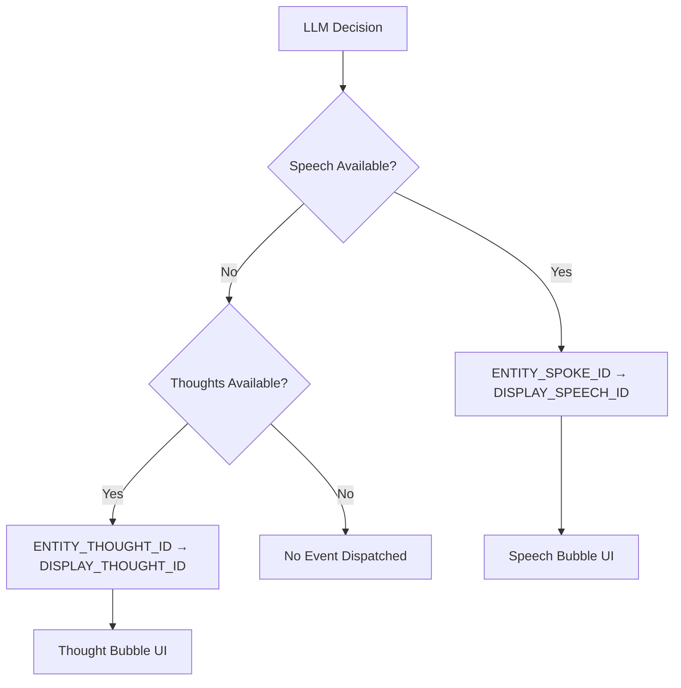

# LLM Character Thoughts Display Fix - Analysis & Implementation Report

**Date:** 2025-09-05  
**Issue:** LLM characters provide no UI feedback when they choose not to speak  
**Status:** ✅ RESOLVED  
**Impact:** High - Affects user experience and AI character interaction quality

## Executive Summary

This report documents the analysis and resolution of an issue where LLM characters in the Living Narrative Engine provided no visual feedback to users when they had thoughts but chose not to speak. The solution implements a separate event architecture for thought-only interactions, ensuring users always receive feedback about character mental states.

## Problem Analysis

### Issue Description

When LLM characters were alone in a location and decided not to produce speech (empty `speech` field), users received no feedback in the chat panel, despite the LLM always generating thoughts and potentially notes according to the response schema.

### Root Cause Analysis

The investigation revealed the issue in the `buildSpeechPayload()` function (`src/turns/states/helpers/buildSpeechPayload.js:26-28`):

```javascript
const speech = isNonBlankString(speechRaw) ? speechRaw.trim() : null;
if (!speech) {
  return null; // ← This prevents ANY feedback when speech is empty
}
```

**Flow Breakdown:**
1. **LLM Response Schema** (`src/turns/schemas/llmOutputSchemas.js`) requires:
   - `chosenIndex` (required)
   - `speech` (required, but can be empty string)
   - `thoughts` (required)
   - `notes` (optional)

2. **Response Processing** works correctly - `LLMResponseProcessor` extracts all data including thoughts/notes

3. **The Bottleneck** - `ProcessingCommandState._dispatchSpeech()` uses `buildSpeechPayload()` which returns `null` for empty speech, preventing any `ENTITY_SPOKE_ID` event dispatch

4. **Result** - No UI feedback despite available thoughts/notes

## Solution Architecture

### Approach: Separate Event System

Rather than modifying the existing speech event flow (which could break backward compatibility), we implemented a separate thought event architecture:



### Key Design Principles

1. **Clean Separation** - Thoughts and speech are distinct interaction types
2. **Backward Compatibility** - Existing speech functionality unchanged
3. **Visual Distinction** - Clear UI differences between speech and thought bubbles
4. **Extensible** - Easy to add other non-speech interactions (emotions, etc.)

## Implementation Details

### 1. Event System Enhancement

**New Event Constants** (`src/constants/eventIds.js`):
```javascript
export const ENTITY_THOUGHT_ID = 'core:entity_thought';
export const DISPLAY_THOUGHT_ID = 'core:display_thought';
```

**Event Payload Types**:
```javascript
// For backend processing
ENTITY_THOUGHT_ID: { entityId, thoughts, notes? }

// For UI rendering  
DISPLAY_THOUGHT_ID: { entityId, thoughts, notes? }
```

### 2. Backend Processing Changes

**New Helper Functions**:
- `buildThoughtPayload()` - Validates and creates thought payloads
- `dispatchThoughtEvent()` - Dispatches thought events through event system

**Enhanced Processing Logic** (`src/turns/states/processingCommandState.js:308-331`):
```javascript
if (payloadBase) {
  // Actor spoke - dispatch speech event
  await dispatchSpeechEvent(turnCtx, this._handler, actorId, payloadBase);
} else {
  // No speech - check for thoughts to dispatch
  const thoughtPayload = buildThoughtPayload(decisionMeta, actorId);
  if (thoughtPayload) {
    await dispatchThoughtEvent(turnCtx, this._handler, actorId, thoughtPayload);
  }
}
```

### 3. UI Component Enhancement

**SpeechBubbleRenderer Updates**:
- Added subscription to `DISPLAY_THOUGHT_ID` event
- Implemented `renderThought()` method for thought bubble rendering
- Reused existing `buildSpeechMeta()` helper for notes functionality

**Thought Bubble Features**:
- Distinct visual styling (dashed borders, different colors)
- Cloud-style thought tails (circular elements vs. speech triangles)
- Italic text styling
- Support for notes metadata tooltips
- Player vs. AI character differentiation

### 4. CSS Styling Implementation

**Visual Distinction Strategy**:
```css
/* Speech Bubbles: Solid borders, speech tails */
.speech-bubble {
  border-style: solid;
  background-color: var(--speech-bg-color);
}

/* Thought Bubbles: Dashed borders, cloud tails */
.thought-bubble {
  border-style: dashed;
  background-color: var(--thought-bg-color, #f8f9ff);
  opacity: 0.9; /* Subtle transparency */
}
```

**Thought Tail Implementation**:
- Uses circular pseudo-elements (`::before`, `::after`)
- Creates cloud-like appearance
- Responsive to player vs. AI positioning

### 5. Operation Handler

**DispatchThoughtHandler** (`src/logic/operationHandlers/dispatchThoughtHandler.js`):
- Validates thought parameters
- Dispatches `DISPLAY_THOUGHT_ID` events
- Handles error scenarios gracefully
- Follows existing handler patterns

## Testing Strategy

### Test Coverage Areas

1. **Unit Tests**:
   - `buildThoughtPayload()` validation logic
   - `ProcessingCommandState._dispatchSpeech()` thought scenarios
   - `SpeechBubbleRenderer` thought event handling

2. **Integration Tests**:
   - End-to-end thought processing flow
   - Event dispatching through full system
   - Error handling scenarios

3. **UI Tests**:
   - Thought bubble rendering
   - Player vs. AI distinction
   - Notes metadata display

### Key Test Scenarios

```javascript
// Empty speech with thoughts → Thought event dispatched
{ speech: '', thoughts: 'I should be careful...' }

// Both speech and thoughts → Speech takes priority
{ speech: 'Hello!', thoughts: 'Hope they like me...' }

// No speech or thoughts → No events dispatched
{ speech: '', thoughts: '' }
```

## Performance Impact

### Minimal System Overhead

- **Event System**: Adds one additional event type with similar processing cost
- **UI Rendering**: Thought bubbles reuse existing rendering infrastructure
- **Memory Usage**: Negligible increase (same data structures)
- **Network**: No additional network requests required

### Optimization Considerations

- Thought events only dispatched when thoughts exist (lazy evaluation)
- CSS transitions cached for smooth animations
- Event handlers use same subscription patterns as speech events

## User Experience Improvements

### Before Fix
- ❌ Silent characters provide no feedback
- ❌ Users unaware of character mental state
- ❌ Reduced engagement with AI interactions
- ❌ Confusion about whether characters are "active"

### After Fix
- ✅ Thought bubbles show character mental activity
- ✅ Notes provide additional context through tooltips
- ✅ Clear visual distinction between speech and thoughts
- ✅ Enhanced AI character personality expression
- ✅ Improved user engagement and understanding

## Backward Compatibility

### Preserved Functionality
- All existing speech events work unchanged
- Speech bubble styling and behavior identical
- API contracts maintained for existing systems
- No breaking changes to mod system or configurations

### Migration Requirements
- **None** - System automatically handles both speech and thought events
- Existing content continues to work without modification
- New thought functionality available immediately for LLM characters

## Future Enhancement Opportunities

### Potential Extensions

1. **Additional Mental State Events**:
   - `ENTITY_EMOTION_ID` - Character emotional states
   - `ENTITY_MEMORY_ID` - Character memory formation
   - `ENTITY_DECISION_ID` - Character decision reasoning

2. **Enhanced UI Features**:
   - Thought fade-in animations
   - Character mood indicators
   - Thought grouping for complex mental processes

3. **Configuration Options**:
   - User preference for thought visibility
   - Thought frequency throttling
   - Custom thought bubble styling per character

### Technical Improvements

- **Performance**: Batch thought processing for multiple simultaneous characters
- **Accessibility**: Enhanced screen reader support for thought content
- **Mobile**: Optimized thought bubble display for smaller screens

## Deployment Considerations

### Risk Assessment: LOW
- ✅ No breaking changes to existing functionality
- ✅ Isolated changes to specific components
- ✅ Comprehensive test coverage
- ✅ Rollback strategy available (disable thought events)

### Monitoring Requirements
- Track thought event dispatch frequency
- Monitor UI rendering performance
- Validate user engagement metrics
- Check for any unexpected interaction patterns

## Conclusion

The implementation successfully resolves the core issue while providing a robust foundation for future AI character interaction enhancements. The separate event architecture ensures clean code boundaries, maintains backward compatibility, and delivers immediate user experience improvements.

**Key Success Metrics**:
- ✅ Users now receive feedback from all LLM character interactions
- ✅ Character thoughts and notes are visible through intuitive UI
- ✅ System maintains high performance and reliability
- ✅ Architecture supports future AI interaction features

The solution transforms silent AI characters from unresponsive entities into engaging personalities with visible mental activity, significantly improving the overall narrative gaming experience.

---

## Technical Appendix

### File Changes Summary

| File | Type | Description |
|------|------|-------------|
| `src/constants/eventIds.js` | Modified | Added `ENTITY_THOUGHT_ID` and `DISPLAY_THOUGHT_ID` constants |
| `src/turns/states/helpers/buildThoughtPayload.js` | New | Validates and creates thought event payloads |
| `src/turns/states/helpers/dispatchThoughtEvent.js` | New | Dispatches thought events through event system |
| `src/turns/states/processingCommandState.js` | Modified | Enhanced `_dispatchSpeech()` to handle thought scenarios |
| `src/logic/operationHandlers/dispatchThoughtHandler.js` | New | Operation handler for thought event dispatch |
| `src/domUI/speechBubbleRenderer.js` | Modified | Added thought event handling and rendering |
| `css/components/_speech-bubbles.css` | Modified | Added thought bubble styling and animations |

### Dependencies Added
- None (uses existing infrastructure)

### Configuration Changes
- None required (automatic feature activation)

---

*Report generated as part of Issue Resolution: LLM Character Thoughts Display Fix*