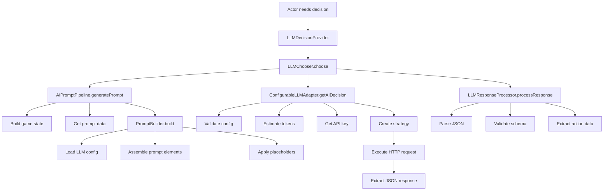
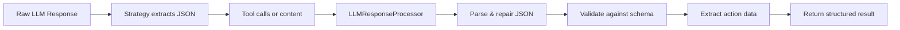

# LLM Prompt Workflow Analysis Report

## Executive Summary

This report provides a comprehensive analysis of the LLM (Large Language Model) prompting workflows in the Living Narrative Engine. It covers configuration usage, the complete workflow for sending prompts to LLMs, response processing, and recommendations for end-to-end testing.

## Table of Contents

1. [Configuration Usage](#configuration-usage)
2. [Prompt Generation Workflow](#prompt-generation-workflow)
3. [Response Processing Workflow](#response-processing-workflow)
4. [Architecture Overview](#architecture-overview)
5. [E2E Test Recommendations](#e2e-test-recommendations)

## Configuration Usage

### Where `config/llm-configs.json` is Used

The `llm-configs.json` file is the central configuration for all LLM interactions in the system. Here's where it's loaded and used:

1. **Primary Loader**: `src/llms/services/llmConfigLoader.js`
   - Loads and validates the configuration file
   - Performs both schema and semantic validation
   - Returns a structured `LLMRootConfiguration` object

2. **Main Consumer**: `src/turns/adapters/configurableLLMAdapter.js`
   - Uses the loaded configuration to determine active LLM settings
   - Manages LLM selection and switching
   - Applies configuration for prompt assembly and API calls

3. **Configuration Manager**: `src/llms/llmConfigManager.js`
   - Provides centralized access to LLM configurations
   - Manages configuration caching and retrieval

### Configuration Structure

The configuration defines:
- **Multiple LLM profiles** with unique `configId`s
- **API settings**: endpoint URLs, API types, authentication
- **JSON output strategies**: tool calling or JSON schema methods
- **Prompt elements**: Structured components with prefixes/suffixes
- **Assembly order**: Sequence for building prompts
- **Token limits**: Context window constraints

## Prompt Generation Workflow

### Complete Flow: Actor Decision to LLM Response



### Detailed Workflow Steps

#### 1. Entry Point: Decision Request
- **Component**: `LLMDecisionProvider` (src/turns/providers/llmDecisionProvider.js)
- **Method**: Delegates to `LLMChooser.choose()`
- **Input**: Actor entity, turn context, available actions, abort signal

#### 2. Prompt Generation Pipeline
- **Component**: `AIPromptPipeline` (src/prompting/AIPromptPipeline.js)
- **Process**:
  1. Determines active LLM ID
  2. Builds game state DTO
  3. Enriches with available actions
  4. Gets prompt content data
  5. Delegates to PromptBuilder

#### 3. Prompt Assembly
- **Component**: `PromptBuilder` (src/prompting/promptBuilder.js)
- **Process**:
  1. Loads LLM configuration for active LLM
  2. Iterates through `promptAssemblyOrder`
  3. Applies conditional logic for elements
  4. Resolves element assemblers
  5. Concatenates with prefixes/suffixes
  6. Resolves placeholders

#### 4. LLM Adapter Execution
- **Component**: `ConfigurableLLMAdapter` (src/turns/adapters/configurableLLMAdapter.js)
- **Process**:
  1. Validates configuration completeness
  2. Estimates token count using gpt-tokenizer
  3. Checks against context limits
  4. Retrieves API key (server-side)
  5. Creates appropriate strategy instance

#### 5. Strategy Pattern Implementation
- **Strategies**:
  - `OpenRouterToolCallingStrategy`: Uses OpenAI-style tool calling
  - `OpenRouterJsonSchemaStrategy`: Uses JSON schema validation
- **HTTP Communication**:
  - Direct calls from server
  - Proxy through llm-proxy-server from browser

## Response Processing Workflow

### Response Flow



### Processing Steps

1. **JSON Extraction** (Strategy-specific)
   - Tool calling: Extract from `tool_calls[0].function.arguments`
   - JSON schema: Extract from message content

2. **JSON Processing** (`LLMResponseProcessor`)
   - Uses `LlmJsonService` for parsing and repair
   - Handles malformed JSON gracefully

3. **Schema Validation**
   - Validates against `LLM_TURN_ACTION_RESPONSE_SCHEMA`
   - Required fields: `chosenIndex`, `speech`, `thoughts`
   - Optional: `notes` (array of strings or structured objects)

4. **Data Extraction**
   - Returns structured object with:
     - `action`: { chosenIndex, speech }
     - `extractedData`: { thoughts, notes }

## Architecture Overview

### Key Components

1. **Configuration Layer**
   - `LlmConfigLoader`: Loads and validates configurations
   - `LlmConfigManager`: Provides configuration access

2. **Adapter Layer**
   - `ConfigurableLLMAdapter`: Main LLM interface
   - `ILLMAdapter`: Abstract interface for different LLM providers

3. **Strategy Layer**
   - `LLMStrategyFactory`: Creates appropriate strategies
   - `BaseOpenRouterStrategy`: Common OpenRouter logic
   - Concrete strategies for different JSON output methods

4. **Prompt Building**
   - `PromptBuilder`: Orchestrates prompt assembly
   - `AssemblerRegistry`: Maps keys to element assemblers
   - Element-specific assemblers for each prompt component

5. **Response Processing**
   - `LLMResponseProcessor`: Validates and extracts data
   - `LlmJsonService`: JSON parsing and repair

### Error Handling

The system implements comprehensive error handling:
- Configuration errors: Missing fields, invalid values
- Token limit errors: Prompt too long
- API errors: Authentication, rate limits, network issues
- Response errors: Invalid JSON, schema violations

## E2E Test Recommendations

### 1. Complete Prompt Generation Pipeline Test

```javascript
describe('E2E: LLM Prompt Generation Pipeline', () => {
  test('should generate complete prompt for AI actor decision', async () => {
    // Setup: Create test actor, context, and actions
    const testActor = createTestActor({ isAI: true });
    const context = createTestContext();
    const actions = createTestActions();
    
    // Execute: Generate prompt
    const promptPipeline = container.get(IAIPromptPipeline);
    const prompt = await promptPipeline.generatePrompt(
      testActor, 
      context, 
      actions
    );
    
    // Assert: Verify prompt structure
    expect(prompt).toContain('<task_definition>');
    expect(prompt).toContain('<character_persona>');
    expect(prompt).toContain('<indexed_choices>');
    expect(prompt).toMatch(/\[1\]/); // Indexed action
  });
});
```

### 2. LLM Adapter Integration Test

```javascript
describe('E2E: LLM Adapter with Mock Responses', () => {
  test('should process complete decision flow with mock LLM', async () => {
    // Setup: Mock HTTP client
    const mockHttpClient = {
      request: jest.fn().mockResolvedValue({
        choices: [{
          message: {
            tool_calls: [{
              type: 'function',
              function: {
                name: 'function_call',
                arguments: JSON.stringify({
                  chosenIndex: 1,
                  speech: "Hello there!",
                  thoughts: "I should greet them."
                })
              }
            }]
          }
        }]
      })
    };
    
    // Execute: Full decision flow
    const adapter = new ConfigurableLLMAdapter({ /* deps */ });
    await adapter.init({ llmConfigLoader });
    const response = await adapter.getAIDecision(testPrompt);
    
    // Assert: Verify response
    const parsed = JSON.parse(response);
    expect(parsed.chosenIndex).toBe(1);
    expect(parsed.speech).toBe("Hello there!");
  });
});
```

### 3. Configuration Loading and Switching Test

```javascript
describe('E2E: LLM Configuration Management', () => {
  test('should load configs and switch between LLMs', async () => {
    // Setup: Multiple LLM configs
    const configLoader = new LlmConfigLoader({ /* deps */ });
    const adapter = new ConfigurableLLMAdapter({ /* deps */ });
    
    // Execute: Initialize and switch
    await adapter.init({ llmConfigLoader: configLoader });
    const initialLlm = await adapter.getCurrentActiveLlmId();
    
    await adapter.setActiveLlm('openrouter-qwen3-235b-a22b');
    const newLlm = await adapter.getCurrentActiveLlmId();
    
    // Assert: Verify switching
    expect(initialLlm).toBe('openrouter-claude-sonnet-4-toolcalling');
    expect(newLlm).toBe('openrouter-qwen3-235b-a22b');
  });
});
```

### 4. Error Handling Scenarios Test

```javascript
describe('E2E: LLM Error Handling', () => {
  test('should handle token limit errors gracefully', async () => {
    // Setup: Create oversized prompt
    const hugePrompt = 'x'.repeat(300000); // Exceeds token limit
    
    // Execute & Assert
    await expect(
      adapter.getAIDecision(hugePrompt)
    ).rejects.toThrow(PromptTooLongError);
  });
  
  test('should handle malformed LLM responses', async () => {
    // Setup: Mock invalid response
    mockHttpClient.request.mockResolvedValue({
      choices: [{ message: { content: 'not json' } }]
    });
    
    // Execute & Assert
    await expect(
      llmChooser.choose({ actor, context, actions })
    ).rejects.toThrow(LLMProcessingError);
  });
});
```

### 5. Token Estimation Validation Test

```javascript
describe('E2E: Token Estimation and Limits', () => {
  test('should accurately estimate tokens and warn near limits', async () => {
    // Setup: Prompt near token limit
    const config = await adapter.getCurrentActiveLlmConfig();
    const nearLimitPrompt = generatePromptNearLimit(config.contextTokenLimit);
    
    // Spy on logger
    const loggerSpy = jest.spyOn(logger, 'warn');
    
    // Execute
    await adapter.getAIDecision(nearLimitPrompt);
    
    // Assert: Warning logged
    expect(loggerSpy).toHaveBeenCalledWith(
      expect.stringContaining('nearing the limit')
    );
  });
});
```

### 6. Full Turn Execution Test

```javascript
describe('E2E: Complete AI Turn Execution', () => {
  test('should execute full AI turn from decision to action', async () => {
    // Setup: Complete game environment
    const gameEngine = await setupTestGameEngine();
    const aiActor = createAIActor();
    
    // Execute: Run AI turn
    const turnResult = await gameEngine.executeAiTurn(aiActor);
    
    // Assert: Verify complete flow
    expect(turnResult).toMatchObject({
      actorId: aiActor.id,
      action: expect.objectContaining({
        chosenIndex: expect.any(Number),
        speech: expect.any(String)
      }),
      thoughts: expect.any(String),
      success: true
    });
  });
});
```

### 7. Prompt Element Assembly Test

```javascript
describe('E2E: Prompt Element Assembly', () => {
  test('should correctly assemble all prompt elements', async () => {
    // Setup: Custom prompt data
    const promptData = {
      taskDefinition: 'Test task',
      characterPersona: 'Test character',
      perceptionLog: [{ type: 'observation', content: 'Test' }],
      availableActions: [{ index: 1, description: 'Test action' }]
    };
    
    // Execute: Build prompt
    const prompt = await promptBuilder.build('test-llm', promptData);
    
    // Assert: All elements present and ordered
    const taskIndex = prompt.indexOf('<task_definition>');
    const personaIndex = prompt.indexOf('<character_persona>');
    const actionsIndex = prompt.indexOf('<indexed_choices>');
    
    expect(taskIndex).toBeLessThan(personaIndex);
    expect(personaIndex).toBeLessThan(actionsIndex);
  });
});
```

## Testing Best Practices

1. **Mock at appropriate boundaries**
   - Mock HTTP client for LLM responses
   - Use real configuration files for integration tests
   - Mock only external dependencies

2. **Test both success and failure paths**
   - Valid responses
   - Network errors
   - Invalid JSON
   - Schema violations
   - Token limits

3. **Use test fixtures**
   - Create reusable test actors, contexts, and actions
   - Maintain test configuration files
   - Use factory functions for complex objects

4. **Verify logging and monitoring**
   - Ensure errors are properly logged
   - Verify event dispatching for monitoring
   - Check performance metrics

5. **Test configuration variations**
   - Different LLM providers
   - Various JSON output strategies
   - Multiple prompt assembly orders

## Conclusion

The LLM prompting workflow in Living Narrative Engine is a well-architected system with clear separation of concerns, comprehensive error handling, and flexible configuration. The recommended E2E tests cover the critical paths and edge cases, ensuring reliable AI-driven gameplay.

Key strengths:
- Modular architecture with clear interfaces
- Comprehensive validation at every step
- Flexible configuration system
- Robust error handling
- Support for multiple LLM providers and strategies

Areas for testing focus:
- Complete workflow integration
- Error handling and recovery
- Configuration management
- Token limit handling
- Response validation

By implementing the recommended E2E tests, the system can maintain high reliability and catch integration issues early in the development cycle.