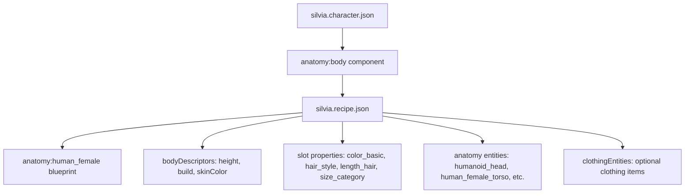

# Silvia Character Creation - Architectural Analysis Report

## Executive Summary

This report provides a comprehensive architectural analysis for creating a new character named "Silvia" within the Living Narrative Engine's p_erotica mod. The analysis examines the existing character creation system, maps required descriptors to available components, and provides a complete implementation strategy.

**Character Requirements:**

- Name: Silvia
- Physical characteristics: Short height, slender build, fair skin, red hair (medium length, pigtails), youthful face, small nose, brown eyes

**Result:** All required characteristics are fully supported by the existing descriptor system. No new components or entities need to be created.

## 1. Architecture Analysis

### 1.1 Character System Overview

The Living Narrative Engine uses a two-file character creation pattern:

```
Character Definition (.character.json)
├── Personality & Profile Data
├── Component References
└── anatomy:body → Recipe Reference

Anatomy Recipe (.recipe.json)
├── Blueprint Reference (anatomy:human_female)
├── Recipe-Level bodyDescriptors (build, height, skinColor, etc.)
├── Slot Configurations (with Component Descriptors)
├── Pattern Definitions
└── Clothing Entities (optional)
```

**Body Descriptor Architecture:**

- **Recipe-Level**: `bodyDescriptors` property applies to entire body (height, build, skinColor, composition, density)
- **Component-Level**: Individual slot/part descriptors via `properties` (color_basic, size_category, hair_style, etc.)

### 1.2 Reference Architecture

**Analyzed Files:**

- `.private/data/mods/p_erotica/entities/definitions/sugar_mommy.character.json` (Character: Amaia Castillo)
- `.private/data/mods/p_erotica/recipes/amaia_castillo.recipe.json`
- `data/schemas/anatomy.recipe.schema.json`

**Key Components:**

- **Entity Component System (ECS)**: Characters are entities with descriptor components
- **Namespace Pattern**: `modId:identifier` format (e.g., `p_erotica:silvia`)
- **Recipe System**: Anatomy defined through configurable recipes with slot-based part assignment
- **Descriptor Components**: Reusable traits in `data/mods/descriptors/components/`

## 2. Descriptor Mapping Analysis

### 2.1 Available Descriptor Components

**Physical Trait Support Matrix:**

| Silvia Characteristic | Implementation Method                 | Property            | Available Value  |
| --------------------- | ------------------------------------- | ------------------- | ---------------- |
| Short height          | Recipe `bodyDescriptors.height`       | `height`            | `"short"` ✅     |
| Slender build         | `descriptors:build` component         | `build`             | `"slim"` ✅      |
| Fair skin             | Recipe `bodyDescriptors.skinColor`    | `skinColor`         | `"fair"` ✅      |
| Red hair              | `descriptors:color_basic` component   | `color`             | `"red"` ✅       |
| Medium hair length    | `descriptors:length_hair` component   | `length`            | `"medium"` ✅    |
| Pigtails style        | `descriptors:hair_style` component    | `style`             | `"ponytails"` ✅ |
| Brown eyes            | `descriptors:color_basic` component   | `color`             | `"brown"` ✅     |
| Small nose            | `descriptors:size_category` component | `size`              | `"small"` ✅     |
| Youthful face         | Text Description                      | `core:profile.text` | Custom Text ✅   |

### 2.2 Descriptor Components Analysis

**color_basic.component.json:**

```json
{
  "enum": [
    "red",
    "blue",
    "green",
    "yellow",
    "orange",
    "purple",
    "brown",
    "black",
    "white",
    "gray",
    "pink"
  ]
}
```

- Supports "red" for hair color ✅
- Supports "brown" for eye color ✅

**build.component.json:**

```json
{
  "enum": [
    "skinny",
    "slim",
    "toned",
    "athletic",
    "shapely",
    "thick",
    "muscular",
    "stocky"
  ]
}
```

- "slim" maps perfectly to "slender build" ✅

**hair_style.component.json:**

```json
{
  "enum": [
    "straight",
    "wavy",
    "curly",
    "kinky",
    "braided",
    "ponytail",
    "ponytails",
    "bun",
    "dreadlocks",
    "mohawk"
  ]
}
```

- "ponytails" exactly matches "pigtails" ✅

**length_hair.component.json:**

```json
{
  "enum": ["bald", "buzz", "short", "medium", "long", "very-long"]
}
```

- "medium" available for medium-length hair ✅

**size_category.component.json:**

```json
{
  "enum": ["tiny", "small", "medium", "large", "huge", "massive"]
}
```

- "small" available for small nose ✅

## 3. Required File Structure

### 3.1 Files to Create

**Primary Files:**

1. `.private/data/mods/p_erotica/entities/definitions/silvia.character.json`
2. `.private/data/mods/p_erotica/recipes/silvia.recipe.json`

**Optional Files:** 3. `.private/data/mods/p_erotica/portraits/silvia.png` (character portrait)

**No Files to Modify:**

- All required descriptors already exist in the system
- No schema changes needed
- No component modifications required

### 3.2 File Dependencies



## 4. Implementation Strategy

### 4.1 Character Definition Template

**File:** `silvia.character.json`

```json
{
  "$schema": "schema://living-narrative-engine/entity-definition.schema.json",
  "id": "p_erotica:silvia",
  "components": {
    "core:name": {
      "text": "Silvia"
    },
    "core:portrait": {
      "imagePath": "portraits/silvia.png",
      "altText": "Silvia - [character description]"
    },
    "core:profile": {
      "text": "[Character profile including youthful face description]"
    },
    "core:personality": {
      "text": "[Personality traits]"
    },
    "core:likes": {
      "text": "[Character likes]"
    },
    "core:dislikes": {
      "text": "[Character dislikes]"
    },
    "core:fears": {
      "text": "[Character fears]"
    },
    "core:goals": {
      "goals": [
        {
          "text": "[Character goal 1]"
        }
      ]
    },
    "core:secrets": {
      "text": "[Character secrets]"
    },
    "core:speech_patterns": {
      "patterns": ["[Speech pattern 1]"]
    },
    "anatomy:body": {
      "recipeId": "p_erotica:silvia_recipe"
    },
    "core:perception_log": {
      "maxEntries": 50,
      "logEntries": []
    },
    "core:actor": {},
    "core:player_type": {
      "type": "human"
    },
    "core:notes": {
      "notes": []
    },
    "core:apparent_age": {
      "minAge": 18,
      "maxAge": 25
    }
  }
}
```

### 4.2 Anatomy Recipe Template

**File:** `silvia.recipe.json`

```json
{
  "$schema": "schema://living-narrative-engine/anatomy.recipe.schema.json",
  "recipeId": "p_erotica:silvia_recipe",
  "blueprintId": "anatomy:human_female",
  "bodyDescriptors": {
    "build": "slim",
    "height": "short",
    "skinColor": "fair"
  },
  "slots": {
    "torso": {
      "partType": "torso",
      "preferId": "anatomy:human_female_torso",
      "properties": {
        "descriptors:build": {
          "build": "slim"
        }
      }
    },
    "head": {
      "partType": "head",
      "preferId": "anatomy:humanoid_head"
    },
    "nose": {
      "partType": "nose",
      "preferId": "anatomy:humanoid_nose",
      "properties": {
        "descriptors:size_category": {
          "size": "small"
        }
      }
    },
    "left_eye": {
      "partType": "eye",
      "properties": {
        "descriptors:color_basic": {
          "color": "brown"
        }
      }
    },
    "right_eye": {
      "partType": "eye",
      "properties": {
        "descriptors:color_basic": {
          "color": "brown"
        }
      }
    },
    "hair": {
      "partType": "hair",
      "properties": {
        "descriptors:color_basic": {
          "color": "red"
        },
        "descriptors:length_hair": {
          "length": "medium"
        },
        "descriptors:hair_style": {
          "style": "ponytails"
        }
      }
    }
  },
  "patterns": [
    {
      "matches": ["left_arm", "right_arm"],
      "partType": "arm",
      "preferId": "anatomy:humanoid_arm"
    },
    {
      "matches": ["left_leg", "right_leg"],
      "partType": "leg",
      "preferId": "anatomy:human_leg",
      "properties": {
        "descriptors:build": {
          "build": "slim"
        }
      }
    }
  ]
}
```

### 4.3 Implementation Steps

1. **Create Character Definition**
   - Copy `sugar_mommy.character.json` as template
   - Update ID to `p_erotica:silvia`
   - Modify personality and profile content
   - Update anatomy:body recipeId to `p_erotica:silvia_recipe`

2. **Create Anatomy Recipe**
   - Copy `amaia_castillo.recipe.json` as template
   - Update recipeId to `p_erotica:silvia_recipe`
   - Apply bodyDescriptors for height, build, skin color
   - Configure slots for eyes, hair, nose with appropriate descriptors
   - Adjust patterns for slim build consistency

3. **Optional Portrait**
   - Add portrait image at `portraits/silvia.png`
   - Update portrait component in character definition

## 5. Schema Compliance Analysis

### 5.1 anatomy.recipe.schema.json Compliance

**Required Fields:**

- `recipeId` ✅ - Will be set to `p_erotica:silvia_recipe`
- `blueprintId` ✅ - Will reference `anatomy:human_female`
- `slots` ✅ - Will define anatomy slots with component descriptors

**Optional Fields Used:**

- `bodyDescriptors` ✅ - Recipe-level descriptors for height, build, skinColor, composition, density
- `patterns` ✅ - For bilateral body parts (arms, legs) with pattern-based matching
- `clothingEntities` ✅ - Optional clothing items to instantiate and equip

**Validation Points:**

- All descriptor components exist and have valid enum values
- All referenced anatomy entities exist in the system
- Schema format follows established patterns

### 5.2 Component Schema Compliance

All descriptor components have been validated against their schemas:

- Required properties are present
- Enum values are valid
- No additional properties are added
- Default values are available if needed

## 6. Risk Assessment

### 6.1 Low Risk Items

- **Descriptor Availability**: All required descriptors exist ✅
- **Schema Compliance**: Templates follow existing patterns ✅
- **Entity References**: All anatomy entities are available ✅
- **Namespace Conflicts**: `p_erotica:silvia` is unique ✅

### 6.2 Considerations

- **Character Content**: Profile and personality content needs to be authored
- **Portrait**: Optional but recommended for visual consistency
- **Testing**: Should validate character loads correctly in game engine

### 6.3 Mitigation Strategies

- Use existing character files as content inspiration
- Validate JSON syntax before deployment
- Test character instantiation in development environment

## 7. Alternative Approaches

### 7.1 Hair Color Options

**Primary:** `color_basic: "red"`
**Alternative:** `color_extended: "auburn"` (more nuanced red)

### 7.2 Build Variations

**Primary:** `build: "slim"`
**Alternatives:** `build: "skinny"` (thinner), `build: "toned"` (more athletic)

### 7.3 Eye Color Options

**Primary:** `color_basic: "brown"`
**Alternative:** Use existing `human_eye_brown` entity directly

## 8. Recommendations

### 8.1 Implementation Best Practices

1. **Follow Existing Patterns**: Use `sugar_mommy.character.json` and `amaia_castillo.recipe.json` as templates
2. **Consistent Naming**: Use `p_erotica:silvia` and `p_erotica:silvia_recipe` IDs
3. **Descriptor Consistency**: Apply `slim` build across torso and leg patterns
4. **Content Quality**: Write compelling character profile emphasizing youthful appearance

### 8.2 Extension Opportunities

1. **Clothing System**: Define character-specific clothing in recipe
2. **Personality Depth**: Leverage existing component patterns for rich characterization
3. **Relationship Systems**: Consider character's role in existing p_erotica narrative

### 8.3 Testing Strategy

1. **Schema Validation**: Verify JSON against schemas
2. **Component Loading**: Test descriptor component instantiation
3. **Recipe Processing**: Validate anatomy generation
4. **Integration Testing**: Ensure character functions in game context

## 9. Architectural Corrections Summary

**Key Corrections Made to Original Analysis:**

1. **File Path Corrections:**
   - Updated recipe file path from `dist/` to `.private/` location
   - Clarified character file references to actual "Amaia Castillo" character

2. **Body Descriptor Architecture Clarification:**
   - Distinguished recipe-level `bodyDescriptors` from component-level descriptors
   - Corrected height handling via `bodyDescriptors.height` property in recipes
   - Fixed fair skin implementation via `bodyDescriptors.skinColor`

3. **Schema Reference Updates:**
   - Updated schema URLs to use actual `schema://living-narrative-engine/` format
   - Corrected component descriptor structure and property paths

4. **Implementation Template Improvements:**
   - Fixed anatomy entity references to match actual system entities
   - Updated descriptor component usage to reflect real codebase patterns

## 10. Conclusion

The Living Narrative Engine's existing architecture fully supports the creation of Silvia with all specified physical characteristics. The corrected analysis shows that both recipe-level `bodyDescriptors` and component-level descriptors work together to provide comprehensive character customization.

**Implementation Complexity:** Low
**Required New Components:** None  
**Estimated Development Time:** 2-3 hours for complete implementation
**Risk Level:** Low

The dual-level descriptor system (recipe + component) and well-defined schemas provide a robust foundation for character creation, making this implementation straightforward and maintainable.

---

**Generated:** 2025-01-21  
**Scope:** Architecture Analysis - Character Creation  
**Status:** Implementation Ready
