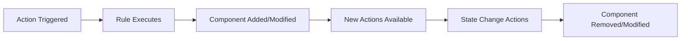

# State-Defining Components Reference Guide

**Living Narrative Engine - Component Architecture Analysis**  
_Generated: August 26, 2025_

## Executive Summary

This comprehensive reference guide analyzes four critical state-defining components in the Living Narrative Engine: `kissing`, `closeness`, `facing_away`, and `kneeling_before`. These components represent different patterns for implementing complex game states that influence character interactions, action availability, and narrative progression.

The analysis reveals four distinct architectural patterns for state management, providing a foundation for implementing new components that define character relationships, positioning, and behavioral states within the game's Entity Component System (ECS) architecture.

### Purpose & Scope

This document serves as the definitive reference for:

- Understanding existing state-defining component implementations
- Identifying architectural patterns and best practices
- Providing templates and guidelines for new component development
- Documenting integration patterns with actions, rules, scopes, and conditions

## Component Architecture Patterns

Based on the analysis, four distinct component architecture patterns emerge:

### 1. Binary Relationship State Pattern

**Example**: `intimacy:kissing`

- **Characteristics**: Two-actor state with role differentiation
- **Data Structure**: Partner reference + metadata (initiator flag)
- **State Management**: Bidirectional (both actors receive component)
- **Use Cases**: Intimate interactions, partnerships, direct relationships

### 2. Multi-Actor Group State Pattern

**Example**: `positioning:closeness`

- **Characteristics**: Shared group membership among multiple actors
- **Data Structure**: Array of partner references
- **State Management**: Synchronized group (all members have identical data)
- **Use Cases**: Group formations, proximity clusters, collaborative states

### 3. Multi-Target Directional State Pattern

**Example**: `positioning:facing_away`

- **Characteristics**: One actor relating to multiple targets directionally
- **Data Structure**: Array of target references
- **State Management**: Unidirectional (only actor has component)
- **Use Cases**: Orientation, attention, directional relationships

### 4. Single-Target Positional State Pattern

**Example**: `positioning:kneeling_before`

- **Characteristics**: Simple one-to-one positional relationship
- **Data Structure**: Single target reference
- **State Management**: Unidirectional with constraints (movement lock)
- **Use Cases**: Positional states, hierarchical positioning, constrained states

---

## Detailed Component Analysis

## 1. Binary Relationship State: `intimacy:kissing`

### Component Schema

```json
{
  "$schema": "schema://living-narrative-engine/component.schema.json",
  "id": "intimacy:kissing",
  "description": "Tracks an active kissing interaction between two characters. Presence indicates the character is currently kissing someone.",
  "dataSchema": {
    "type": "object",
    "additionalProperties": false,
    "required": ["partner", "initiator"],
    "properties": {
      "partner": {
        "description": "The entity ID of the character being kissed",
        "$ref": "schema://living-narrative-engine/common.schema.json#/definitions/namespacedId"
      },
      "initiator": {
        "type": "boolean",
        "description": "Whether this character initiated the kiss",
        "default": false
      }
    }
  }
}
```

### Key Characteristics

- **Bidirectional State**: Both participants receive the component
- **Role Differentiation**: Initiator flag distinguishes actor roles
- **Validation**: Uses JSON Schema references for entity ID validation
- **Namespace**: Part of intimacy mod for relationship mechanics

### Associated Actions

#### State Initiation: `intimacy:lean_in_for_deep_kiss`

- **Required Components**: `positioning:closeness` (must be close first)
- **Forbidden Components**: `intimacy:kissing` (prevents duplicate states)
- **Targets**: Custom scope `intimacy:actors_with_mouth_facing_each_other`

#### State Termination: `intimacy:break_kiss_gently`

- **Required Components**: `intimacy:kissing` (must be kissing to break)
- **Targets**: Custom scope `intimacy:current_kissing_partner`

### Rule Implementation Pattern

#### State Addition (lean_in_for_deep_kiss.rule.json)

```json
{
  "type": "ADD_COMPONENT",
  "parameters": {
    "entity_ref": "actor",
    "component_type": "intimacy:kissing",
    "value": {
      "partner": "{event.payload.targetId}",
      "initiator": true
    }
  }
},
{
  "type": "ADD_COMPONENT",
  "parameters": {
    "entity_ref": "target",
    "component_type": "intimacy:kissing",
    "value": {
      "partner": "{event.payload.actorId}",
      "initiator": false
    }
  }
}
```

#### State Removal (break_kiss_gently.rule.json)

```json
{
  "type": "REMOVE_COMPONENT",
  "parameters": {
    "entity_ref": "actor",
    "component_type": "intimacy:kissing"
  }
},
{
  "type": "REMOVE_COMPONENT",
  "parameters": {
    "entity_ref": "target",
    "component_type": "intimacy:kissing"
  }
}
```

### Scope Integration

#### Partner Resolution: `current_kissing_partner.scope`

```
intimacy:current_kissing_partner := entities(intimacy:kissing)[][{
  "and": [
    {"==": [{"var": "entity.id"}, {"var": "actor.components.intimacy:kissing.partner"}]},
    {"condition_ref": "core:entity-has-actor-component"}
  ]
}]
```

### Condition Logic

#### Partner Validation: `target-is-kissing-partner.condition.json`

```json
{
  "id": "intimacy:target-is-kissing-partner",
  "description": "Checks if the target is the actor's current kissing partner",
  "logic": {
    "==": [
      { "var": "target.id" },
      { "var": "actor.components.intimacy:kissing.partner" }
    ]
  }
}
```

---

## 2. Multi-Actor Group State: `positioning:closeness`

### Component Schema

```json
{
  "$schema": "schema://living-narrative-engine/component.schema.json",
  "id": "positioning:closeness",
  "description": "A fully-connected, order-independent set of actors who have explicitly chosen to be 'close'. Its presence indicates an actor is part of a Closeness Circle.",
  "dataSchema": {
    "type": "object",
    "additionalProperties": false,
    "required": ["partners"],
    "properties": {
      "partners": {
        "type": "array",
        "description": "A list of entity IDs that are also in this closeness circle.",
        "uniqueItems": true,
        "default": [],
        "items": {
          "$ref": "schema://living-narrative-engine/common.schema.json#/definitions/namespacedId"
        }
      }
    }
  }
}
```

### Key Characteristics

- **Group Synchronization**: All members maintain identical partner arrays
- **Order Independence**: Array order doesn't affect functionality
- **Unique Items**: Schema enforces no duplicate partners
- **Transitivity**: If A is close to B and B is close to C, then A is close to C

### Associated Actions

#### State Modification: `positioning:step_back`

- **Required Components**: `positioning:closeness` (must be in group)
- **Targets**: `none` (self-action)
- **Effect**: Removes actor from closeness circle

### Custom Operations

#### Group Management: `REMOVE_FROM_CLOSENESS_CIRCLE`

```json
{
  "type": "REMOVE_FROM_CLOSENESS_CIRCLE",
  "parameters": {
    "actor_id": "{event.payload.actorId}"
  }
}
```

**Operation Schema**: `removeFromClosenessCircle.schema.json`

- **Required Parameters**: `actor_id`
- **Optional Parameters**: `result_variable`
- **Implementation**: Custom operation handler manages group synchronization

### Rule Implementation Pattern

#### Complex State Management (step_back.rule.json)

```json
{
  "type": "REMOVE_FROM_CLOSENESS_CIRCLE",
  "parameters": {
    "actor_id": "{event.payload.actorId}"
  }
},
{
  "type": "HAS_COMPONENT",
  "parameters": {
    "entity_ref": "actor",
    "component_type": "positioning:facing_away",
    "result_variable": "hasFacingAway"
  }
},
{
  "type": "IF",
  "parameters": {
    "condition": { "var": "context.hasFacingAway" },
    "then_actions": [
      {
        "type": "REMOVE_COMPONENT",
        "parameters": {
          "entity_ref": "actor",
          "component_type": "positioning:facing_away"
        }
      }
    ]
  }
}
```

### Scope Integration

#### Direct Partner Access: `close_actors.scope`

```
positioning:close_actors := actor.components.positioning:closeness.partners[]
```

### Condition Logic

#### Group Membership: `actor-is-in-closeness.condition.json`

```json
{
  "id": "positioning:actor-is-in-closeness",
  "description": "Checks if the actor is in a state of 'closeness' with another entity.",
  "logic": {
    "!!": {
      "var": "actor.components.positioning:closeness"
    }
  }
}
```

---

## 3. Multi-Target Directional State: `positioning:facing_away`

### Component Schema

```json
{
  "$schema": "schema://living-narrative-engine/component.schema.json",
  "id": "positioning:facing_away",
  "description": "Tracks which actors this entity is facing away from in an intimate context. Used for position-aware intimate actions.",
  "dataSchema": {
    "type": "object",
    "additionalProperties": false,
    "required": ["facing_away_from"],
    "properties": {
      "facing_away_from": {
        "type": "array",
        "description": "Entity IDs this actor is facing away from",
        "uniqueItems": true,
        "default": [],
        "items": {
          "$ref": "schema://living-narrative-engine/common.schema.json#/definitions/namespacedId"
        }
      }
    }
  }
}
```

### Key Characteristics

- **Unidirectional**: Only the facing-away actor has the component
- **Multiple Targets**: Can face away from multiple entities simultaneously
- **Contextual**: Specifically designed for intimate/positioning contexts
- **Dynamic**: Array can be modified to add/remove targets

### Associated Actions

#### State Addition: `positioning:turn_your_back`

- **Required Components**: None (can always turn away)
- **Forbidden Components**: `positioning:facing_away` (prevents duplicate states)
- **Targets**: `core:actors_in_location`

#### State Modification: `positioning:turn_around_to_face`

- **Effect**: Removes target from facing_away_from array

### Scope Integration

#### Directional Filtering: Used in complex scopes

```
// Example from actor_kneeling_before_target_with_penis.scope
sex-core:actor_kneeling_before_target_with_penis := actor.components.positioning:closeness.partners[][{
  "and": [
    {"hasPartOfType": [".", "penis"]},
    {"not": {"isSocketCovered": [".", "penis"]}},
    {
      "==": [
        {"var": "actor.components.positioning:kneeling_before.entityId"},
        {"var": "id"}
      ]
    }
  ]
}]
```

### Condition Logic

#### Directional Validation: `entity-in-facing-away.condition.json`

```json
{
  "id": "positioning:entity-in-facing-away",
  "description": "Checks if the entity is in the actor's facing_away_from array",
  "logic": {
    "in": [
      {
        "var": "entity.id"
      },
      {
        "var": "actor.components.positioning:facing_away.facing_away_from"
      }
    ]
  }
}
```

#### Negation Condition: `entity-not-in-facing-away.condition.json`

```json
{
  "id": "positioning:entity-not-in-facing-away",
  "logic": {
    "!": {
      "in": [
        { "var": "entity.id" },
        { "var": "actor.components.positioning:facing_away.facing_away_from" }
      ]
    }
  }
}
```

---

## 4. Single-Target Positional State: `positioning:kneeling_before`

### Component Schema

```json
{
  "$schema": "schema://living-narrative-engine/component.schema.json",
  "id": "positioning:kneeling_before",
  "description": "Tracks which entity the component holder is currently kneeling before. Represents a positional state where the actor has assumed a kneeling position directed toward another entity.",
  "dataSchema": {
    "type": "object",
    "additionalProperties": false,
    "required": ["entityId"],
    "properties": {
      "entityId": {
        "type": "string",
        "description": "The ID of the entity that the component holder is kneeling before",
        "pattern": "^[a-zA-Z0-9_-]+:[a-zA-Z0-9_-]+$"
      }
    }
  }
}
```

### Key Characteristics

- **Simple Structure**: Single target reference
- **Regex Validation**: Enforces namespaced ID pattern at schema level
- **Positional Constraint**: Affects movement and positioning
- **Hierarchical Implication**: Suggests respectful/submissive positioning

### Associated Actions

#### State Addition: `deference:kneel_before`

- **Required Components**: None
- **Forbidden Components**: `positioning:kneeling_before` (one kneel at a time)
- **Targets**: `core:actors_in_location`
- **Side Effects**: Movement lock

#### State Removal: `deference:stand_up`

- **Required Components**: `positioning:kneeling_before`
- **Side Effects**: Movement unlock

### Constraint Integration

#### Movement Lock System

```json
{
  "type": "LOCK_MOVEMENT",
  "comment": "Lock movement while kneeling (handles both legacy and anatomy entities)",
  "parameters": {
    "actor_id": "{event.payload.actorId}"
  }
}
```

**Custom Operations Used**:

- `LOCK_MOVEMENT`: Prevents positional changes while kneeling
- `UNLOCK_MOVEMENT`: Restores movement when standing up

### Rule Implementation Pattern

#### State Addition with Constraints (kneel_before.rule.json)

```json
{
  "type": "ADD_COMPONENT",
  "parameters": {
    "entity_ref": "actor",
    "component_type": "positioning:kneeling_before",
    "value": {
      "entityId": "{event.payload.targetId}"
    }
  }
},
{
  "type": "LOCK_MOVEMENT",
  "parameters": {
    "actor_id": "{event.payload.actorId}"
  }
}
```

### Scope Integration

#### Complex Filtering: `actor_kneeling_before_target_with_penis.scope`

```
sex-core:actor_kneeling_before_target_with_penis := actor.components.positioning:closeness.partners[][{
  "and": [
    {"hasPartOfType": [".", "penis"]},
    {"not": {"isSocketCovered": [".", "penis"]}},
    {
      "==": [
        {"var": "actor.components.positioning:kneeling_before.entityId"},
        {"var": "id"}
      ]
    }
  ]
}]
```

**Scope Analysis**:

- Combines multiple component states (closeness + kneeling_before)
- Uses anatomy system integration
- Demonstrates complex filtering logic

---

## Implementation Patterns & Best Practices

### 1. State Lifecycle Management

**Standard Pattern**: Action → Rule → Component → Action Availability



#### Implementation Checklist

- ✅ Action requires appropriate precondition components
- ✅ Action forbids conflicting states
- ✅ Rule adds/removes components atomically
- ✅ Component presence enables new actions
- ✅ State termination actions are available

### 2. Component Design Principles

#### Schema Design

```json
{
  "$schema": "schema://living-narrative-engine/component.schema.json",
  "id": "mod:component_name",
  "description": "Clear, specific description of state purpose",
  "dataSchema": {
    "type": "object",
    "additionalProperties": false,
    "required": ["essential_field"],
    "properties": {
      "essential_field": {
        "description": "Clear field purpose",
        "$ref": "schema://living-narrative-engine/common.schema.json#/definitions/namespacedId"
      },
      "metadata_field": {
        "type": "boolean",
        "description": "Optional metadata",
        "default": false
      }
    }
  }
}
```

#### Key Principles

1. **Clear Naming**: Component ID should indicate purpose and module
2. **Descriptive Documentation**: Both component and field descriptions
3. **Strict Validation**: Use `additionalProperties: false`
4. **Reference Standards**: Use common schema refs for entity IDs
5. **Sensible Defaults**: Provide defaults for optional fields

### 3. Action-Component Integration

#### Required Component Pattern

```json
{
  "required_components": {
    "actor": ["positioning:closeness", "core:actor"]
  },
  "forbidden_components": {
    "actor": ["intimacy:kissing"]
  }
}
```

#### Best Practices

- **Precise Requirements**: Specify exactly what states are needed
- **Conflict Prevention**: Use forbidden_components to prevent invalid states
- **Logical Progression**: Components should represent logical state transitions

### 4. Rule Implementation Patterns

#### Bidirectional State Management

```json
[
  {
    "type": "ADD_COMPONENT",
    "parameters": {
      "entity_ref": "actor",
      "component_type": "mod:relationship",
      "value": {
        "partner": "{event.payload.targetId}",
        "role": "initiator"
      }
    }
  },
  {
    "type": "ADD_COMPONENT",
    "parameters": {
      "entity_ref": "target",
      "component_type": "mod:relationship",
      "value": {
        "partner": "{event.payload.actorId}",
        "role": "receiver"
      }
    }
  }
]
```

#### Unidirectional State Management

```json
{
  "type": "ADD_COMPONENT",
  "parameters": {
    "entity_ref": "actor",
    "component_type": "mod:directional_state",
    "value": {
      "targets": ["{event.payload.targetId}"]
    }
  }
}
```

#### Custom Operation Integration

```json
{
  "type": "CUSTOM_OPERATION_NAME",
  "comment": "Explain why custom operation is needed",
  "parameters": {
    "required_param": "{event.payload.value}",
    "optional_param": "default_value"
  }
}
```

### 5. Scope Definition Patterns

#### Component-Based Filtering

```
// Simple component access
mod:simple_targets := actor.components.mod:state.partners[]

// Complex filtering
mod:filtered_targets := actor.components.mod:state.partners[][{
  "and": [
    {"condition_ref": "mod:validation-condition"},
    {"!=": [{"var": "id"}, {"var": "actor.id"}]}
  ]
}]
```

#### Best Practices

- **Descriptive Names**: Scope names should indicate purpose
- **Efficient Filtering**: Use simple access patterns when possible
- **Condition Integration**: Leverage existing conditions for validation
- **Self-Exclusion**: Prevent actors from targeting themselves

### 6. Condition Logic Patterns

#### Component Existence Check

```json
{
  "logic": {
    "!!": {
      "var": "actor.components.mod:state"
    }
  }
}
```

#### Component Field Validation

```json
{
  "logic": {
    "==": [
      { "var": "target.id" },
      { "var": "actor.components.mod:state.partner" }
    ]
  }
}
```

#### Array Membership Check

```json
{
  "logic": {
    "in": [
      { "var": "entity.id" },
      { "var": "actor.components.mod:state.targets" }
    ]
  }
}
```

### 7. Testing Strategies

#### Component Schema Validation

- Test valid data structures
- Test invalid data (should fail validation)
- Test edge cases (empty arrays, null values)
- Test schema references

#### Action-Rule Integration

- Test action prerequisites are met
- Test forbidden components prevent actions
- Test rule execution adds/removes components correctly
- Test bidirectional state synchronization

#### Scope Resolution

- Test scope returns expected entities
- Test filtering logic works correctly
- Test performance with large entity sets
- Test scope with various component states

#### Condition Logic

- Test all condition branches (true/false paths)
- Test edge cases (missing components, empty arrays)
- Test complex boolean logic combinations
- Test performance with complex conditions

---

## Reference Implementation Templates

### 1. Binary Relationship Component Template

#### Component Schema

```json
{
  "$schema": "schema://living-narrative-engine/component.schema.json",
  "id": "{{mod}}:{{component_name}}",
  "description": "{{Description of binary relationship state}}",
  "dataSchema": {
    "type": "object",
    "additionalProperties": false,
    "required": ["partner", "role"],
    "properties": {
      "partner": {
        "description": "The entity ID of the relationship partner",
        "$ref": "schema://living-narrative-engine/common.schema.json#/definitions/namespacedId"
      },
      "role": {
        "type": "string",
        "enum": ["initiator", "receiver"],
        "description": "Role in the relationship"
      },
      "metadata": {
        "type": "object",
        "description": "Additional relationship data",
        "default": {}
      }
    }
  }
}
```

#### Initiation Action

```json
{
  "$schema": "schema://living-narrative-engine/action.schema.json",
  "id": "{{mod}}:initiate_{{action_name}}",
  "name": "{{Action Display Name}}",
  "description": "{{Action Description}}",
  "targets": "{{mod}}:{{target_scope}}",
  "required_components": {
    "actor": ["{{required_component}}"]
  },
  "forbidden_components": {
    "actor": ["{{mod}}:{{component_name}}"]
  },
  "template": "{{action_template_with_target}}",
  "visual": {
    "backgroundColor": "#{{color}}",
    "textColor": "#ffffff"
  }
}
```

#### Initiation Rule

```json
{
  "$schema": "schema://living-narrative-engine/rule.schema.json",
  "rule_id": "handle_initiate_{{action_name}}",
  "comment": "Handles {{mod}}:initiate_{{action_name}} action",
  "event_type": "core:attempt_action",
  "condition": {
    "condition_ref": "{{mod}}:event-is-action-initiate-{{action_name}}"
  },
  "actions": [
    {
      "type": "ADD_COMPONENT",
      "parameters": {
        "entity_ref": "actor",
        "component_type": "{{mod}}:{{component_name}}",
        "value": {
          "partner": "{event.payload.targetId}",
          "role": "initiator"
        }
      }
    },
    {
      "type": "ADD_COMPONENT",
      "parameters": {
        "entity_ref": "target",
        "component_type": "{{mod}}:{{component_name}}",
        "value": {
          "partner": "{event.payload.actorId}",
          "role": "receiver"
        }
      }
    },
    { "macro": "core:logSuccessAndEndTurn" }
  ]
}
```

### 2. Multi-Actor Group Component Template

#### Component Schema

```json
{
  "$schema": "schema://living-narrative-engine/component.schema.json",
  "id": "{{mod}}:{{component_name}}",
  "description": "{{Description of group state}}",
  "dataSchema": {
    "type": "object",
    "additionalProperties": false,
    "required": ["members"],
    "properties": {
      "members": {
        "type": "array",
        "description": "List of group member entity IDs",
        "uniqueItems": true,
        "default": [],
        "items": {
          "$ref": "schema://living-narrative-engine/common.schema.json#/definitions/namespacedId"
        }
      },
      "group_metadata": {
        "type": "object",
        "description": "Group-specific data",
        "default": {}
      }
    }
  }
}
```

#### Custom Operation Schema

```json
{
  "$schema": "http://json-schema.org/draft-07/schema#",
  "$id": "schema://living-narrative-engine/operations/{{operation_name}}.schema.json",
  "title": "{{OPERATION_NAME}} Operation",
  "allOf": [
    {
      "$ref": "../base-operation.schema.json"
    },
    {
      "properties": {
        "type": {
          "const": "{{OPERATION_NAME}}"
        },
        "parameters": {
          "$ref": "#/$defs/Parameters"
        }
      }
    }
  ],
  "$defs": {
    "Parameters": {
      "type": "object",
      "properties": {
        "actor_id": {
          "type": "string",
          "minLength": 1
        },
        "group_id": {
          "type": "string",
          "minLength": 1
        }
      },
      "required": ["actor_id"],
      "additionalProperties": false
    }
  }
}
```

### 3. Multi-Target Directional Component Template

#### Component Schema

```json
{
  "$schema": "schema://living-narrative-engine/component.schema.json",
  "id": "{{mod}}:{{component_name}}",
  "description": "{{Description of directional state}}",
  "dataSchema": {
    "type": "object",
    "additionalProperties": false,
    "required": ["targets"],
    "properties": {
      "targets": {
        "type": "array",
        "description": "Entity IDs this actor is relating to directionally",
        "uniqueItems": true,
        "default": [],
        "items": {
          "$ref": "schema://living-narrative-engine/common.schema.json#/definitions/namespacedId"
        }
      }
    }
  }
}
```

#### Array Modification Rule Pattern

```json
{
  "type": "MODIFY_COMPONENT",
  "parameters": {
    "entity_ref": "actor",
    "component_type": "{{mod}}:{{component_name}}",
    "modification": {
      "type": "array_add",
      "field": "targets",
      "value": "{event.payload.targetId}"
    }
  }
}
```

### 4. Single-Target Positional Component Template

#### Component Schema

```json
{
  "$schema": "schema://living-narrative-engine/component.schema.json",
  "id": "{{mod}}:{{component_name}}",
  "description": "{{Description of positional state}}",
  "dataSchema": {
    "type": "object",
    "additionalProperties": false,
    "required": ["target_id"],
    "properties": {
      "target_id": {
        "type": "string",
        "description": "The ID of the target entity",
        "pattern": "^[a-zA-Z0-9_-]+:[a-zA-Z0-9_-]+$"
      },
      "position_data": {
        "type": "object",
        "description": "Additional positional information",
        "default": {}
      }
    }
  }
}
```

#### Constrained State Rule

```json
{
  "actions": [
    {
      "type": "ADD_COMPONENT",
      "parameters": {
        "entity_ref": "actor",
        "component_type": "{{mod}}:{{component_name}}",
        "value": {
          "target_id": "{event.payload.targetId}"
        }
      }
    },
    {
      "type": "APPLY_CONSTRAINT",
      "comment": "Apply positioning constraints",
      "parameters": {
        "actor_id": "{event.payload.actorId}",
        "constraint_type": "{{constraint_name}}"
      }
    }
  ]
}
```

---

## Conclusion

This comprehensive analysis of four state-defining components reveals consistent architectural patterns that enable complex character interactions and behaviors within the Living Narrative Engine. The four patterns identified provide templates for implementing new components that manage:

- **Binary relationships** with role differentiation
- **Group dynamics** with synchronized state management
- **Directional relationships** with array-based targeting
- **Positional constraints** with system integration

### Key Takeaways

1. **Component schemas must be precise** with strict validation and clear documentation
2. **Action-rule-component coordination** follows predictable patterns
3. **Scope integration enables sophisticated targeting** beyond simple entity lists
4. **Custom operations extend the system** for complex state management
5. **Bidirectional vs unidirectional states** require different implementation approaches
6. **Testing strategies must cover** schema validation, integration, and performance

### Future Applications

These patterns can be applied to implement new state-defining components for:

- **Social dynamics** (friendship, rivalry, leadership)
- **Spatial relationships** (hiding, following, guarding)
- **Emotional states** (attraction, fear, trust)
- **Temporal states** (concentration, exhaustion, inspiration)
- **Environmental interactions** (operating machinery, performing rituals)

By following the patterns and best practices outlined in this guide, developers can create robust, well-integrated components that enhance the narrative possibilities within the Living Narrative Engine while maintaining system consistency and performance.

---

_This guide represents the current state of component architecture as of August 2025. As the engine evolves, these patterns may be refined and extended to support new use cases and requirements._
