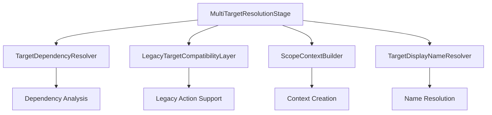

# MultiTargetResolutionStage Decomposition Specification

**Version**: 1.0  
**Date**: 2025-01-08  
**Status**: Draft  
**Priority**: Critical (Priority 1.1 from Action Pipeline Refactoring Report)

## Executive Summary

This specification defines the decomposition of the 734-line `MultiTargetResolutionStage` class into specialized services to address critical architectural issues identified in the Action Pipeline Refactoring Report. The current monolithic implementation handles 6+ distinct responsibilities within a single class, creating high cyclomatic complexity, tight coupling, and maintenance challenges.

**Core Problem**: The `MultiTargetResolutionStage` violates the Single Responsibility Principle by combining legacy action compatibility, multi-target resolution, dependency ordering, context building, error handling, and display name resolution into a single 734-line class.

**Solution**: Decompose the monolith into 4 specialized services with clear separation of concerns, reducing complexity by ~70% and enabling independent testing and maintenance.

## Problem Definition

### Current Architecture Issues

The `MultiTargetResolutionStage` located at `src/actions/pipeline/stages/MultiTargetResolutionStage.js` exhibits the following problems:

1. **Excessive File Size**: 734 lines in a single file
2. **Multiple Responsibilities**: 6+ distinct concerns handled by one class
3. **High Cyclomatic Complexity**: Complex nested logic and control flow
4. **Deep Method Nesting**: Methods with multiple levels of indentation
5. **Mixed Legacy/Modern Patterns**: Inconsistent handling of different action types
6. **Tight Coupling**: Difficult to test individual components in isolation

### Specific Responsibility Analysis

#### Current Single Class Handles:

1. **Pipeline Orchestration** (lines 85-201): Main execution flow and result aggregation
2. **Legacy Action Compatibility** (lines 223-293): Single-target action resolution for backward compatibility
3. **Multi-Target Resolution** (lines 295-529): Modern multi-target action processing
4. **Dependency Ordering** (lines 531-567): Target dependency resolution algorithm
5. **Scope Context Building** (lines 579-644): Context creation for scope evaluation
6. **Display Name Resolution** (lines 713-730): Entity display name retrieval
7. **Error Handling**: Distributed throughout the class with inconsistent patterns

### Impact Assessment

- **Maintainability**: Very difficult to modify without affecting unrelated functionality
- **Testability**: Complex setup required to test individual components
- **Extensibility**: Adding new features requires changes to the monolith
- **Bug Risk**: Changes in one area can break seemingly unrelated functionality
- **Developer Productivity**: High cognitive load to understand and modify

## Target Architecture

### Service-Oriented Design

The new architecture decomposes the monolith into 4 specialized services with clear interfaces and single responsibilities:



### Service Specifications

#### 1. TargetDependencyResolver

**Responsibility**: Analyze target definitions and determine resolution order based on dependencies.

**Extracted Code**: Lines 531-567 from `#getResolutionOrder(targetDefs)`

**Interface**:
```javascript
class TargetDependencyResolver {
  /**
   * Analyze target definitions and return resolution order
   * @param {Object.<string, TargetDefinition>} targetDefinitions
   * @returns {string[]} Dependency-ordered target keys
   * @throws {Error} If circular dependencies detected
   */
  getResolutionOrder(targetDefinitions);
  
  /**
   * Validate target definitions for dependency issues
   * @param {Object.<string, TargetDefinition>} targetDefinitions
   * @returns {ValidationResult}
   */
  validateDependencies(targetDefinitions);
}
```

**Key Features**:
- Topological sorting algorithm for dependency resolution
- Circular dependency detection with clear error messages
- Maximum iteration protection to prevent infinite loops
- Comprehensive dependency validation

#### 2. LegacyTargetCompatibilityLayer

**Responsibility**: Handle legacy single-target actions for backward compatibility.

**Extracted Code**: Lines 223-293 from `#resolveLegacyTarget(context, trace)`

**Interface**:
```javascript
class LegacyTargetCompatibilityLayer {
  /**
   * Resolve legacy single-target action
   * @param {Object} context - Action processing context
   * @param {TraceContext} trace - Tracing context
   * @returns {Promise<PipelineResult>}
   */
  resolveLegacyTarget(context, trace);
  
  /**
   * Check if action uses legacy format
   * @param {ActionDefinition} actionDef
   * @returns {boolean}
   */
  isLegacyAction(actionDef);
  
  /**
   * Convert legacy result to multi-target format
   * @param {Object} legacyResult
   * @param {ActionDefinition} actionDef
   * @returns {Object}
   */
  convertToMultiTargetFormat(legacyResult, actionDef);
}
```

**Key Features**:
- Seamless legacy action processing
- Format conversion for consistency
- Backward compatibility preservation
- Clear separation from modern processing

#### 3. ScopeContextBuilder

**Responsibility**: Build scope evaluation contexts for target resolution.

**Extracted Code**: 
- Lines 579-597 from `#buildScopeContext(actor, actionContext, resolvedTargets, targetDef, trace)`
- Lines 610-644 from `#buildScopeContextForSpecificPrimary(context)`

**Interface**:
```javascript
class ScopeContextBuilder {
  /**
   * Build scope context for target resolution
   * @param {Entity} actor - Acting entity
   * @param {Object} actionContext - Action context
   * @param {Object} resolvedTargets - Previously resolved targets
   * @param {TargetDefinition} targetDef - Target definition
   * @param {TraceContext} trace - Tracing context
   * @returns {Object} Scope evaluation context
   */
  buildScopeContext(actor, actionContext, resolvedTargets, targetDef, trace);
  
  /**
   * Build context for specific primary target
   * @param {Object} context - Base context
   * @returns {Object} Enhanced context with primary target
   */
  buildContextForSpecificPrimary(context);
  
  /**
   * Validate context completeness
   * @param {Object} context
   * @returns {ValidationResult}
   */
  validateContext(context);
}
```

**Key Features**:
- Context-aware scope building
- Primary target specialization
- Context validation and completeness checking
- Trace integration for debugging

#### 4. TargetDisplayNameResolver

**Responsibility**: Resolve entity display names for target presentation.

**Extracted Code**: Lines 713-730 from `#getEntityDisplayName(entityId)`

**Interface**:
```javascript
class TargetDisplayNameResolver {
  /**
   * Get display name for entity
   * @param {string} entityId - Entity identifier
   * @returns {string} Display name or fallback
   */
  getEntityDisplayName(entityId);
  
  /**
   * Get display names for multiple entities
   * @param {string[]} entityIds - Entity identifiers
   * @returns {Object.<string, string>} Map of ID to display name
   */
  getEntityDisplayNames(entityIds);
  
  /**
   * Set fallback name for unknown entities
   * @param {string} fallbackName - Default name to use
   */
  setFallbackName(fallbackName);
}
```

**Key Features**:
- Consistent display name resolution
- Batch processing support
- Configurable fallback handling
- Entity manager integration

### Simplified Main Stage

The refactored `MultiTargetResolutionStage` becomes a lightweight orchestrator:

```javascript
export class MultiTargetResolutionStage extends PipelineStage {
  #dependencyResolver;
  #legacyLayer;
  #contextBuilder;
  #nameResolver;
  #unifiedScopeResolver;
  #logger;

  constructor({
    targetDependencyResolver,
    legacyTargetCompatibilityLayer,
    scopeContextBuilder,
    targetDisplayNameResolver,
    unifiedScopeResolver,
    logger,
  }) {
    super('MultiTargetResolution');
    
    // Validate and assign dependencies
    this.#dependencyResolver = targetDependencyResolver;
    this.#legacyLayer = legacyLayer;
    this.#contextBuilder = contextBuilder;
    this.#nameResolver = nameResolver;
    this.#unifiedScopeResolver = unifiedScopeResolver;
    this.#logger = logger;
  }

  async executeInternal(context) {
    const { candidateActions = [], actor, actionContext, trace } = context;
    
    const allActionsWithTargets = [];
    const errors = [];
    
    for (const actionDef of candidateActions) {
      try {
        let result;
        
        if (this.#legacyLayer.isLegacyAction(actionDef)) {
          result = await this.#legacyLayer.resolveLegacyTarget(
            { ...context, actionDef }, 
            trace
          );
        } else {
          result = await this.#resolveMultiTargets(
            { ...context, actionDef }, 
            trace
          );
        }
        
        if (result.success && result.data.actionsWithTargets) {
          allActionsWithTargets.push(...result.data.actionsWithTargets);
        }
      } catch (error) {
        this.#logger.error(`Error resolving targets for action '${actionDef.id}':`, error);
        errors.push(this.#buildErrorContext(error, actionDef));
      }
    }
    
    return PipelineResult.success({
      data: {
        ...context.data,
        actionsWithTargets: allActionsWithTargets,
      },
      errors,
    });
  }
  
  async #resolveMultiTargets(context, trace) {
    // Simplified multi-target resolution using specialized services
    // Delegates complex logic to appropriate services
  }
  
  #buildErrorContext(error, actionDef) {
    // Standardized error context building
  }
}
```

## Implementation Strategy

### Phase 1: Service Extraction (Days 1-2)

#### Step 1.1: Create Service Interfaces
- Define TypeScript-style interfaces for all 4 services
- Create base classes with validation and error handling
- Establish dependency injection patterns

#### Step 1.2: Extract TargetDependencyResolver
- Move `#getResolutionOrder` logic to new service
- Add comprehensive unit tests for dependency resolution
- Test circular dependency detection
- Test complex dependency chains

#### Step 1.3: Extract LegacyTargetCompatibilityLayer
- Move `#resolveLegacyTarget` logic to new service
- Add `#isLegacyAction` detection logic
- Create format conversion methods
- Test backward compatibility thoroughly

### Phase 2: Context and Display Services (Day 3)

#### Step 2.1: Extract ScopeContextBuilder
- Move `#buildScopeContext` logic to new service
- Move `#buildScopeContextForSpecificPrimary` logic
- Add context validation methods
- Test context building scenarios

#### Step 2.2: Extract TargetDisplayNameResolver
- Move `#getEntityDisplayName` logic to new service
- Add batch processing capabilities
- Implement configurable fallback handling
- Test name resolution edge cases

### Phase 3: Integration and Testing (Day 4)

#### Step 3.1: Refactor Main Stage
- Update constructor to use new services
- Simplify `executeInternal` method
- Update error handling to use services
- Maintain existing API contracts

#### Step 3.2: Comprehensive Testing
- Run full e2e test suite
- Verify backward compatibility
- Test error scenarios
- Performance regression testing

#### Step 3.3: Documentation and Cleanup
- Update JSDoc comments
- Remove dead code
- Update architecture documentation
- Create migration guide

## Testing Requirements

### Unit Testing Strategy

Each extracted service requires comprehensive unit tests:

#### TargetDependencyResolver Tests
```javascript
describe('TargetDependencyResolver', () => {
  let resolver;
  
  beforeEach(() => {
    resolver = new TargetDependencyResolver({ logger: mockLogger });
  });
  
  describe('getResolutionOrder', () => {
    it('should resolve simple dependencies', () => {
      const targetDefs = {
        primary: { scope: 'actor.partners' },
        secondary: { scope: 'primary.items', contextFrom: 'primary' }
      };
      
      const order = resolver.getResolutionOrder(targetDefs);
      expect(order).toEqual(['primary', 'secondary']);
    });
    
    it('should detect circular dependencies', () => {
      const targetDefs = {
        primary: { scope: 'secondary.items', contextFrom: 'secondary' },
        secondary: { scope: 'primary.items', contextFrom: 'primary' }
      };
      
      expect(() => resolver.getResolutionOrder(targetDefs))
        .toThrow('Circular dependency detected');
    });
    
    it('should handle complex dependency chains', () => {
      // Test multiple levels of dependencies
    });
    
    it('should handle targets with no dependencies', () => {
      // Test independent targets
    });
  });
});
```

#### LegacyTargetCompatibilityLayer Tests
```javascript
describe('LegacyTargetCompatibilityLayer', () => {
  let layer;
  let mockTargetResolver;
  let mockEntityManager;
  
  beforeEach(() => {
    mockTargetResolver = createMockTargetResolver();
    mockEntityManager = createMockEntityManager();
    layer = new LegacyTargetCompatibilityLayer({
      targetResolver: mockTargetResolver,
      entityManager: mockEntityManager,
      logger: mockLogger
    });
  });
  
  describe('isLegacyAction', () => {
    it('should identify string targets as legacy', () => {
      const actionDef = { targets: 'actor.partners' };
      expect(layer.isLegacyAction(actionDef)).toBe(true);
    });
    
    it('should identify scope property as legacy', () => {
      const actionDef = { scope: 'actor.items' };
      expect(layer.isLegacyAction(actionDef)).toBe(true);
    });
    
    it('should identify modern multi-target actions', () => {
      const actionDef = { 
        targets: { 
          primary: { scope: 'actor.partners' } 
        } 
      };
      expect(layer.isLegacyAction(actionDef)).toBe(false);
    });
  });
  
  describe('resolveLegacyTarget', () => {
    it('should resolve legacy scope correctly', async () => {
      // Test legacy target resolution
    });
    
    it('should handle "none" scope', async () => {
      // Test actions with no targets
    });
    
    it('should convert to multi-target format', async () => {
      // Test format conversion
    });
  });
});
```

#### ScopeContextBuilder Tests
```javascript
describe('ScopeContextBuilder', () => {
  let builder;
  
  beforeEach(() => {
    builder = new ScopeContextBuilder({ logger: mockLogger });
  });
  
  describe('buildScopeContext', () => {
    it('should build basic context', () => {
      // Test basic context building
    });
    
    it('should include resolved targets in context', () => {
      // Test context with resolved targets
    });
    
    it('should handle missing dependencies gracefully', () => {
      // Test error handling
    });
  });
  
  describe('buildContextForSpecificPrimary', () => {
    it('should enhance context with primary target', () => {
      // Test primary target context enhancement
    });
  });
});
```

#### TargetDisplayNameResolver Tests
```javascript
describe('TargetDisplayNameResolver', () => {
  let resolver;
  let mockEntityManager;
  
  beforeEach(() => {
    mockEntityManager = createMockEntityManager();
    resolver = new TargetDisplayNameResolver({
      entityManager: mockEntityManager,
      logger: mockLogger
    });
  });
  
  describe('getEntityDisplayName', () => {
    it('should return entity display name', () => {
      // Test normal name resolution
    });
    
    it('should return fallback for unknown entities', () => {
      // Test fallback behavior
    });
    
    it('should handle null/undefined entity IDs', () => {
      // Test edge cases
    });
  });
  
  describe('getEntityDisplayNames', () => {
    it('should resolve multiple names efficiently', () => {
      // Test batch processing
    });
  });
});
```

### Integration Testing Strategy

The refactored stage must maintain full compatibility with existing e2e tests:

#### Existing Test Coverage
- `ActionExecutionPipeline.e2e.test.js` - Complete pipeline testing
- `multiTargetFullPipeline.e2e.test.js` - Multi-target specific scenarios
- `ActionSystemIntegration.e2e.test.js` - Scope DSL integration

#### Additional Integration Tests
```javascript
describe('MultiTargetResolutionStage Integration', () => {
  let stage;
  let testBed;
  
  beforeEach(async () => {
    testBed = new MultiTargetTestBed();
    await testBed.setup();
    stage = testBed.createMultiTargetResolutionStage();
  });
  
  it('should process mixed legacy and modern actions', async () => {
    const context = {
      candidateActions: [
        { id: 'legacy-action', targets: 'actor.items' },
        { 
          id: 'modern-action', 
          targets: { 
            primary: { scope: 'actor.partners' },
            secondary: { scope: 'primary.items', contextFrom: 'primary' }
          }
        }
      ],
      actor: testBed.createActor(),
      actionContext: testBed.createActionContext()
    };
    
    const result = await stage.executeInternal(context);
    
    expect(result.success).toBe(true);
    expect(result.data.actionsWithTargets).toHaveLength(2);
    // Verify both action types processed correctly
  });
  
  it('should maintain backward compatibility', async () => {
    // Test that existing functionality is preserved
  });
  
  it('should handle complex dependency chains', async () => {
    // Test complex scenarios that stress the new architecture
  });
});
```

## Migration Path

### Pre-Migration Preparation

1. **Create Feature Branch**: `feature/decompose-multi-target-resolution-stage`
2. **Baseline Testing**: Run complete test suite and document results
3. **Performance Baseline**: Measure current performance metrics
4. **Create Rollback Plan**: Document rollback procedure

### Migration Steps

#### Day 1: Foundation
1. Create service interfaces and base classes
2. Set up dependency injection structure
3. Create comprehensive unit test suites for each service
4. Extract and test `TargetDependencyResolver`

#### Day 2: Core Services  
1. Extract and test `LegacyTargetCompatibilityLayer`
2. Extract and test `ScopeContextBuilder`
3. Extract and test `TargetDisplayNameResolver`

#### Day 3: Integration
1. Refactor main `MultiTargetResolutionStage` class
2. Update dependency injection configuration
3. Run integration tests and fix issues
4. Performance regression testing

#### Day 4: Validation and Cleanup
1. Run complete e2e test suite
2. Fix any compatibility issues
3. Update documentation
4. Code review and approval
5. Merge to main branch

### Rollback Strategy

If issues are discovered during migration:

1. **Immediate Rollback**: Revert to previous commit
2. **Issue Analysis**: Identify specific problems
3. **Targeted Fixes**: Address issues in feature branch
4. **Re-migration**: Attempt migration again with fixes

### Validation Criteria

Migration is considered successful when:

- [ ] All existing unit tests pass
- [ ] All integration tests pass  
- [ ] All e2e tests pass
- [ ] Performance regression < 5%
- [ ] Code coverage maintained or improved
- [ ] No breaking changes to public APIs
- [ ] Documentation updated

## Success Metrics

### Code Quality Improvements

#### Complexity Reduction
- **Current**: 734-line monolithic class
- **Target**: 4 services averaging <150 lines each
- **Improvement**: ~70% complexity reduction

#### Cyclomatic Complexity
- **Current**: High complexity due to nested conditions
- **Target**: <10 complexity per method
- **Measurement**: Use complexity analysis tools

#### Coupling Reduction  
- **Current**: Single class with multiple concerns
- **Target**: Loosely coupled services with clear interfaces
- **Measurement**: Dependency analysis

### Maintainability Improvements

#### Testability
- **Current**: Complex setup required for testing
- **Target**: Independent unit tests for each service
- **Measurement**: Test setup complexity and coverage

#### Extensibility
- **Current**: Changes require modifying monolith
- **Target**: New features via service composition
- **Measurement**: Feature addition effort

#### Documentation Quality
- **Current**: Inline comments in complex methods
- **Target**: Clear service interfaces and contracts
- **Measurement**: Documentation completeness

### Performance Metrics

#### Execution Time
- **Baseline**: Current pipeline execution time
- **Target**: No regression (< 5% increase acceptable)
- **Measurement**: Benchmark tests

#### Memory Usage
- **Baseline**: Current memory footprint
- **Target**: Potential improvement through better separation
- **Measurement**: Memory profiling

#### Test Execution Time
- **Improvement**: Faster unit tests due to isolated components
- **Target**: <50% of current test execution time for unit tests
- **Measurement**: Test suite timing

## Risk Assessment

### High-Risk Areas

#### Service Boundaries
- **Risk**: Incorrect separation of concerns
- **Mitigation**: Careful analysis of current code and thorough testing
- **Contingency**: Adjust boundaries based on testing feedback

#### Dependency Management
- **Risk**: Complex dependency injection setup
- **Mitigation**: Use existing DI patterns in codebase
- **Contingency**: Fallback to direct instantiation if needed

#### Backward Compatibility
- **Risk**: Breaking existing functionality
- **Mitigation**: Comprehensive integration testing
- **Contingency**: Maintain compatibility layers

### Medium-Risk Areas

#### Performance Impact
- **Risk**: Service calls introducing overhead
- **Mitigation**: Performance testing and optimization
- **Contingency**: Inline critical paths if needed

#### Testing Complexity
- **Risk**: More complex test setup for integration
- **Mitigation**: Create test utilities and helpers
- **Contingency**: Simplify service interfaces if needed

### Low-Risk Areas

#### Error Handling
- **Risk**: Inconsistent error handling across services
- **Mitigation**: Standardized error handling patterns
- **Contingency**: Centralized error handling service

## Implementation Guidelines

### Code Standards

#### Service Structure
```javascript
/**
 * @file ServiceName - Brief description of service responsibility
 */

import { validateDependency } from '../utils/dependencyUtils.js';

/**
 * Service description and purpose
 */
export class ServiceName {
  #dependency1;
  #dependency2;
  #logger;

  /**
   * @param {object} deps
   * @param {IDependency1} deps.dependency1
   * @param {IDependency2} deps.dependency2  
   * @param {ILogger} deps.logger
   */
  constructor({ dependency1, dependency2, logger }) {
    validateDependency(dependency1, 'IDependency1');
    validateDependency(dependency2, 'IDependency2');
    validateDependency(logger, 'ILogger');

    this.#dependency1 = dependency1;
    this.#dependency2 = dependency2;
    this.#logger = logger;
  }

  /**
   * Primary service method
   * @param {Type} param - Parameter description
   * @returns {Promise<Type>} Return description
   */
  async primaryMethod(param) {
    try {
      // Implementation
      this.#logger.debug('Service operation completed', { param });
      return result;
    } catch (error) {
      this.#logger.error('Service operation failed', { param, error });
      throw error;
    }
  }

  /**
   * Validation helper
   * @param {Type} input
   * @returns {ValidationResult}
   */
  #validateInput(input) {
    // Validation logic
  }
}
```

#### Dependency Injection Registration
```javascript
// In dependency injection container
container.register(tokens.ITargetDependencyResolver, TargetDependencyResolver);
container.register(tokens.ILegacyTargetCompatibilityLayer, LegacyTargetCompatibilityLayer);
container.register(tokens.IScopeContextBuilder, ScopeContextBuilder);
container.register(tokens.ITargetDisplayNameResolver, TargetDisplayNameResolver);

// Updated stage registration
container.register(tokens.IMultiTargetResolutionStage, MultiTargetResolutionStage, {
  dependencies: [
    tokens.ITargetDependencyResolver,
    tokens.ILegacyTargetCompatibilityLayer,
    tokens.IScopeContextBuilder,
    tokens.ITargetDisplayNameResolver,
    tokens.IUnifiedScopeResolver,
    tokens.ILogger
  ]
});
```

### Testing Standards

#### Test Structure
```javascript
import { describe, it, expect, beforeEach, afterEach } from '@jest/globals';
import { ServiceTestBed } from '../../common/serviceTestBed.js';

describe('ServiceName', () => {
  let testBed;
  let service;

  beforeEach(() => {
    testBed = new ServiceTestBed();
    service = testBed.createService();
  });

  afterEach(() => {
    testBed.cleanup();
  });

  describe('primaryMethod', () => {
    it('should handle normal case', async () => {
      // Arrange
      const input = testBed.createValidInput();

      // Act
      const result = await service.primaryMethod(input);

      // Assert
      expect(result).toBeDefined();
      expect(result.success).toBe(true);
    });

    it('should handle edge cases', async () => {
      // Test edge cases
    });

    it('should handle error conditions', async () => {
      // Test error handling
    });
  });
});
```

## Conclusion

The decomposition of `MultiTargetResolutionStage` represents a critical architectural improvement that will:

1. **Reduce Complexity**: Transform a 734-line monolith into manageable, focused services
2. **Improve Maintainability**: Enable independent development and testing of components
3. **Enhance Extensibility**: Support new features through service composition
4. **Increase Reliability**: Reduce bug risk through better separation of concerns
5. **Accelerate Development**: Faster feature development and debugging

This specification provides a comprehensive blueprint for implementing Priority 1.1 from the Action Pipeline Refactoring Report, establishing the foundation for subsequent pipeline improvements.

**Next Steps**: Upon approval of this specification, proceed with Phase 1 implementation following the defined migration path and testing requirements.

---

**Specification Author**: Claude Code Analysis  
**Review Required**: Development Team, QA Team, Architecture Review Board  
**Implementation Timeline**: 4 days  
**Risk Level**: High (mitigated through comprehensive testing and phased approach)