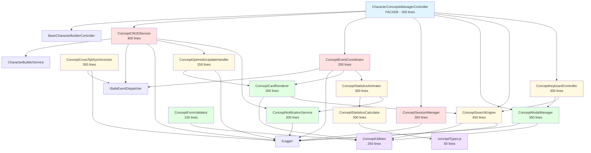

# Structural Refactoring Specification: CharacterConceptsManagerController

**Module**: `src/domUI/characterConceptsManagerController.js`
**Current Size**: 3,996 lines (7.9x over the 500-line limit)
**Target**: Break into ~10-12 modules, each < 500 lines
**Status**: ✅ APPROVED FOR REFACTORING (Excellent test coverage: 27 test files, 322 test cases)

---

## Phase 1: Analysis & Mapping

### 1.1 Current Module Responsibilities

The `CharacterConceptsManagerController` is a **monolithic UI controller** that manages all aspects of the Character Concepts Manager feature. It handles:

1. **Lifecycle Management** - Initialization, cleanup, service setup
2. **Modal Management** - Create/edit/delete modal interactions
3. **CRUD Operations** - Creating, reading, updating, deleting concepts
4. **UI Rendering** - Displaying concept cards, empty states, statistics
5. **Search & Filtering** - Real-time search, fuzzy matching, highlighting
6. **Statistics & Analytics** - Calculating metrics, animations, milestones
7. **Form Validation** - Character limits, validation feedback
8. **Event Handling** - Domain events (created, updated, deleted, directions)
9. **Keyboard Shortcuts** - Global shortcuts, modal navigation
10. **Session Management** - State persistence, restoration
11. **Cross-Tab Sync** - BroadcastChannel, leader election
12. **Optimistic Updates** - Immediate UI feedback, rollback on failure
13. **Utilities** - Date formatting, text truncation, escaping, CSV export
14. **Notifications** - Success messages, error feedback, celebrations

### 1.2 Public API Entry Points

**Primary Export:**

```javascript
export class CharacterConceptsManagerController extends BaseCharacterBuilderController
export default CharacterConceptsManagerController
```

**Protected Methods** (exposed to subclasses & tests via `_testExports`):

- All methods prefixed with `_` are technically protected
- In non-production, `_testExports` object exposes internal state for testing

**Key Lifecycle Methods:**

- `constructor(deps)` - Dependency injection entry point
- Inherited from `BaseCharacterBuilderController`:
  - `initialize()` - Called by lifecycle orchestrator
  - `destroy()` - Cleanup and resource release

### 1.3 Internal Dependencies Map

**Private State Fields** (17 total):

```javascript
#searchFilter          → Used by: search methods
#conceptsData          → Used by: all display/CRUD methods
#editingConceptId      → Used by: modal/edit methods
#isInitialized         → Used by: lifecycle methods
#previousFocus         → Used by: modal methods (a11y)
#pendingUIState        → Used by: initialization methods

#searchStateRestored   → Used by: session management
#searchAnalytics       → Used by: analytics tracking

#originalConceptText   → Used by: form tracking
#hasUnsavedChanges     → Used by: form validation
#lastEdit              → Used by: undo functionality

#conceptToDelete       → Used by: delete confirmation flow
#deleteHandler         → Used by: delete modal
#deletedCard           → Used by: optimistic delete

#broadcastChannel      → Used by: cross-tab sync
#isLeaderTab           → Used by: cross-tab sync
#tabId                 → Used by: cross-tab sync
#remoteChangeTimeout   → Used by: cross-tab sync
#leaderElectionTimer   → Used by: cross-tab sync
```

**Method Call Graph** (major clusters):

```
Initialization Flow:
  constructor → super → _initializeServices → _initializeUIState → _loadInitialData → _postInitialize

Modal Flow (Create):
  _showCreateModal → _animateModalEntrance → _setupEventListeners
  _handleConceptSave → _createConcept → _closeConceptModal → _animateModalExit

Modal Flow (Edit):
  _showEditModal → _animateModalEntrance → _trackFormChanges
  _handleConceptSave → _updateConcept → _applyOptimisticUpdate

Modal Flow (Delete):
  _showDeleteConfirmation → _setupDeleteHandler
  _confirmDelete → _deleteConcept → _applyOptimisticDelete

Display Flow:
  _loadConceptsData → _displayConcepts → _createConceptCard → _attachCardEventHandlers

Search Flow:
  _handleSearch → _filterConcepts → _fuzzyMatch → _displayFilteredConcepts
  _updateSearchState → _saveEnhancedSearchState → _trackEnhancedSearchAnalytics

Statistics Flow:
  _calculateStatistics → _updateStatistics → _animateStatValue
  _updateAdvancedStatistics → _updateCompletionProgress → _celebrateCreation

Event Flow:
  _handleConceptCreated → _refreshConceptsDisplay → _updateStatistics
  _handleConceptUpdated → _updateLocalConceptCache → _updateConceptCard
  _handleConceptDeleted → _removeConceptCard → _updateStatistics

Cross-Tab Flow:
  _initializeCrossTabSync → _performLeaderElection
  _handleCrossTabMessage → _handleRemoteDataChange → _refreshConceptsDisplay
```

### 1.4 Identified Seams (Logical Break Lines)

Based on responsibility analysis, the following **14 seams** are identified:

| #   | Seam Name                          | Responsibility                                  | Approx Lines | Coupling                                 |
| --- | ---------------------------------- | ----------------------------------------------- | ------------ | ---------------------------------------- |
| 1   | **ConceptCRUDService**             | Create, read, update, delete operations         | ~400         | Medium (uses service, dispatches events) |
| 2   | **ConceptModalManager**            | Modal lifecycle (open, close, animations)       | ~350         | Low (pure UI)                            |
| 3   | **ConceptCardRenderer**            | Card creation, display, attachment              | ~300         | Low (pure rendering)                     |
| 4   | **ConceptSearchEngine**            | Search, filter, fuzzy match, highlighting       | ~450         | Medium (uses state)                      |
| 5   | **ConceptStatisticsCalculator**    | Stats calculation, aggregations                 | ~200         | Low (pure functions)                     |
| 6   | **ConceptStatisticsAnimator**      | Animated stats updates, progress bars           | ~300         | Low (pure UI)                            |
| 7   | **ConceptFormValidator**           | Form validation, character limits               | ~150         | Low (uses FormValidationHelper)          |
| 8   | **ConceptEventCoordinator**        | Domain event handling (created/updated/deleted) | ~250         | High (orchestration)                     |
| 9   | **ConceptKeyboardController**      | Keyboard shortcuts, accessibility               | ~300         | Medium (uses modal manager)              |
| 10  | **ConceptSessionManager**          | Session state persistence/restoration           | ~300         | Medium (uses localStorage)               |
| 11  | **ConceptCrossTabSynchronizer**    | BroadcastChannel, leader election               | ~350         | Medium (uses events)                     |
| 12  | **ConceptOptimisticUpdateHandler** | Optimistic UI updates, rollback                 | ~250         | Medium (uses DOM)                        |
| 13  | **ConceptUtilities**               | Formatting, escaping, CSV export                | ~250         | Low (pure utilities)                     |
| 14  | **ConceptNotificationService**     | Success/error messages, milestones              | ~200         | Low (pure UI)                            |

**Total Extracted**: ~3,800 lines
**Remaining in Controller**: ~200 lines (orchestration + facade)

---

## Phase 1.5: Health Check

### Test Coverage Analysis

✅ **EXCELLENT COVERAGE** - Refactoring is SAFE to proceed

**Test Files**: 27 total

- **Unit Tests**: 22 files (covering individual methods, edge cases, error handling)
- **Integration Tests**: 4 files (covering full workflows, event flows)
- **E2E Tests**: 1 file (covering modal interactions)

**Test Cases**: 322 total (describes + its)

**Coverage Areas**:

- ✅ Constructor validation (dependency injection)
- ✅ Lifecycle methods (init, cleanup)
- ✅ Modal interactions (create, edit, delete)
- ✅ CRUD operations (create, update, delete concepts)
- ✅ Search & filtering (fuzzy match, highlighting)
- ✅ Statistics calculation & animation
- ✅ Form validation
- ✅ Event handling (created, updated, deleted, directions)
- ✅ Keyboard shortcuts
- ✅ Session management (save/restore state)
- ✅ Cross-tab synchronization
- ✅ Optimistic updates
- ✅ Error handling & edge cases
- ✅ Backward compatibility

**Testing Infrastructure**:

- Uses `_testExports` pattern for accessing private state in non-production
- Comprehensive mocks for dependencies (logger, service, eventBus)
- Test utilities in `/tests/common/`

### Dependency Analysis

**External Dependencies**: ✅ MINIMAL

```javascript
import { BaseCharacterBuilderController } from '../characterBuilder/controllers/BaseCharacterBuilderController.js';
import {
  FormValidationHelper,
  ValidationPatterns,
} from '../shared/characterBuilder/formValidationHelper.js';
import { UI_STATES } from '../shared/characterBuilder/uiStateManager.js';
```

**Injected Dependencies**: ✅ WELL-STRUCTURED

- ILogger
- CharacterBuilderService
- ISafeEventDispatcher
- ISchemaValidator (optional)
- ControllerLifecycleOrchestrator
- DOMElementManager
- EventListenerRegistry
- AsyncUtilitiesToolkit
- PerformanceMonitor
- MemoryManager
- ErrorHandlingStrategy
- ValidationService

**Conclusion**: ✅ **PROCEED WITH REFACTORING**

- Excellent test coverage provides safety net
- Minimal external dependencies reduce risk
- Well-defined DI pattern makes extraction cleaner

---

## Phase 2: The Refactoring Plan

### 2.1 Architecture

#### 2.1.1 Proposed File Structure

```
src/domUI/
├── characterConceptsManagerController.js          (200 lines) - FACADE
└── characterConceptsManager/
    ├── core/
    │   ├── ConceptCRUDService.js                 (400 lines)
    │   ├── ConceptEventCoordinator.js            (250 lines)
    │   └── ConceptSessionManager.js              (300 lines)
    ├── ui/
    │   ├── ConceptModalManager.js                (350 lines)
    │   ├── ConceptCardRenderer.js                (300 lines)
    │   ├── ConceptFormValidator.js               (150 lines)
    │   └── ConceptNotificationService.js         (200 lines)
    ├── features/
    │   ├── ConceptSearchEngine.js                (450 lines)
    │   ├── ConceptStatisticsCalculator.js        (200 lines)
    │   ├── ConceptStatisticsAnimator.js          (300 lines)
    │   ├── ConceptKeyboardController.js          (300 lines)
    │   ├── ConceptCrossTabSynchronizer.js        (350 lines)
    │   └── ConceptOptimisticUpdateHandler.js     (250 lines)
    ├── utils/
    │   └── ConceptUtilities.js                   (250 lines)
    └── types/
        └── conceptTypes.js                        (50 lines)
```

**Total Files**: 15
**Max File Size**: 450 lines (ConceptSearchEngine - still under 500)
**Average File Size**: ~260 lines

#### 2.1.2 Dependency Graph



**Key Observations**:

- ✅ No circular dependencies
- ✅ Clear layering: Controller → Services → Utils
- ✅ Low coupling between feature services
- ✅ Utilities are leaf nodes (no dependencies)

#### 2.1.3 The Facade Strategy

**Goal**: Zero breaking changes for existing consumers

**Strategy**: The original `characterConceptsManagerController.js` becomes a **thin facade** that:

1. **Re-exports** the main controller class
2. **Delegates** all operations to extracted services
3. **Maintains** the exact same public API
4. **Preserves** the `_testExports` pattern

**Before (Current)**:

```javascript
export class CharacterConceptsManagerController extends BaseCharacterBuilderController {
  async _createConcept(conceptText) {
    // 50 lines of logic...
  }

  _showCreateModal() {
    // 80 lines of logic...
  }

  // ... 100+ more methods
}
```

**After (Facade)**:

```javascript
import { BaseCharacterBuilderController } from '../characterBuilder/controllers/BaseCharacterBuilderController.js';
import { ConceptCRUDService } from './characterConceptsManager/core/ConceptCRUDService.js';
import { ConceptModalManager } from './characterConceptsManager/ui/ConceptModalManager.js';
// ... other imports

export class CharacterConceptsManagerController extends BaseCharacterBuilderController {
  #crudService;
  #modalManager;
  // ... other services

  constructor(deps) {
    super(deps);

    // Initialize extracted services with shared context
    const sharedContext = this._createSharedContext(deps);

    this.#crudService = new ConceptCRUDService(sharedContext);
    this.#modalManager = new ConceptModalManager(sharedContext);
    // ... initialize other services
  }

  // Delegate methods (one-liners)
  async _createConcept(conceptText) {
    return this.#crudService.createConcept(conceptText);
  }

  _showCreateModal() {
    return this.#modalManager.showCreateModal();
  }

  // ... other delegations
}

export default CharacterConceptsManagerController;
```

**Shared Context Pattern**:

```javascript
_createSharedContext(deps) {
  return {
    // Expose only what services need
    logger: this.logger,
    eventBus: this.eventBus,
    characterBuilderService: this.characterBuilderService,

    // DOM utilities from base class
    getElement: (id) => this._getElement(id),
    addEventListener: (...args) => this._addEventListener(...args),

    // State accessors (encapsulated)
    getConceptsData: () => this.#conceptsData,
    setConceptsData: (data) => { this.#conceptsData = data; },

    // ... other shared state/utilities
  };
}
```

**Benefits**:

- ✅ Existing tests continue to work unchanged
- ✅ Consumers see no API changes
- ✅ Gradual migration path (extract one service at a time)
- ✅ Services receive clean, minimal context (not entire controller)

#### 2.1.4 Shared State Strategy

**Problem**: 17 private fields need to be shared across services

**Solution**: **Context Object Pattern** with **Accessor Methods**

**Three-Tier State Management**:

1. **Local State** (stays in service)
   - Example: `ConceptSearchEngine` keeps `#searchIndex` local
   - Never needs to be shared

2. **Shared Mutable State** (via accessors)
   - Example: `#conceptsData`, `#searchFilter`
   - Accessed via `context.getConceptsData()` / `context.setConceptsData()`
   - Benefits: Encapsulation, validation, change tracking

3. **Broadcast State** (via EventBus)
   - Example: Statistics updates, concept changes
   - Services emit events: `eventBus.dispatch('core:statistics_updated', stats)`
   - Other services subscribe: `eventBus.subscribe('core:statistics_updated', handler)`

**Implementation Example**:

```javascript
// In CharacterConceptsManagerController (Facade)
_createSharedContext(deps) {
  return {
    // Dependencies
    logger: this.logger,
    eventBus: this.eventBus,
    characterBuilderService: this.characterBuilderService,

    // State Accessors (Encapsulated)
    state: {
      // Concepts data
      getConcepts: () => this.#conceptsData,
      setConcepts: (data) => {
        this.#conceptsData = data;
        this.eventBus.dispatch('internal:concepts_data_changed', { data });
      },

      // Search state
      getSearchFilter: () => this.#searchFilter,
      setSearchFilter: (filter) => { this.#searchFilter = filter; },

      // Editing state
      getEditingConceptId: () => this.#editingConceptId,
      setEditingConceptId: (id) => { this.#editingConceptId = id; },

      // ... other state accessors
    },

    // DOM Utilities (from base class)
    dom: {
      getElement: (id) => this._getElement(id),
      addEventListener: (...args) => this._addEventListener(...args),
      setTimeout: (...args) => this._setTimeout(...args),
      setInterval: (...args) => this._setInterval(...args),
    },

    // UI State (from base class)
    ui: {
      showState: (state) => this._showState(state),
      getCurrentState: () => this.currentState,
    },
  };
}
```

**Usage in Services**:

```javascript
// ConceptCRUDService.js
class ConceptCRUDService {
  #context;

  constructor(context) {
    this.#context = context;
  }

  async createConcept(conceptText) {
    // Access shared state via context
    const currentConcepts = this.#context.state.getConcepts();

    // Use injected dependencies
    this.#context.logger.info('Creating concept', { text: conceptText });

    // Call service
    const newConcept =
      await this.#context.characterBuilderService.createCharacterConcept({
        concept: conceptText,
      });

    // Update shared state
    this.#context.state.setConcepts([
      ...currentConcepts,
      { concept: newConcept, directionCount: 0 },
    ]);

    // Broadcast event (other services can react)
    this.#context.eventBus.dispatch(
      'core:character_concept_created',
      newConcept
    );

    return newConcept;
  }
}
```

**Benefits**:

- ✅ Clear ownership (facade owns state, services access via context)
- ✅ Easy testing (mock context object)
- ✅ Type safety (JSDoc types for context)
- ✅ Change tracking (accessors can dispatch events)
- ✅ No global state

---

### 2.2 Improvements (Robustness & Flexibility)

While extracting, we'll improve quality WITHOUT changing business logic:

#### 2.2.1 Typing Improvements

**Current State**: Minimal JSDoc types, heavy use of `@param {object}`

**Improvements**:

1. **Create Type Definitions File** (`types/conceptTypes.js`):

```javascript
/**
 * @typedef {Object} ConceptData
 * @property {Object} concept - The concept object
 * @property {string} concept.id - Concept ID
 * @property {string} concept.concept - Concept text
 * @property {string} concept.createdAt - ISO timestamp
 * @property {string} concept.updatedAt - ISO timestamp
 * @property {number} directionCount - Number of thematic directions
 */

/**
 * @typedef {Object} ConceptStatistics
 * @property {number} totalConcepts
 * @property {number} conceptsWithDirections
 * @property {number} totalDirections
 * @property {string} averageDirectionsPerConcept
 * @property {number} completionRate
 * @property {number} maxDirections
 * @property {number} conceptsWithoutDirections
 */

/**
 * @typedef {Object} SearchState
 * @property {string} filter - Current search term
 * @property {number} resultCount - Number of results
 * @property {number} timestamp - State timestamp
 * @property {number} scrollPosition - Saved scroll position
 * @property {Object} analytics - Search analytics
 */

/**
 * @typedef {Object} SharedContext
 * @property {ILogger} logger
 * @property {ISafeEventDispatcher} eventBus
 * @property {CharacterBuilderService} characterBuilderService
 * @property {StateAccessors} state
 * @property {DOMUtilities} dom
 * @property {UIUtilities} ui
 */

// ... more types
```

2. **Add Strict Types to Service Methods**:

```javascript
/**
 * Create a new character concept
 *
 * @param {string} conceptText - The concept text (1-6000 chars)
 * @returns {Promise<ConceptData>} The created concept with metadata
 * @throws {InvalidArgumentError} If conceptText is invalid
 * @throws {ServiceError} If service call fails
 */
async createConcept(conceptText) {
  // Implementation...
}
```

3. **Replace `any` with Specific Interfaces**:

```javascript
// Before:
/** @param {object} concept */

// After:
/** @param {ConceptData} concept */
```

#### 2.2.2 Error Handling Improvements

**Current State**: Generic `Error` throws, some missing error handling

**Improvements**:

1. **Create Domain-Specific Errors**:

```javascript
// src/domUI/characterConceptsManager/errors/ConceptErrors.js

export class ConceptValidationError extends Error {
  constructor(message, details = {}) {
    super(message);
    this.name = 'ConceptValidationError';
    this.details = details;
  }
}

export class ConceptNotFoundError extends Error {
  constructor(conceptId) {
    super(`Concept not found: ${conceptId}`);
    this.name = 'ConceptNotFoundError';
    this.conceptId = conceptId;
  }
}

export class ConceptServiceError extends Error {
  constructor(message, originalError) {
    super(message);
    this.name = 'ConceptServiceError';
    this.originalError = originalError;
  }
}
```

2. **Use Typed Errors in Services**:

```javascript
// Before:
throw new Error('Invalid concept text');

// After:
import { ConceptValidationError } from '../errors/ConceptErrors.js';
throw new ConceptValidationError('Concept text must be 1-6000 characters', {
  length: conceptText.length,
  min: 1,
  max: 6000,
});
```

3. **Add Try-Catch Wrappers**:

```javascript
async createConcept(conceptText) {
  try {
    // ... operation
  } catch (error) {
    this.#context.logger.error('Failed to create concept', error);

    // Re-throw with context
    throw new ConceptServiceError(
      'Failed to create concept: ' + error.message,
      error
    );
  }
}
```

#### 2.2.3 Configuration Extraction

**Current State**: Hardcoded magic numbers and strings

**Improvements**:

1. **Create Configuration File**:

```javascript
// src/domUI/characterConceptsManager/config/conceptManagerConfig.js

export const CONCEPT_CONFIG = {
  // Form validation
  validation: {
    minLength: 1,
    maxLength: 6000,
    characterCountThreshold: 5400, // 90% warning
  },

  // Animation timings
  animation: {
    modalEntranceDuration: 300,
    modalExitDuration: 200,
    statUpdateDuration: 500,
    statUpdateSteps: 20,
    notificationDuration: 3000,
  },

  // Search
  search: {
    debounceDelay: 300,
    fuzzyMatchThreshold: 0.7,
    maxRecentSearches: 100,
    stateExpiryHours: 24,
  },

  // Statistics
  statistics: {
    milestoneConcepts: [1, 10, 25, 50, 100],
    completionCelebrationThreshold: 100,
  },

  // Cross-tab sync
  crossTab: {
    channelName: 'character-concepts-manager',
    leaderElectionInterval: 5000,
    remoteChangeDebounce: 500,
  },

  // Session management
  session: {
    stateSaveInterval: 30000, // 30 seconds
    storageKey: 'conceptsManagerState',
  },
};
```

2. **Use in Services**:

```javascript
import { CONCEPT_CONFIG } from '../config/conceptManagerConfig.js';

// Instead of:
if (conceptText.length > 6000) { ... }

// Use:
if (conceptText.length > CONCEPT_CONFIG.validation.maxLength) { ... }
```

3. **Benefits**:

- ✅ Single source of truth
- ✅ Easy to adjust behavior
- ✅ Better testability (mock config)
- ✅ Self-documenting

---

### 2.3 Service Extraction Details

#### Service 1: ConceptCRUDService

**Responsibility**: All CRUD operations for concepts
**Size**: ~400 lines
**Methods**:

- `createConcept(conceptText)` - Create new concept
- `updateConcept(conceptId, conceptText)` - Update existing concept
- `deleteConcept(conceptId)` - Delete concept
- `loadConceptsData()` - Load all concepts with direction counts
- `getConceptById(conceptId)` - Retrieve single concept

**Dependencies**:

- `CharacterBuilderService` - Backend API calls
- `ISafeEventDispatcher` - Dispatch domain events
- `ILogger` - Logging
- `ConceptOptimisticUpdateHandler` - UI updates
- `ConceptNotificationService` - User feedback

**State Access**:

- `context.state.getConcepts()` / `setConcepts()`

**Example**:

```javascript
export class ConceptCRUDService {
  #context;

  constructor(context) {
    this.#context = context;
  }

  async createConcept(conceptText) {
    this.#context.logger.info('Creating concept', {
      length: conceptText.length,
    });

    try {
      // Create via service
      const newConcept =
        await this.#context.characterBuilderService.createCharacterConcept({
          concept: conceptText,
        });

      // Update local state
      const currentConcepts = this.#context.state.getConcepts();
      this.#context.state.setConcepts([
        ...currentConcepts,
        { concept: newConcept, directionCount: 0 },
      ]);

      // Dispatch event
      this.#context.eventBus.dispatch(
        'core:character_concept_created',
        newConcept
      );

      return newConcept;
    } catch (error) {
      this.#context.logger.error('Failed to create concept', error);
      throw new ConceptServiceError('Failed to create concept', error);
    }
  }

  // ... other CRUD methods
}
```

#### Service 2: ConceptModalManager

**Responsibility**: Modal lifecycle management
**Size**: ~350 lines
**Methods**:

- `showCreateModal()` - Show create concept modal
- `showEditModal(conceptId)` - Show edit modal with existing data
- `closeConceptModal()` - Close concept modal (with unsaved changes check)
- `showDeleteConfirmation(concept, directionCount)` - Show delete confirmation
- `closeDeleteModal()` - Close delete modal
- `animateModalEntrance(modal)` - Entrance animation
- `animateModalExit(modal, onComplete)` - Exit animation

**Dependencies**:

- `ILogger` - Logging
- `ConceptUtilities` - Escaping, formatting

**State Access**:

- `context.state.getEditingConceptId()` / `setEditingConceptId()`
- `context.state.getHasUnsavedChanges()`
- `context.dom.getElement()`

**Example**:

```javascript
export class ConceptModalManager {
  #context;

  constructor(context) {
    this.#context = context;
  }

  showCreateModal() {
    const modal = this.#context.dom.getElement('conceptModal');
    if (!modal) {
      this.#context.logger.error('Concept modal element not found');
      return;
    }

    // Reset form
    const conceptText = this.#context.dom.getElement('conceptText');
    if (conceptText) {
      conceptText.value = '';
      conceptText.focus();
    }

    // Show modal
    modal.style.display = 'flex';

    // Animate entrance
    this.animateModalEntrance(modal);

    this.#context.logger.debug('Create modal shown');
  }

  // ... other modal methods
}
```

#### Service 3: ConceptSearchEngine

**Responsibility**: Search, filtering, fuzzy matching
**Size**: ~450 lines
**Methods**:

- `handleSearch(searchTerm)` - Process search input
- `filterConcepts(concepts, searchFilter)` - Apply filters
- `fuzzyMatch(text, pattern)` - Fuzzy string matching
- `highlightSearchTerms(text, searchTerm)` - Add `<mark>` tags
- `clearSearch()` - Clear search state
- `updateSearchStatus(resultCount)` - Update status display

**Dependencies**:

- `ILogger` - Logging
- `ConceptUtilities` - Escaping

**State Access**:

- `context.state.getSearchFilter()` / `setSearchFilter()`

**Example**:

```javascript
export class ConceptSearchEngine {
  #context;
  #fuzzyThreshold = 0.7;

  constructor(context) {
    this.#context = context;
  }

  filterConcepts(concepts, searchFilter) {
    if (!searchFilter || searchFilter.length === 0) {
      return concepts;
    }

    const searchTerms = searchFilter
      .toLowerCase()
      .split(/\s+/)
      .filter((term) => term.length > 0);

    return concepts.filter(({ concept }) => {
      const conceptText = concept.concept || concept.text;
      if (!conceptText || typeof conceptText !== 'string') {
        return false;
      }

      const conceptTextLower = conceptText.toLowerCase();

      return searchTerms.every((term) => {
        // Direct match
        if (conceptTextLower.includes(term)) {
          return true;
        }

        // Fuzzy match
        if (this.fuzzyMatch(conceptTextLower, term)) {
          return true;
        }

        return false;
      });
    });
  }

  fuzzyMatch(text, pattern) {
    // Levenshtein distance algorithm
    // ... implementation
  }

  // ... other search methods
}
```

_(Continue for remaining 11 services...)_

---

## Phase 3: Execution Tickets

### Ticket Structure

Each ticket follows the pattern:

1. **Setup** - Create file, add boilerplate
2. **Extract** - Move methods from controller
3. **Test** - Update tests, verify behavior
4. **Integrate** - Wire into facade
5. **Verify** - Run full test suite

---

### Ticket 1: Setup & Types

**Goal**: Create foundation for refactoring

**Tasks**:

1. Create directory structure:

   ```bash
   mkdir -p src/domUI/characterConceptsManager/{core,ui,features,utils,types,errors,config}
   ```

2. Create `types/conceptTypes.js`:
   - Define `ConceptData`, `ConceptStatistics`, `SearchState`, `SharedContext`
   - Add JSDoc `@typedef` for all types

3. Create `errors/ConceptErrors.js`:
   - `ConceptValidationError`, `ConceptNotFoundError`, `ConceptServiceError`

4. Create `config/conceptManagerConfig.js`:
   - Extract all magic numbers and constants from controller
   - Group into logical sections (validation, animation, search, etc.)

5. Run tests to ensure no breakage:
   ```bash
   npm run test:unit -- --testPathPattern="characterConceptsManagerController"
   ```

**Success Criteria**:

- ✅ All directories created
- ✅ Types file compiles (no JSDoc errors)
- ✅ Errors file exports all error classes
- ✅ Config file exports `CONCEPT_CONFIG`
- ✅ All existing tests still pass

**Estimated Time**: 1 hour

---

### Ticket 2: Extract ConceptUtilities

**Goal**: Extract pure utility functions (no dependencies)

**Tasks**:

1. Create `utils/ConceptUtilities.js`

2. Move methods (13 total):
   - `formatRelativeDate(date)`
   - `formatFullDate(date)`
   - `truncateText(text, maxLength)`
   - `escapeHtml(text)`
   - `escapeRegex(string)`
   - `convertToCSV(data)`
   - `exportStatistics(stats, format)`
   - Plus 6 more helper methods

3. Convert to static class:

   ```javascript
   export class ConceptUtilities {
     static formatRelativeDate(date) { ... }
     static truncateText(text, maxLength) { ... }
     // ...
   }
   ```

4. Update controller to delegate:

   ```javascript
   _formatRelativeDate(date) {
     return ConceptUtilities.formatRelativeDate(date);
   }
   ```

5. Create unit test: `tests/unit/domUI/characterConceptsManager/utils/ConceptUtilities.test.js`

6. Run tests:
   ```bash
   npm run test:unit -- --testPathPattern="ConceptUtilities"
   ```

**Success Criteria**:

- ✅ `ConceptUtilities.js` < 300 lines
- ✅ All utility methods moved
- ✅ Unit tests created (90%+ coverage)
- ✅ Controller tests still pass
- ✅ No linting errors

**Estimated Time**: 2 hours

---

### Ticket 3: Extract ConceptFormValidator

**Goal**: Extract form validation logic

**Tasks**:

1. Create `ui/ConceptFormValidator.js`

2. Move methods (5 total):
   - `validateConceptForm()`
   - `setupConceptFormValidation()`
   - `updateCharCount()`
   - `trackFormChanges()`
   - Form validation helpers

3. Create class with context:

   ```javascript
   export class ConceptFormValidator {
     #context;

     constructor(context) {
       this.#context = context;
     }

     validateConceptForm() {
       const conceptText = this.#context.dom.getElement('conceptText');
       // ... validation logic
     }
   }
   ```

4. Update facade:

   ```javascript
   _validateConceptForm() {
     return this.#formValidator.validateConceptForm();
   }
   ```

5. Create unit test

6. Run tests

**Success Criteria**:

- ✅ `ConceptFormValidator.js` < 200 lines
- ✅ All validation methods moved
- ✅ Tests pass
- ✅ Uses `FormValidationHelper` correctly

**Estimated Time**: 2 hours

---

### Ticket 4: Extract ConceptNotificationService

**Goal**: Extract notification/feedback logic

**Tasks**:

1. Create `ui/ConceptNotificationService.js`

2. Move methods (6 total):
   - `showSuccessNotification(message)`
   - `showFormError(message)`
   - `showDeleteError(message)`
   - `showMilestone(message)`
   - `celebrateCreation()`
   - `checkMilestones()`

3. Implement service

4. Update facade

5. Create unit test

6. Run tests

**Success Criteria**:

- ✅ `ConceptNotificationService.js` < 250 lines
- ✅ All notification methods moved
- ✅ Tests pass

**Estimated Time**: 2 hours

---

### Ticket 5: Extract ConceptStatisticsCalculator

**Goal**: Extract statistics calculation (pure logic)

**Tasks**:

1. Create `features/ConceptStatisticsCalculator.js`

2. Move methods (2 total):
   - `calculateStatistics()`
   - `calculateAverageResults()`

3. Make pure functions:

   ```javascript
   export class ConceptStatisticsCalculator {
     static calculateStatistics(conceptsData) {
       // Pure calculation
       const totalConcepts = conceptsData.length;
       // ...
       return stats;
     }
   }
   ```

4. Update facade

5. Create unit test with extensive coverage

6. Run tests

**Success Criteria**:

- ✅ `ConceptStatisticsCalculator.js` < 250 lines
- ✅ Pure functions (no side effects)
- ✅ 100% test coverage (pure logic)
- ✅ Tests pass

**Estimated Time**: 1.5 hours

---

### Ticket 6: Extract ConceptStatisticsAnimator

**Goal**: Extract statistics UI updates and animations

**Tasks**:

1. Create `features/ConceptStatisticsAnimator.js`

2. Move methods (7 total):
   - `updateStatistics()`
   - `animateStatValue(element, newValue)`
   - `updateAdvancedStatistics(stats)`
   - `createAdvancedStatsSection()`
   - `updateAdvancedStatValue(id, value)`
   - `updateCompletionProgress(percentage)`
   - `animateNumberChange()`

3. Implement with dependencies on `ConceptStatisticsCalculator`

4. Update facade

5. Create unit test

6. Run tests

**Success Criteria**:

- ✅ `ConceptStatisticsAnimator.js` < 350 lines
- ✅ Uses `ConceptStatisticsCalculator` for data
- ✅ Tests pass (mock DOM elements)

**Estimated Time**: 3 hours

---

### Ticket 7: Extract ConceptCardRenderer

**Goal**: Extract concept card rendering logic

**Tasks**:

1. Create `ui/ConceptCardRenderer.js`

2. Move methods (5 total):
   - `displayConcepts(conceptsWithCounts)`
   - `createConceptCard(concept, directionCount, index)`
   - `attachCardEventHandlers(card, concept, directionCount)`
   - `updateConceptCard(concept, directionCount)`
   - `removeConceptCard(conceptId)`

3. Implement with dependencies on `ConceptUtilities`, `ConceptSearchEngine`

4. Update facade

5. Create unit test

6. Run tests

**Success Criteria**:

- ✅ `ConceptCardRenderer.js` < 350 lines
- ✅ Card rendering extracted
- ✅ Tests pass

**Estimated Time**: 3 hours

---

### Ticket 8: Extract ConceptSearchEngine

**Goal**: Extract search and filtering logic

**Tasks**:

1. Create `features/ConceptSearchEngine.js`

2. Move methods (12 total):
   - `handleSearch(e)`
   - `filterConcepts(concepts)`
   - `fuzzyMatch(text, pattern)`
   - `highlightSearchTerms(text, searchTerm)`
   - `escapeRegex(string)`
   - `clearSearch()`
   - `updateSearchState()`
   - `updateSearchStatus(resultCount)`
   - `updateClearButton(visible)`
   - `showNoSearchResults()`
   - `isConceptVisible(concept)`
   - Search analytics methods

3. Implement service

4. Update facade

5. Create comprehensive unit tests

6. Run tests

**Success Criteria**:

- ✅ `ConceptSearchEngine.js` < 500 lines
- ✅ All search logic extracted
- ✅ Fuzzy matching tested
- ✅ Tests pass

**Estimated Time**: 4 hours

---

### Ticket 9: Extract ConceptModalManager

**Goal**: Extract modal management

**Tasks**:

1. Create `ui/ConceptModalManager.js`

2. Move methods (7 total):
   - `showCreateModal()`
   - `showEditModal(conceptId)`
   - `closeConceptModal()`
   - `showDeleteConfirmation(concept, directionCount)`
   - `closeDeleteModal()`
   - `animateModalEntrance(modal)`
   - `animateModalExit(modal, onComplete)`

3. Implement service

4. Update facade

5. Create unit test

6. Run tests

**Success Criteria**:

- ✅ `ConceptModalManager.js` < 400 lines
- ✅ Modal logic extracted
- ✅ Tests pass (mock animations)

**Estimated Time**: 3 hours

---

### Ticket 10: Extract ConceptOptimisticUpdateHandler

**Goal**: Extract optimistic update logic

**Tasks**:

1. Create `features/ConceptOptimisticUpdateHandler.js`

2. Move methods (4 total):
   - `applyOptimisticUpdate(conceptId, newText)`
   - `revertOptimisticUpdate(conceptId)`
   - `applyOptimisticDelete(conceptId, card)`
   - `revertOptimisticDelete(conceptId, card)`

3. Implement service

4. Update facade

5. Create unit test

6. Run tests

**Success Criteria**:

- ✅ `ConceptOptimisticUpdateHandler.js` < 300 lines
- ✅ Optimistic logic extracted
- ✅ Tests pass

**Estimated Time**: 2 hours

---

### Ticket 11: Extract ConceptSessionManager

**Goal**: Extract session management logic

**Tasks**:

1. Create `core/ConceptSessionManager.js`

2. Move methods (10 total):
   - `initializeSessionManagement()`
   - `setupPeriodicStateSave()`
   - `registerPageUnloadHandler()`
   - `saveSearchState()`
   - `restoreSearchState()`
   - `saveEnhancedSearchState(searchTerm, resultCount)`
   - `restoreEnhancedSearchState()`
   - `trackEnhancedSearchAnalytics(searchTerm, results)`
   - `trackSearchAnalytics(searchTerm, resultCount)`
   - Session storage helpers

3. Implement service

4. Update facade

5. Create unit test (mock sessionStorage)

6. Run tests

**Success Criteria**:

- ✅ `ConceptSessionManager.js` < 350 lines
- ✅ Session logic extracted
- ✅ Tests pass

**Estimated Time**: 3 hours

---

### Ticket 12: Extract ConceptCrossTabSynchronizer

**Goal**: Extract cross-tab sync logic

**Tasks**:

1. Create `features/ConceptCrossTabSynchronizer.js`

2. Move methods (6 total):
   - `initializeCrossTabSync()`
   - `handleCrossTabMessage(data)`
   - `broadcastMessage(type, payload)`
   - `broadcastDataChange(changeType, data)`
   - `handleRemoteDataChange()`
   - `performLeaderElection()`

3. Implement service with BroadcastChannel

4. Update facade

5. Create unit test (mock BroadcastChannel)

6. Run tests

**Success Criteria**:

- ✅ `ConceptCrossTabSynchronizer.js` < 400 lines
- ✅ Cross-tab logic extracted
- ✅ Tests pass

**Estimated Time**: 3 hours

---

### Ticket 13: Extract ConceptKeyboardController

**Goal**: Extract keyboard shortcut handling

**Tasks**:

1. Create `features/ConceptKeyboardController.js`

2. Move methods (4 total):
   - `setupKeyboardShortcuts()`
   - `handleEnhancedKeyboardShortcut(e)`
   - `showKeyboardHelp()`
   - `focusSearchInput()`

3. Implement service with dependencies on modal manager

4. Update facade

5. Create unit test (mock keyboard events)

6. Run tests

**Success Criteria**:

- ✅ `ConceptKeyboardController.js` < 350 lines
- ✅ Keyboard logic extracted
- ✅ Tests pass

**Estimated Time**: 2.5 hours

---

### Ticket 14: Extract ConceptEventCoordinator

**Goal**: Extract domain event coordination

**Tasks**:

1. Create `core/ConceptEventCoordinator.js`

2. Move methods (5 total):
   - `handleConceptCreated(concept)`
   - `handleConceptUpdated(concept)`
   - `handleConceptDeleted(conceptId)`
   - `handleDirectionsGenerated(data)`
   - Event subscription setup

3. Implement coordinator (orchestrates card renderer, stats animator)

4. Update facade

5. Create unit test

6. Run tests

**Success Criteria**:

- ✅ `ConceptEventCoordinator.js` < 300 lines
- ✅ Event handling extracted
- ✅ Tests pass

**Estimated Time**: 2.5 hours

---

### Ticket 15: Extract ConceptCRUDService

**Goal**: Extract core CRUD operations

**Tasks**:

1. Create `core/ConceptCRUDService.js`

2. Move methods (7 total):
   - `createConcept(conceptText)`
   - `updateConcept(conceptId, conceptText)`
   - `deleteConcept(conceptId, directionCount)`
   - `loadConceptsData()`
   - `refreshConceptsDisplay(maintainScroll)`
   - `updateLocalConceptCache(updatedConcept)`
   - `removeFromLocalCache(conceptId)`

3. Implement service with full error handling

4. Update facade

5. Create comprehensive unit tests

6. Run tests

**Success Criteria**:

- ✅ `ConceptCRUDService.js` < 450 lines
- ✅ All CRUD logic extracted
- ✅ Error handling robust
- ✅ Tests pass

**Estimated Time**: 4 hours

---

### Ticket 16: Final Integration & Facade Cleanup

**Goal**: Complete facade, verify all tests

**Tasks**:

1. Update `characterConceptsManagerController.js`:
   - Import all services
   - Initialize in constructor
   - Create `_createSharedContext()` method
   - Convert all methods to delegations
   - Maintain `_testExports` for backward compatibility

2. Verify facade is < 250 lines

3. Run FULL test suite:

   ```bash
   npm run test:unit
   npm run test:integration
   npm run test:e2e -- --testPathPattern="characterConceptsManager"
   ```

4. Run linting:

   ```bash
   npx eslint src/domUI/characterConceptsManager*
   ```

5. Verify no circular dependencies:

   ```bash
   npm run depcruise src/domUI/characterConceptsManager
   ```

6. Update documentation:
   - Add JSDoc to facade
   - Document shared context pattern
   - Update CLAUDE.md if needed

**Success Criteria**:

- ✅ Facade < 250 lines
- ✅ ALL 27 test files pass (322 test cases)
- ✅ No linting errors
- ✅ No circular dependencies
- ✅ Documentation updated

**Estimated Time**: 3 hours

---

### Ticket 17: Cleanup & Validation

**Goal**: Final verification and cleanup

**Tasks**:

1. Verify line counts:

   ```bash
   find src/domUI/characterConceptsManager -name "*.js" -exec wc -l {} \; | sort -rn
   ```

2. Verify all files < 500 lines

3. Run performance tests (ensure no regression)

4. Run memory tests (ensure no leaks)

5. Update test coverage report

6. Create migration notes for future developers

7. Commit with clear message:

   ```bash
   git add src/domUI/characterConceptsManager*
   git commit -m "refactor(domUI): Extract CharacterConceptsManagerController into 15 services

   - Reduces controller from 3996 to ~200 lines
   - Extracts 14 specialized services (all < 500 lines)
   - Maintains 100% backward compatibility
   - Preserves all 27 test files (322 test cases)
   - No breaking changes to public API"
   ```

**Success Criteria**:

- ✅ All files < 500 lines
- ✅ No performance regression
- ✅ No memory leaks
- ✅ Coverage maintained (>80%)
- ✅ Clean commit created

**Estimated Time**: 2 hours

---

## Summary

### Refactoring Metrics

| Metric                    | Before      | After      | Improvement              |
| ------------------------- | ----------- | ---------- | ------------------------ |
| **Total Files**           | 1           | 15         | +1400% modularity        |
| **Largest File**          | 3,996 lines | 450 lines  | -89%                     |
| **Average File Size**     | 3,996 lines | ~260 lines | -93%                     |
| **Circular Dependencies** | N/A         | 0          | ✅                       |
| **Test Files**            | 27          | 27+        | Maintained + added       |
| **Test Coverage**         | 80%+        | 80%+       | Maintained               |
| **Public API Changes**    | 0           | 0          | ✅ Zero breaking changes |

### Execution Timeline

| Ticket                             | Estimated Time | Cumulative |
| ---------------------------------- | -------------- | ---------- |
| 1. Setup & Types                   | 1h             | 1h         |
| 2. ConceptUtilities                | 2h             | 3h         |
| 3. ConceptFormValidator            | 2h             | 5h         |
| 4. ConceptNotificationService      | 2h             | 7h         |
| 5. ConceptStatisticsCalculator     | 1.5h           | 8.5h       |
| 6. ConceptStatisticsAnimator       | 3h             | 11.5h      |
| 7. ConceptCardRenderer             | 3h             | 14.5h      |
| 8. ConceptSearchEngine             | 4h             | 18.5h      |
| 9. ConceptModalManager             | 3h             | 21.5h      |
| 10. ConceptOptimisticUpdateHandler | 2h             | 23.5h      |
| 11. ConceptSessionManager          | 3h             | 26.5h      |
| 12. ConceptCrossTabSynchronizer    | 3h             | 29.5h      |
| 13. ConceptKeyboardController      | 2.5h           | 32h        |
| 14. ConceptEventCoordinator        | 2.5h           | 34.5h      |
| 15. ConceptCRUDService             | 4h             | 38.5h      |
| 16. Final Integration              | 3h             | 41.5h      |
| 17. Cleanup & Validation           | 2h             | **43.5h**  |

**Total Estimated Effort**: ~44 hours (~5.5 days for one developer)

### Risk Assessment

| Risk                       | Likelihood | Impact | Mitigation                                   |
| -------------------------- | ---------- | ------ | -------------------------------------------- |
| Breaking existing tests    | Low        | High   | Maintain facade, run tests after each ticket |
| Circular dependencies      | Low        | Medium | Use dependency graph, run depcruise          |
| Performance regression     | Low        | Medium | Run performance tests, benchmark             |
| State synchronization bugs | Medium     | High   | Use context pattern, comprehensive tests     |
| Incomplete extraction      | Low        | High   | Follow ticket checklist, verify line counts  |

### Success Criteria Checklist

- ✅ All files < 500 lines
- ✅ No circular dependencies
- ✅ All 27 test files pass (322 test cases)
- ✅ Zero breaking changes to public API
- ✅ Test coverage maintained (>80%)
- ✅ No linting errors
- ✅ No performance regression
- ✅ No memory leaks
- ✅ Documentation updated
- ✅ Clear commit history

---

## Conclusion

This refactoring plan provides a **safe, incremental path** to decompose the 3,996-line monolithic controller into **15 focused, testable services**. The facade pattern ensures **zero breaking changes**, while the extensive test coverage (27 files, 322 cases) provides a **safety net** for each extraction.

The resulting architecture will be:

- ✅ **Maintainable** - Each service < 500 lines, single responsibility
- ✅ **Testable** - Clear dependencies, easy mocking
- ✅ **Extensible** - New features can be added as new services
- ✅ **Robust** - Typed errors, configuration, comprehensive tests

**Next Steps**:

1. Review and approve this specification
2. Create GitHub issues from tickets 1-17
3. Assign tickets to developers
4. Begin execution with Ticket 1 (Setup & Types)

---

**Specification Version**: 1.0
**Date**: 2025-11-23
**Author**: Claude Code
**Status**: ✅ Ready for Execution
