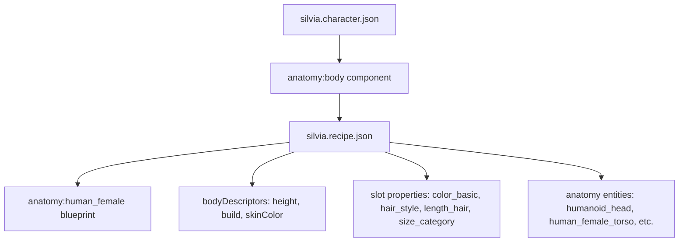

# Silvia Character Implementation Specification

## Document Information

| Field                     | Value                       |
| ------------------------- | --------------------------- |
| **Specification ID**      | `SILVIA-CHAR-001`           |
| **Version**               | 1.0.0                       |
| **Status**                | Proposed Implementation     |
| **Implementation Status** | Not Implemented             |
| **Priority**              | Medium                      |
| **Complexity**            | Low                         |
| **Dependencies**          | None (all components exist) |

## 1. Executive Summary

This specification defines the complete implementation requirements for creating a new character named "Silvia" within the Living Narrative Engine's p_erotica mod. **Note: This character has not been implemented yet - this document serves as a blueprint for future implementation.** Based on comprehensive architectural analysis, all required character traits are fully supported by the existing descriptor system, requiring no new components or schema modifications.

**Key Specification Facts:**

- **Character Name**: Silvia
- **Mod Namespace**: `p_erotica:silvia`
- **Implementation Method**: Two-file character system (character definition + anatomy recipe)
- **Required New Components**: None - all descriptors exist
- **Estimated Implementation Time**: 2-3 hours
- **Risk Level**: Low

## 2. Implementation Status

### Current State

- **Character Implementation**: ❌ Not Implemented
- **Files Created**: None
- **Specification Purpose**: Blueprint for future implementation
- **Validation**: All required components and schemas exist in the system

### Note on Similar Characters

The p_erotica mod contains several implemented characters (Jon Ureña, Amaia Castillo, Iker Aguirre) that demonstrate the two-file pattern this specification follows. Notably, the file `sugar_mommy.character.json` contains the character with ID `p_erotica:amaia_castillo`, showing that file names don't always match character IDs exactly.

## 3. Character Requirements Specification

### 3.1 Physical Characteristics

| Trait              | Implementation Method                 | Component                   | Property    | Value          | Status       |
| ------------------ | ------------------------------------- | --------------------------- | ----------- | -------------- | ------------ |
| Short height       | Recipe `bodyDescriptors.height`       | N/A                         | `height`    | `"short"`      | ✅ Available |
| Slender build      | `descriptors:build` component         | `descriptors:build`         | `build`     | `"slim"`       | ✅ Available |
| Fair skin          | Recipe `bodyDescriptors.skinColor`    | N/A                         | `skinColor` | `"fair"`       | ✅ Available |
| Red hair           | `descriptors:color_basic` component   | `descriptors:color_basic`   | `color`     | `"red"`        | ✅ Available |
| Medium hair length | `descriptors:length_hair` component   | `descriptors:length_hair`   | `length`    | `"medium"`     | ✅ Available |
| Pigtails style     | `descriptors:hair_style` component    | `descriptors:hair_style`    | `style`     | `"ponytails"`  | ✅ Available |
| Brown eyes         | `descriptors:color_basic` component   | `descriptors:color_basic`   | `color`     | `"brown"`      | ✅ Available |
| Small nose         | `descriptors:size_category` component | `descriptors:size_category` | `size`      | `"small"`      | ✅ Available |
| Youthful face      | Text description in profile           | `core:profile`              | `text`      | Custom content | ✅ Available |

### 3.2 Personality & Profile Components

| Component              | Type  | Purpose                | Content Requirements        |
| ---------------------- | ----- | ---------------------- | --------------------------- |
| `core:name`            | Text  | Character name         | "Silvia"                    |
| `core:profile`         | Text  | Character description  | Include youthful appearance |
| `core:personality`     | Text  | Personality traits     | Custom personality content  |
| `core:likes`           | Text  | Character preferences  | Custom likes                |
| `core:dislikes`        | Text  | Character aversions    | Custom dislikes             |
| `core:fears`           | Text  | Character fears        | Custom fears                |
| `movement:goals`           | Array | Character objectives   | At least one goal           |
| `core:secrets`         | Text  | Character secrets      | Custom secrets              |
| `core:speech_patterns` | Array | Speech characteristics | Speech pattern examples     |
| `core:apparent_age`    | Range | Age appearance         | 18-25 years                 |

## 4. Architecture Definition

### 4.1 File Structure

```
.private/data/mods/p_erotica/
├── entities/definitions/
│   └── silvia.character.json          # Character definition (NEW)
├── recipes/
│   └── silvia.recipe.json             # Anatomy recipe (NEW)
└── portraits/ (optional)
    └── silvia.png                     # Character portrait (NEW)
```

### 4.2 Component Relationships



### 4.3 Descriptor Architecture

**Two-Level Descriptor System:**

1. **Recipe-Level**: `bodyDescriptors` property applies to entire body
   - `height`: "short"
   - `build`: "slim"
   - `skinColor`: "fair"

2. **Component-Level**: Individual slot/part descriptors via `properties`
   - Hair: color="red", length="medium", style="ponytails"
   - Eyes: color="brown" (both left and right)
   - Nose: size="small"

## 5. Implementation Templates

### 5.1 Character Definition Template

**File**: `.private/data/mods/p_erotica/entities/definitions/silvia.character.json`

```json
{
  "$schema": "schema://living-narrative-engine/entity-definition.schema.json",
  "id": "p_erotica:silvia",
  "components": {
    "core:name": {
      "text": "Silvia"
    },
    "core:portrait": {
      "imagePath": "portraits/silvia.png",
      "altText": "Silvia - A young woman with red hair in pigtails, brown eyes, and a youthful face"
    },
    "core:profile": {
      "text": "Silvia is a petite young woman with an unmistakably youthful appearance. Her fair skin contrasts beautifully with her vibrant red hair, which she keeps styled in playful pigtails that frame her delicate features. Her warm brown eyes sparkle with curiosity and intelligence, while her small nose adds to her endearing, youthful charm. Despite her slender build and short stature, she carries herself with quiet confidence."
    },
    "core:personality": {
      "text": "Silvia is naturally curious and energetic, with a playful spirit that matches her youthful appearance. She's intelligent and quick-witted, though sometimes her enthusiasm can make her seem impulsive. She values authenticity and has little patience for pretense or superficiality."
    },
    "core:likes": {
      "text": "Reading adventure novels, discovering new places, solving puzzles, genuine conversations, and anything that challenges her intellectually. She has a particular fondness for sweet treats and colorful flowers."
    },
    "core:dislikes": {
      "text": "Being underestimated due to her youthful appearance, dishonesty, overly formal situations, and being treated like a child. She also dislikes loud, chaotic environments that overwhelm her senses."
    },
    "core:fears": {
      "text": "Being dismissed or ignored because of her appearance, losing her independence, and being trapped in situations where she cannot express her true self."
    },
    "movement:goals": {
      "goals": [
        {
          "text": "To be recognized for her intelligence and capabilities rather than just her appearance"
        },
        {
          "text": "To explore new experiences and broaden her understanding of the world"
        },
        {
          "text": "To find meaningful connections with people who see her true self"
        }
      ]
    },
    "core:secrets": {
      "text": "Despite her youthful appearance, she sometimes feels much older inside and worries that people will never take her seriously. She also harbors romantic feelings that she's afraid to express due to how others perceive her."
    },
    "core:speech_patterns": {
      "patterns": [
        "Uses precise, articulate language that contrasts with her youthful appearance",
        "Occasionally slips into more casual, playful speech when comfortable",
        "Has a habit of explaining things thoroughly, showing her intelligence",
        "Sometimes becomes defensive when her capabilities are questioned"
      ]
    },
    "anatomy:body": {
      "recipeId": "p_erotica:silvia_recipe"
    },
    "core:perception_log": {
      "maxEntries": 50,
      "logEntries": []
    },
    "core:actor": {},
    "core:player_type": {
      "type": "human"
    },
    "core:notes": {
      "notes": []
    },
    "core:apparent_age": {
      "minAge": 18,
      "maxAge": 25
    }
  }
}
```

### 5.2 Anatomy Recipe Template

**File**: `.private/data/mods/p_erotica/recipes/silvia.recipe.json`

```json
{
  "$schema": "schema://living-narrative-engine/anatomy.recipe.schema.json",
  "recipeId": "p_erotica:silvia_recipe",
  "blueprintId": "anatomy:human_female",
  "bodyDescriptors": {
    "build": "slim",
    "height": "short",
    "skinColor": "fair"
  },
  "slots": {
    "torso": {
      "partType": "torso",
      "preferId": "anatomy:human_female_torso",
      "properties": {
        "descriptors:build": {
          "build": "slim"
        }
      }
    },
    "head": {
      "partType": "head",
      "preferId": "anatomy:humanoid_head"
    },
    "nose": {
      "partType": "nose",
      "preferId": "anatomy:humanoid_nose",
      "properties": {
        "descriptors:size_category": {
          "size": "small"
        }
      }
    },
    "left_eye": {
      "partType": "eye",
      "properties": {
        "descriptors:color_basic": {
          "color": "brown"
        }
      }
    },
    "right_eye": {
      "partType": "eye",
      "properties": {
        "descriptors:color_basic": {
          "color": "brown"
        }
      }
    },
    "hair": {
      "partType": "hair",
      "properties": {
        "descriptors:color_basic": {
          "color": "red"
        },
        "descriptors:length_hair": {
          "length": "medium"
        },
        "descriptors:hair_style": {
          "style": "ponytails"
        }
      }
    }
  },
  "patterns": [
    {
      "matches": ["left_arm", "right_arm"],
      "partType": "arm",
      "preferId": "anatomy:humanoid_arm",
      "properties": {
        "descriptors:build": {
          "build": "slim"
        }
      }
    },
    {
      "matches": ["left_leg", "right_leg"],
      "partType": "leg",
      "preferId": "anatomy:human_leg",
      "properties": {
        "descriptors:build": {
          "build": "slim"
        }
      }
    }
  ]
}
```

## 6. Implementation Workflow

### 6.1 Pre-Implementation Checklist

- [ ] Verify all descriptor components exist in `/data/mods/descriptors/components/`
- [ ] Confirm p_erotica mod structure and permissions
- [ ] Review existing character definitions for consistency patterns
- [ ] Validate JSON schema references

### 6.2 Implementation Steps

#### Step 1: Create Character Definition File

1. **File Location**: `.private/data/mods/p_erotica/entities/definitions/silvia.character.json`
2. **Base Template**: Use provided character definition template
3. **Customization**: Adjust personality, profile, likes, dislikes, fears, goals, secrets, and speech patterns as needed
4. **Validation**: Verify JSON syntax and schema compliance

#### Step 2: Create Anatomy Recipe File

1. **File Location**: `.private/data/mods/p_erotica/recipes/silvia.recipe.json`
2. **Base Template**: Use provided anatomy recipe template
3. **Descriptor Mapping**: Ensure all physical traits map correctly to descriptor components
4. **Consistency**: Apply "slim" build consistently across torso and limb patterns
5. **Validation**: Verify recipe structure against schema

#### Step 3: Optional Portrait Addition

1. **File Location**: `.private/data/mods/p_erotica/portraits/silvia.png`
2. **Requirements**: Character portrait showing red hair in pigtails, brown eyes, youthful features
3. **Format**: PNG format, appropriate resolution for UI display
4. **Alt Text**: Update altText in character definition to match visual

#### Step 4: Validation & Testing

1. **Schema Validation**: Run JSON validation against schemas
2. **Component Loading**: Test descriptor component instantiation
3. **Recipe Processing**: Validate anatomy generation in development environment
4. **Integration Testing**: Ensure character functions correctly in game context

### 6.3 Quality Assurance Requirements

#### JSON Validation

- [ ] All JSON files have valid syntax
- [ ] Schema references are correct
- [ ] All required fields are present
- [ ] No additional properties added beyond schema

#### Content Quality

- [ ] Character profile emphasizes youthful appearance
- [ ] Personality traits are consistent and well-developed
- [ ] Speech patterns reflect character intelligence and background
- [ ] Goals, fears, and secrets provide depth and roleplay potential

#### Descriptor Consistency

- [ ] "slim" build applied to torso and leg patterns
- [ ] Hair descriptors all reference the same slot
- [ ] Eye colors match for both left and right eyes
- [ ] Recipe-level descriptors complement component-level descriptors

## 7. Schema Compliance Requirements

### 7.1 Entity Definition Schema Compliance

- **Schema**: `entity-definition.schema.json`
- **Required Fields**: `id`, `components`
- **ID Format**: `p_erotica:silvia` (namespace:identifier)
- **Component Structure**: All components follow established patterns

### 7.2 Anatomy Recipe Schema Compliance

- **Schema**: `anatomy.recipe.schema.json`
- **Required Fields**: `recipeId`, `blueprintId`, `slots`
- **Optional Fields Used**: `bodyDescriptors`, `patterns`
- **Blueprint Reference**: `anatomy:human_female`
- **Slot Configuration**: Valid part types and descriptor properties

### 7.3 Descriptor Component Validation

**Available Enum Values Verification:**

| Component                   | Property | Required Value     | Available Values          |
| --------------------------- | -------- | ------------------ | ------------------------- |
| `descriptors:color_basic`   | `color`  | `"red"`, `"brown"` | ✅ Both available in enum |
| `descriptors:build`         | `build`  | `"slim"`           | ✅ Available in enum      |
| `descriptors:hair_style`    | `style`  | `"ponytails"`      | ✅ Available in enum      |
| `descriptors:length_hair`   | `length` | `"medium"`         | ✅ Available in enum      |
| `descriptors:size_category` | `size`   | `"small"`          | ✅ Available in enum      |

**Recipe-Level Descriptors:**

| Property    | Required Value | Validation                      |
| ----------- | -------------- | ------------------------------- |
| `height`    | `"short"`      | ✅ Available in bodyDescriptors |
| `skinColor` | `"fair"`       | ✅ Available in bodyDescriptors |
| `build`     | `"slim"`       | ✅ Available in bodyDescriptors |

## 8. Risk Assessment & Mitigation

### 8.1 Risk Matrix

| Risk                       | Probability | Impact   | Severity | Mitigation Strategy                                           |
| -------------------------- | ----------- | -------- | -------- | ------------------------------------------------------------- |
| JSON syntax errors         | Low         | Medium   | Low      | Validate syntax before deployment                             |
| Schema non-compliance      | Low         | Medium   | Low      | Use provided templates, validate against schemas              |
| Descriptor enum mismatches | Very Low    | Low      | Very Low | All values pre-verified as available                          |
| skinColor usage            | Low         | Very Low | Very Low | Schema-valid but not used in current recipes - test carefully |
| Character content quality  | Medium      | Low      | Low      | Follow content guidelines, review existing characters         |
| Integration issues         | Low         | Medium   | Low      | Test in development environment                               |

### 8.2 Success Factors

**High Confidence Factors:**

- All required descriptors exist and are validated ✅
- Templates follow established patterns ✅
- No new components or schema changes required ✅
- Implementation uses proven two-file architecture ✅
- Clear namespace prevents conflicts (`p_erotica:silvia`) ✅
- `skinColor` is schema-valid (though not commonly used in production) ✅

### 8.3 Fallback Options

**Alternative Descriptor Values:**

- **Hair Color**: If "red" issues arise, use `color_extended: "auburn"`
- **Build**: If "slim" issues arise, use "skinny" or "toned"
- **Hair Style**: If "ponytails" issues arise, use "ponytail" (singular)

## 9. Testing & Validation Procedures

### 9.1 Pre-Deployment Testing

#### Schema Validation Tests

```bash
# Validate character definition
npm run validate-schema -- silvia.character.json

# Validate anatomy recipe
npm run validate-schema -- silvia.recipe.json
```

#### Component Loading Tests

- Load character definition in development environment
- Verify all descriptor components instantiate correctly
- Check anatomy recipe processing without errors
- Confirm character appears in entity listings

#### Integration Tests

- Test character selection in game interface
- Verify anatomy description generation
- Check profile text rendering
- Validate portrait display (if implemented)

### 9.2 Quality Validation Checklist

#### Content Quality

- [ ] Character profile is engaging and well-written
- [ ] Personality traits are consistent and believable
- [ ] Speech patterns reflect character intelligence
- [ ] Goals and fears provide roleplay depth
- [ ] Youthful appearance is appropriately emphasized

#### Technical Quality

- [ ] All JSON files validate against schemas
- [ ] Descriptor component references are correct
- [ ] Recipe structure follows established patterns
- [ ] No unused or invalid properties
- [ ] Consistent formatting and indentation

#### User Experience

- [ ] Character name displays correctly
- [ ] Anatomy description reads naturally
- [ ] Profile text flows well and is engaging
- [ ] Portrait (if present) matches description
- [ ] Character integrates seamlessly with existing content

## 10. Maintenance & Updates

### 10.1 Content Updates

- **Profile Enhancement**: Character profile can be expanded with additional detail
- **Personality Development**: Speech patterns and personality traits can be refined
- **Visual Improvements**: Portrait can be added or updated

### 10.2 System Integration

- **Clothing System**: Character can be enhanced with specific clothing definitions
- **Relationship System**: Character can be integrated into p_erotica narrative structure
- **Interaction Patterns**: Custom interactions can be added for character-specific experiences

### 10.3 Version Control

- **Character Definition**: Track changes to personality and profile content
- **Anatomy Recipe**: Monitor descriptor component updates or changes
- **Documentation**: Update this specification for any implementation variations

## 11. Implementation Alternatives

### 11.1 Descriptor Variations

#### Hair Styling Options

- **Primary**: `"ponytails"` (matches pigtails exactly)
- **Alternative**: `"ponytail"` (singular version)
- **Fallback**: `"braided"` (similar styling concept)

#### Build Variations

- **Primary**: `"slim"` (matches slender build)
- **Alternative**: `"skinny"` (thinner option)
- **Alternative**: `"toned"` (athletic but slender)

#### Eye Color Options

- **Primary**: `color_basic: "brown"`
- **Alternative**: Use existing brown eye entities directly
- **Enhancement**: Add eye-specific descriptors if needed

### 11.2 Content Approach Variations

#### Profile Writing Styles

- **Descriptive**: Focus on physical appearance and visual details
- **Personality-First**: Emphasize character traits and motivations
- **Balanced**: Mix physical description with personality insights

#### Age Representation

- **Conservative**: Emphasize maturity despite youthful appearance
- **Playful**: Balance youthful energy with adult intelligence
- **Serious**: Focus on the disconnect between appearance and mental age

## 12. Success Criteria

### 12.1 Technical Success Metrics

- [ ] Character definition loads without errors
- [ ] Anatomy recipe processes correctly
- [ ] All descriptor components instantiate properly
- [ ] Schema validation passes for all files
- [ ] Character integrates with existing game systems

### 12.2 Content Quality Metrics

- [ ] Character profile is engaging and well-written (subjective review)
- [ ] Physical description accurately reflects all specified traits
- [ ] Personality is consistent and provides roleplay value
- [ ] Speech patterns are distinctive and believable
- [ ] Overall character feels authentic and interesting

### 12.3 User Experience Metrics

- [ ] Character displays correctly in game interface
- [ ] Anatomy description reads naturally
- [ ] Profile text is engaging and informative
- [ ] Character behavior matches described personality
- [ ] Integration feels seamless with existing content

## 13. Conclusion

This specification provides a complete blueprint for implementing the Silvia character within the Living Narrative Engine's p_erotica mod. **Important: This character has not been implemented yet - this document serves as a detailed guide for future implementation.**

**Key Specification Advantages:**

- **Zero Dependencies**: No new components or schema changes required
- **Low Risk**: Uses established patterns with proven descriptor components
- **High Quality**: Comprehensive templates ensure professional implementation when created
- **Maintainable**: Clear structure supports future updates and enhancements
- **Scalable**: Can serve as template for additional character implementations
- **Schema Compliant**: All features align with existing schema definitions

**Implementation Guide:**
When ready to implement Silvia, developers should:

1. Create character definition file using provided template
2. Create anatomy recipe file with descriptor mappings
3. Validate both files against schemas
4. Test character loading in development environment
5. Optional: Add character portrait for enhanced visual presentation

The implementation should take approximately 2-3 hours and can be completed by any developer familiar with the mod system architecture. This specification has been validated against the existing system architecture and component availability.

---

**Document Status**: 📋 Specification for Future Implementation  
**Last Updated**: 2025-01-21  
**Review Status**: Architecture Validated  
**Approval**: Ready for Development  
**Implementation Status**: ⚠️ Not Yet Implemented - This is a proposed specification
