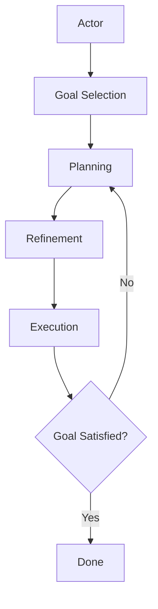

# GOAPIMPL-026: GOAP System Documentation

**Priority**: MEDIUM
**Estimated Effort**: 3-4 hours
**Dependencies**: All implementation tickets (GOAPIMPL-007 through GOAPIMPL-025)

## Description

Create comprehensive documentation for implemented GOAP system: architecture guide, implementation guide, troubleshooting guide, performance tuning guide, and API reference.

Complete documentation ensures the GOAP system is maintainable and extensible - helping developers understand, debug, and enhance the system.

## Acceptance Criteria

- [ ] Architecture guide explains system design and components
- [ ] Implementation guide covers all services and their responsibilities
- [ ] Troubleshooting guide addresses common issues with solutions
- [ ] Performance tuning guide optimizes planning and execution
- [ ] API reference documents all public interfaces
- [ ] Examples for common scenarios (tasks, goals, refinements)
- [ ] Migration guide from placeholder to real GOAP
- [ ] Documentation is clear, accurate, and complete

## Files to Create

### Main Documentation

- `docs/goap/architecture-guide.md` - System architecture overview
- `docs/goap/implementation-guide.md` - Detailed implementation documentation
- `docs/goap/troubleshooting-guide.md` - Common issues and solutions
- `docs/goap/performance-tuning-guide.md` - Performance optimization
- `docs/goap/api-reference.md` - Complete API documentation

## Files to Modify

### Update Existing Docs

- `docs/goap/IMPLEMENTATION-STATUS.md` - Mark all components as IMPLEMENTED
- `README.md` - Add GOAP system section with overview and links

## Documentation Structure

## 1. Architecture Guide

### Contents

- High-level system overview
- Component diagram
- Data flow diagrams
- Key design decisions and rationale
- Integration points with game systems

### Sections

```markdown
# GOAP System Architecture Guide

## Overview

Brief introduction to GOAP and its purpose

## System Components

- Context Assembly Service
- Parameter Resolution Service
- Refinement Engine
  - State Manager
  - Method Selector
  - Step Executors
- GOAP Planner
  - Planning Nodes
  - Effects Simulator
  - Heuristic Functions
  - A\* Algorithm
- GOAP Controller
- Knowledge System

## Data Flow

Actor → Goal Selection → Planning → Refinement → Execution

## Integration Points

- Turn System
- Action System
- Event Bus
- Entity Component System

## Design Decisions

- Why A\* for planning
- Why HTN-style refinement
- Why knowledge limitation
```

## 2. Implementation Guide

### Contents

- Service responsibilities
- Dependencies between services
- Configuration options
- Extension points for modders

### Sections

```markdown
# GOAP Implementation Guide

## Context Assembly Service

- Purpose: Build execution contexts
- Dependencies: EntityManager, ScopeDslEngine
- Configuration: None
- Extension: Custom context sources

## Parameter Resolution Service

- Purpose: Resolve parameter references
- Dependencies: ContextAssemblyService
- Configuration: None
- Extension: Custom resolution rules

[Continue for all services...]

## Adding New Tasks

Step-by-step guide

## Adding New Refinement Methods

Step-by-step guide

## Customizing Heuristics

How to add custom heuristics

## Extending Knowledge System

How to add custom knowledge rules
```

## 3. Troubleshooting Guide

### Contents

- Common error messages and fixes
- Debugging strategies
- Performance issues
- Integration problems

### Sections

```markdown
# GOAP Troubleshooting Guide

## Common Errors

### "No applicable method found"

**Symptom**: Task cannot be refined
**Causes**:

1. No refinement methods defined for task
2. Applicability conditions too strict
3. Actor missing required components

**Solutions**:

1. Check task.refinementMethods array
2. Review method applicability conditions
3. Verify actor has required capabilities

### "Planning failed: No solution found"

**Symptom**: Planner cannot find path to goal
**Causes**:

1. Goal is impossible given current state
2. Required entities not known to actor
3. Preconditions too strict

**Solutions**:

1. Verify goal is achievable
2. Check actor.known_to includes needed entities
3. Review task preconditions

[Continue for all common issues...]

## Debugging Strategies

- Enable GOAP debug logging
- Use GOAPDebugger tools
- Inspect plan state
- Trace refinement execution

## Performance Issues

- Planning taking too long
- Memory usage growing
- Search space explosion
```

## 4. Performance Tuning Guide

### Contents

- Performance metrics
- Optimization techniques
- Configuration tuning
- Profiling tools

### Sections

````markdown
# GOAP Performance Tuning Guide

## Performance Metrics

- Planning time target: < 50ms
- Refinement time target: < 10ms
- Memory usage: < 10MB per actor

## Optimization Techniques

### Task Library Construction

- Cache per-actor libraries
- Use structural gates effectively
- Minimize gate complexity

### Planning Optimization

- Choose appropriate heuristic (RPG vs goal-distance)
- Set search limits (maxNodes, maxTime)
- Optimize precondition evaluation
- Cache planning effects simulation

### Refinement Optimization

- Minimize refinement.localState size
- Cache method selection results
- Optimize condition evaluation

### Knowledge System Optimization

- Batch knowledge updates
- Cache known_to queries
- Limit knowledge propagation scope

## Configuration Tuning

```javascript
const goapConfig = {
  planner: {
    heuristic: 'rpg', // or 'goal-distance'
    maxNodes: 1000,
    maxTime: 5000,
    maxDepth: 20,
  },
  refinement: {
    maxConditionalDepth: 3,
  },
  knowledge: {
    visibilityRadius: 10, // or visibility algorithm
  },
};
```
````

## Profiling

- Use built-in GOAP profiler
- Profile with Chrome DevTools
- Analyze search space statistics

````

## 5. API Reference

### Contents
- All public classes and methods
- Parameter documentation
- Return value documentation
- Usage examples

### Sections
```markdown
# GOAP API Reference

## GOAPController

### decideTurn(actor, world)
Make decision for actor's turn using GOAP

**Parameters**:
- `actor` (Entity): Actor making decision
- `world` (WorldState): Current world state

**Returns**: `Action | null`
- Action to execute, or null if idle

**Example**:
```javascript
const action = await goapController.decideTurn(actor, worldState);
if (action) {
  await actionExecutor.execute(action);
}
````

[Continue for all public APIs...]

## Refinement Engine

### refine(task, actor, context)

[Full API documentation...]

## GOAP Planner

### plan(actor, goal, initialState)

[Full API documentation...]

[Continue for all services...]

````

## 6. Examples Documentation

### Contents
- Complete working examples
- Step-by-step walkthroughs
- Common patterns

### Examples to Include
```markdown
# GOAP Examples

## Example 1: Simple Hunger Goal
Complete walkthrough of actor satisfying hunger

## Example 2: Multi-Step Crafting
Building item requiring multiple resources

## Example 3: Dynamic Replanning
Adapting plan when world changes

## Example 4: Knowledge-Limited Exploration
Finding resources actor doesn't know about

## Example 5: Conditional Refinement
Method with branching logic

## Example 6: Custom Heuristic
Implementing domain-specific heuristic
````

## Reference Documentation

### Existing Docs to Reference

- `specs/goap-system-specs.md` - Original specification
- `docs/goap/refinement-*.md` - Refinement documentation
- `docs/goap/task-loading.md` - Task loading guide

## Implementation Notes

### Documentation Standards

- Use Markdown format
- Include code examples
- Add diagrams (using Mermaid or ASCII)
- Cross-reference related docs
- Keep examples up-to-date

### Code Examples

All code examples should:

- Be complete (runnable if possible)
- Include comments explaining key points
- Follow project code style
- Be tested for accuracy

### Diagrams

Consider adding:

- Architecture diagrams (component relationships)
- Sequence diagrams (GOAP cycle flow)
- State diagrams (planning search)
- Data flow diagrams (context assembly)

Use Mermaid syntax for maintainability:



### Version Information

Include in docs:

- GOAP system version
- Compatible game engine version
- Last updated date
- Author/maintainer

### Maintenance Plan

- Review docs quarterly
- Update after significant changes
- Add new examples as needed
- Incorporate user feedback

## Success Validation

✅ **Done when**:

- All documentation files created
- IMPLEMENTATION-STATUS.md updated (all components marked IMPLEMENTED)
- README.md updated with GOAP section
- Code examples are accurate and tested
- Documentation is clear and comprehensive
- All links work correctly
- Documentation reviewed by another developer
- Examples validated with real GOAP system
