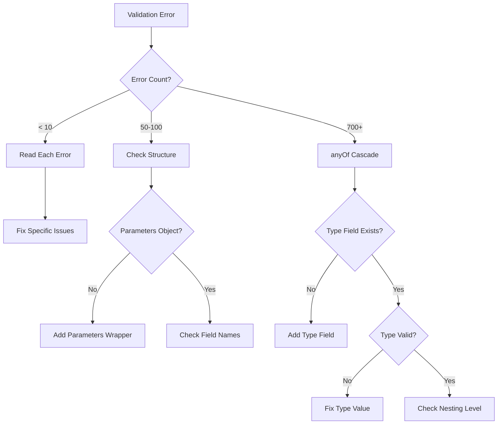

# AJVVALENH-010: Create Validation Best Practices Documentation

## Priority: 5 - Low

## Problem Statement
Developers working with the Living Narrative Engine need comprehensive documentation on validation best practices, common patterns, and troubleshooting techniques. Currently, this knowledge is scattered or undocumented, leading to repeated mistakes and inefficient debugging. A centralized best practices guide would help developers avoid common pitfalls and use the validation system effectively.

## Current State
- No centralized validation documentation
- Common mistakes are repeated by different developers
- Troubleshooting techniques are not documented
- No examples of correct vs incorrect patterns
- No guide for understanding validation errors

## Technical Requirements

### 1. Documentation Structure

Create comprehensive validation documentation:
```
docs/validation/
├── README.md                          # Overview and quick start
├── best-practices/
│   ├── operation-structure.md         # How to structure operations correctly
│   ├── common-patterns.md            # Frequently used patterns
│   ├── anti-patterns.md              # What to avoid
│   └── performance-tips.md           # Optimization strategies
├── troubleshooting/
│   ├── understanding-errors.md       # How to read validation errors
│   ├── anyof-cascade.md             # Dealing with anyOf cascades
│   ├── debugging-guide.md           # Step-by-step debugging
│   └── common-issues.md             # FAQ and solutions
├── reference/
│   ├── operation-types.md           # All 41 operation types
│   ├── error-types.md              # Types of validation errors
│   ├── tools.md                    # Available validation tools
│   └── schemas.md                  # Schema documentation
└── examples/
    ├── valid/                       # Examples of valid operations
    ├── invalid/                    # Examples with errors (and fixes)
    └── migrations/                  # Before/after examples
```

### 2. Main README

```markdown
# Validation Guide for Living Narrative Engine

## Quick Start

The Living Narrative Engine uses JSON Schema validation to ensure all operations and game data are correctly structured. This guide will help you understand and work with the validation system effectively.

### Table of Contents
1. [Understanding Validation](#understanding-validation)
2. [Common Issues and Solutions](#common-issues)
3. [Best Practices](#best-practices)
4. [Tools and Commands](#tools)
5. [Troubleshooting](#troubleshooting)

## Understanding Validation

### What Gets Validated?

Every operation in the Living Narrative Engine must conform to a specific schema:
- **Structure**: The operation has the correct shape and required fields
- **Types**: All values are the correct data type
- **Constraints**: Values meet specific requirements (e.g., enums, patterns)

### The anyOf Problem

The most common source of confusion is the "anyOf cascade" error. When you see 700+ errors for a simple operation, here's what's happening:

1. The validation system uses an `anyOf` array with 41 different operation schemas
2. When your operation doesn't match its intended schema, AJV tries ALL 41 schemas
3. Each failed attempt generates ~18 errors
4. Result: 41 × 18 = 700+ errors for a single structural issue

**Solution**: Look for the FIRST error or use the enhanced error formatter to see the real issue.

## Common Issues

### Issue 1: Properties at Wrong Nesting Level

❌ **Wrong:**
```json
{
  "type": "IF",
  "condition": { "==": [1, 1] },     // Should be inside parameters
  "then_actions": []                  // Should be inside parameters
}
```

✅ **Correct:**
```json
{
  "type": "IF",
  "parameters": {
    "condition": { "==": [1, 1] },
    "then_actions": []
  }
}
```

**Error Signs:**
- "additionalProperties not allowed"
- "parameters is required"
- 700+ cascading errors

### Issue 2: Missing Required Fields

❌ **Wrong:**
```json
{
  "type": "QUERY_COMPONENT",
  "parameters": {
    "query": { "path": "health" }
    // Missing required "componentId"
  }
}
```

✅ **Correct:**
```json
{
  "type": "QUERY_COMPONENT",
  "parameters": {
    "componentId": "core:health",
    "query": { "path": "health" }
  }
}
```

### Issue 3: Invalid Type Values

❌ **Wrong:**
```json
{
  "type": "If",  // Case matters! Should be "IF"
  "parameters": { ... }
}
```

✅ **Correct:**
```json
{
  "type": "IF",   // All caps for operation types
  "parameters": { ... }
}
```

## Best Practices

### 1. Always Include Type Field
Every operation MUST have a `type` field at the root level.

### 2. Use parameters Object
Most operations require their data to be inside a `parameters` object.

### 3. Check Schema Documentation
Before creating an operation, check its schema:
```bash
validate-operation schema IF --example
```

### 4. Validate Early and Often
Don't wait until runtime to discover validation errors:
```bash
validate-operation file my-rule.json --verbose
```

### 5. Use the CLI Tool
The validation CLI tool provides immediate feedback:
```bash
# Validate with helpful error messages
validate-operation file data/rules/my-rule.json

# Watch mode for development
validate-operation watch "data/**/*.rule.json"

# Fix common issues automatically
validate-operation file my-rule.json --fix
```

## Tools

### Command Line Tools

#### validate-operation
Main validation tool for development:
```bash
# Install globally
npm install -g @living-narrative/validate-operation

# Basic usage
validate-operation file <path>
validate-operation batch "**/*.rule.json"
validate-operation watch "data/mods/**/*.json"
```

#### validation-debugger
Interactive debugging for complex issues:
```bash
# Start debugger
validation-debugger

# Commands:
# load <file>     - Load a file for debugging
# validate <file> - Validate with detailed trace
# tree           - Show decision tree
# step           - Step through validation
```

### VS Code Integration

Install the Living Narrative Engine extension for:
- Real-time validation in editor
- IntelliSense for operation types
- Quick fixes for common issues

### Web Tools

Access the validation dashboard at:
```
http://localhost:3000/validation-dashboard
```

Features:
- Visual validation results
- Decision tree visualization
- Performance metrics
- Error pattern analysis

## Troubleshooting

### Reading Validation Errors

#### Step 1: Check Error Count
- **< 10 errors**: Likely a simple issue, read each error
- **50-100 errors**: Possibly multiple issues or wrong structure
- **700+ errors**: anyOf cascade - structural issue

#### Step 2: Find the Real Error
For anyOf cascades:
1. Look for your operation type in errors
2. Check if `parameters` object exists
3. Verify properties are at correct level

#### Step 3: Use Enhanced Error Messages
With enhanced formatter enabled:
```
Error: IF operation structure error
  Properties 'condition' and 'then_actions' found at operation level
  Fix: Move these properties inside a 'parameters' object
  Example: { type: 'IF', parameters: { condition: {...}, then_actions: [...] } }
```

### Common Error Messages Decoded

| Error Message | Likely Cause | Solution |
|--------------|--------------|----------|
| "additionalProperties not allowed" | Properties at wrong level | Check nesting structure |
| "should be object" | Wrong data type | Ensure value is an object/array as needed |
| "should match exactly one schema in anyOf" | Structural issue | Check operation structure |
| "required property 'parameters'" | Missing parameters object | Add parameters wrapper |
| "should be equal to one of the allowed values" | Invalid enum value | Check valid values in schema |

### Debugging Workflow

1. **Start with CLI validation**
   ```bash
   validate-operation file problem.json --verbose
   ```

2. **If unclear, use debugger**
   ```bash
   validation-debugger
   > load problem.json
   > validate
   > tree  # Shows validation decision tree
   ```

3. **Check against working example**
   ```bash
   validate-operation schema YOUR_TYPE --example
   ```

4. **Try auto-fix**
   ```bash
   validate-operation file problem.json --fix
   ```

5. **Still stuck? Check logs**
   - Validation metrics: `./validation-metrics/`
   - Debug logs: `./logs/validation-debug.log`

## Migration Guide

### From Old Structure to New

If migrating from an older version:

#### Old (pre-v2.0):
```json
{
  "operation": "IF",
  "data": {
    "condition": {},
    "actions": []
  }
}
```

#### New (v2.0+):
```json
{
  "type": "IF",
  "parameters": {
    "condition": {},
    "then_actions": []
  }
}
```

### Batch Migration

Use the migration script:
```bash
npm run migrate-operations -- --dir data/mods/old --output data/mods/new
```
```

### 3. Operation Structure Guide

```markdown
# Operation Structure Best Practices

## The Golden Rule

**Every operation follows this structure:**
```json
{
  "type": "OPERATION_TYPE",
  "parameters": {
    // Operation-specific parameters go here
  }
}
```

## Why Structure Matters

The validation system uses the `type` field to determine which schema to apply. If the structure is wrong, validation fails catastrophically with hundreds of errors.

## Correct Structures by Category

### Conditional Operations

#### IF Operation
```json
{
  "type": "IF",
  "parameters": {
    "condition": { /* JSON Logic */ },
    "then_actions": [ /* operations */ ],
    "else_actions": [ /* operations */ ]  // optional
  }
}
```

**Common Mistakes:**
- Putting `condition` at root level
- Using `actions` instead of `then_actions`
- Wrong JSON Logic format in condition

### Component Operations

#### QUERY_COMPONENT
```json
{
  "type": "QUERY_COMPONENT",
  "parameters": {
    "componentId": "modId:componentName",
    "query": {
      "path": "field.subfield",
      "default": null  // optional
    },
    "targetEntity": "entityId"  // optional
  }
}
```

**Common Mistakes:**
- Missing namespace in componentId (should be "mod:component")
- Invalid query path syntax
- Wrong targetEntity format

#### SET_COMPONENT
```json
{
  "type": "SET_COMPONENT",
  "parameters": {
    "componentId": "modId:componentName",
    "data": { /* component data */ },
    "targetEntity": "entityId",  // optional
    "merge": false  // optional, default false
  }
}
```

### Entity Operations

#### ADD_ENTITY
```json
{
  "type": "ADD_ENTITY",
  "parameters": {
    "entityId": "unique_id",
    "components": [
      {
        "componentId": "core:position",
        "data": { "x": 0, "y": 0 }
      }
    ],
    "tags": ["npc", "merchant"]  // optional
  }
}
```

### Variable Operations

#### SET_VARIABLE
```json
{
  "type": "SET_VARIABLE",
  "parameters": {
    "variableName": "playerHealth",
    "value": 100,
    "scope": "global"  // optional: "global" | "local"
  }
}
```

### Flow Control Operations

#### FOR_EACH
```json
{
  "type": "FOR_EACH",
  "parameters": {
    "items": { /* query or array */ },
    "itemVariable": "item",
    "indexVariable": "index",  // optional
    "actions": [ /* operations */ ]
  }
}
```

#### PARALLEL
```json
{
  "type": "PARALLEL",
  "parameters": {
    "operations": [ /* operations to run in parallel */ ],
    "waitForAll": true  // optional, default true
  }
}
```

## Nesting Operations

Operations can be nested within action arrays:

```json
{
  "type": "IF",
  "parameters": {
    "condition": { "==": [{ "var": "health" }, 0] },
    "then_actions": [
      {
        "type": "SET_COMPONENT",
        "parameters": {
          "componentId": "core:state",
          "data": { "alive": false }
        }
      },
      {
        "type": "TRIGGER_EVENT",
        "parameters": {
          "eventType": "PLAYER_DIED"
        }
      }
    ]
  }
}
```

## Tips for Success

1. **Start Simple**: Test with minimal required fields first
2. **Add Incrementally**: Add optional fields one at a time
3. **Validate Often**: Check validity after each change
4. **Use Templates**: Keep working examples as templates
5. **Check Types**: Ensure all values match expected types
```

### 4. Troubleshooting Guide

```markdown
# Troubleshooting Validation Errors

## Diagnostic Flowchart



## Error Patterns and Solutions

### Pattern 1: The anyOf Cascade

**Symptoms:**
- 700+ errors
- Errors mention all 41 operation types
- Message includes "should match exactly one schema in anyOf"

**Diagnosis Steps:**
1. Check if `type` field exists and is valid
2. Verify `parameters` object exists (if required)
3. Check property nesting levels

**Solution:**
```bash
# Use the pre-validator to catch structural issues
validate-operation file problem.json --pre-validate

# Or use the debugger to see validation tree
validation-debugger
> load problem.json
> tree
```

### Pattern 2: Silent Failures

**Symptoms:**
- Validation passes but operation doesn't work
- Runtime errors despite valid schema

**Common Causes:**
1. Valid structure but wrong semantics
2. Missing optional fields that are actually required by logic
3. Type coercion hiding issues

**Solution:**
```bash
# Use lint mode to catch semantic issues
validate-operation lint problem.json

# Test with actual runtime
npm run test:operation problem.json
```

### Pattern 3: Performance Issues

**Symptoms:**
- Validation takes >100ms
- Browser freezes during validation
- Memory usage spikes

**Diagnosis:**
```bash
# Profile validation performance
validate-operation file problem.json --profile

# Check operation complexity
validate-operation analyze problem.json --complexity
```

**Solutions:**
1. Simplify deeply nested operations
2. Break complex operations into smaller pieces
3. Enable discriminated union schemas (if available)

## Error Message Decoder

### Structural Errors

| Error | Meaning | Fix |
|-------|---------|-----|
| "additionalProperties not allowed" | Extra fields at wrong level | Move to correct location or remove |
| "required property 'parameters'" | Missing parameters wrapper | Add `parameters: {}` object |
| "required property 'type'" | Missing operation type | Add `type` field with valid operation |
| "should be object" | Wrong data type | Change to object `{}` |
| "should be array" | Wrong data type | Change to array `[]` |

### Type Errors

| Error | Meaning | Fix |
|-------|---------|-----|
| "should be string" | Value must be text | Wrap in quotes: `"value"` |
| "should be number" | Value must be numeric | Remove quotes: `42` not `"42"` |
| "should be boolean" | Value must be true/false | Use `true` or `false` without quotes |
| "should match pattern" | Text doesn't match regex | Check pattern requirements |

### Constraint Errors

| Error | Meaning | Fix |
|-------|---------|-----|
| "should be equal to one of" | Invalid enum value | Check allowed values in schema |
| "should NOT have fewer than" | Array too short | Add more items to array |
| "should NOT be longer than" | String/array too long | Reduce length |
| "should match format" | Invalid format (date, email, etc.) | Fix format |

## Advanced Debugging

### Using the Validation Debugger

1. **Start the debugger:**
   ```bash
   validation-debugger
   ```

2. **Load your file:**
   ```
   validator> load data/rules/problem.json
   ```

3. **Step through validation:**
   ```
   validator> step
   Breakpoint: anyOf validation
   Schema: operation.schema.json
   Testing against: IF.schema.json
   Result: FAIL - missing required property 'parameters'
   
   validator> continue
   ```

4. **View decision tree:**
   ```
   validator> tree
   ✗ anyOf (742.3ms) - operation.schema.json
     ✗ IF (2.1ms) - Missing parameters
     ✗ QUERY_COMPONENT (1.8ms) - Type mismatch
     ... 39 more
   ```

### Using Chrome DevTools

For browser-based validation issues:

1. **Enable validation logging:**
   ```javascript
   window.DEBUG_VALIDATION = true;
   ```

2. **Set breakpoints in validation code:**
   ```javascript
   // In console
   debug(validateOperation);
   ```

3. **Inspect validation state:**
   ```javascript
   // During breakpoint
   console.log(validator.errors);
   console.table(validator.errors.slice(0, 10));
   ```

### Memory Profiling

For performance issues:

```bash
# Generate heap snapshot
node --inspect scripts/validate-heavy-file.js
# Open chrome://inspect
# Take heap snapshot before/after validation

# Or use built-in profiler
validate-operation file large.json --memory-profile
```

## Getting Help

### Self-Help Resources

1. **Check examples:**
   ```bash
   ls data/examples/operations/
   validate-operation schema IF --example
   ```

2. **Search error database:**
   ```bash
   validate-operation search-errors "additionalProperties"
   ```

3. **Generate test case:**
   ```bash
   validate-operation generate-test problem.json
   ```

### Community Resources

- Discord: #validation-help channel
- GitHub Issues: Label with `validation`
- Stack Overflow: Tag with `living-narrative-engine`

### Reporting Bugs

When reporting validation issues, include:

1. **Minimal reproduction:**
   ```json
   {
     "description": "What you're trying to do",
     "operation": { /* your operation */ },
     "error": "Error message",
     "expected": "What should happen"
   }
   ```

2. **Environment info:**
   ```bash
   validate-operation --version
   node --version
   npm ls ajv
   ```

3. **Debug output:**
   ```bash
   validate-operation file problem.json --verbose --debug > debug.log
   ```
```

### 5. Examples Documentation

Create a comprehensive examples directory:

```javascript
// docs/validation/examples/generate-examples.js
const fs = require('fs');
const path = require('path');

// Generate valid examples for all 41 operation types
const operations = [
  'IF', 'QUERY_COMPONENT', 'SET_COMPONENT', // ... all 41
];

operations.forEach(type => {
  const validExample = generateValidExample(type);
  const invalidExamples = generateInvalidExamples(type);
  
  // Save valid example
  fs.writeFileSync(
    `valid/${type.toLowerCase()}.json`,
    JSON.stringify(validExample, null, 2)
  );
  
  // Save invalid examples with explanations
  invalidExamples.forEach((example, index) => {
    fs.writeFileSync(
      `invalid/${type.toLowerCase()}-error-${index + 1}.json`,
      JSON.stringify({
        description: example.description,
        operation: example.operation,
        error: example.expectedError,
        fix: example.fix
      }, null, 2)
    );
  });
});
```

### 6. Interactive Documentation

Create an interactive web-based documentation:

```html
<!-- docs/validation/interactive/index.html -->
<!DOCTYPE html>
<html>
<head>
  <title>Validation Interactive Guide</title>
  <style>
    .validator-container {
      display: grid;
      grid-template-columns: 1fr 1fr;
      gap: 20px;
    }
    
    .error {
      background: #fee;
      border-left: 3px solid red;
      padding: 10px;
    }
    
    .success {
      background: #efe;
      border-left: 3px solid green;
      padding: 10px;
    }
  </style>
</head>
<body>
  <h1>Interactive Validation Guide</h1>
  
  <div class="validator-container">
    <div>
      <h2>Try It Yourself</h2>
      <select id="operation-type">
        <option value="IF">IF</option>
        <option value="QUERY_COMPONENT">QUERY_COMPONENT</option>
        <!-- All 41 types -->
      </select>
      
      <textarea id="operation-input" rows="20" cols="50"></textarea>
      <button onclick="validateOperation()">Validate</button>
    </div>
    
    <div>
      <h2>Results</h2>
      <div id="results"></div>
      
      <h3>Explanation</h3>
      <div id="explanation"></div>
      
      <h3>Suggested Fix</h3>
      <div id="fix"></div>
    </div>
  </div>
  
  <script src="validator.js"></script>
</body>
</html>
```

## Success Criteria

### Documentation Completeness
- [ ] All 41 operation types documented
- [ ] All common errors have solutions
- [ ] All tools have usage examples
- [ ] Troubleshooting covers 90% of issues

### Documentation Quality
- [ ] Clear and concise writing
- [ ] Accurate technical information
- [ ] Helpful examples and diagrams
- [ ] Easy navigation and search

### Documentation Maintenance
- [ ] Version controlled in repository
- [ ] Auto-generated from schemas where possible
- [ ] Regular updates with new patterns
- [ ] Community contributions enabled

## Dependencies
- Schema documentation must be up-to-date
- Examples must be validated
- Tools must be documented
- Integration with main documentation

## Estimated Complexity
- **Effort**: 8-10 hours
- **Risk**: Low (documentation only)
- **Maintenance**: Ongoing

## Implementation Notes

### Documentation Standards
1. Use clear, simple language
2. Provide examples for everything
3. Include both correct and incorrect patterns
4. Explain WHY, not just HOW
5. Keep examples minimal but complete

### Auto-Generation Strategy
Some documentation can be auto-generated:
```javascript
// scripts/generate-docs.js
const schemas = loadAllSchemas();
const operations = extractOperations(schemas);

operations.forEach(op => {
  generateOperationDoc(op);
  generateExamples(op);
  generateTests(op);
});
```

### Version Management
- Tag documentation with version numbers
- Maintain compatibility notes
- Document breaking changes
- Provide migration guides

## Definition of Done
- [ ] Main documentation structure created
- [ ] All sections written and reviewed
- [ ] Examples for all operation types
- [ ] Interactive guide functional
- [ ] Documentation indexed and searchable
- [ ] Integrated with main project docs
- [ ] Community feedback incorporated
- [ ] Maintenance process established

## Related Tickets
- All AJVVALENH tickets contribute to documentation needs
- Especially AJVVALENH-007 (Debugger) and AJVVALENH-008 (CLI Tool)

## Notes
This documentation will be the primary resource for developers working with the validation system. It should be comprehensive yet accessible, technical yet understandable. The goal is to make validation issues rare and, when they occur, easily solvable. The documentation should evolve based on real user issues and feedback.