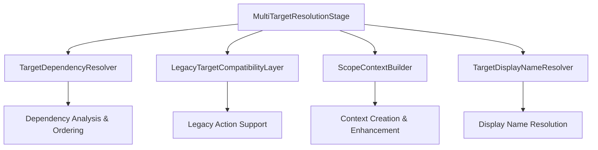

# Ticket 12: Documentation & Migration Completion

**Epic**: MultiTargetResolutionStage Decomposition  
**Phase**: 4 - Validation & Deployment  
**Priority**: Low  
**Estimated Time**: 4 hours  
**Dependencies**: Ticket 11 (Performance & Regression Testing)  
**Assignee**: Technical Writer / Senior Developer

## 📋 Summary

Complete the MultiTargetResolutionStage decomposition by updating all documentation, creating migration guides, performing final cleanup, and preparing for production deployment. This ticket ensures the project is fully documented and ready for team adoption.

## 🎯 Objectives

- Update all architectural documentation for the new service-oriented design
- Create comprehensive migration guide for developers
- Update JSDoc and inline documentation
- Cleanup temporary files and dead code
- Prepare deployment checklist and rollback procedures

## 📝 Requirements Analysis

From the specification:

> "Update JSDoc comments, Remove dead code, Update architecture documentation, Create migration guide"

Final deliverables include:

- Updated system architecture documentation
- Developer migration guide with examples
- API documentation for all services
- Deployment and rollback procedures

## 🏗️ Implementation Tasks

### Task 12.1: Architecture Documentation Update (1.5 hours)

**Objective**: Update all architectural documentation for the new design

**Files to Update**:

- `docs/architecture/action-pipeline-architecture.md`
- `docs/architecture/service-oriented-design.md` (new)
- `README.md` - Update MultiTargetResolutionStage section

**Documentation Updates**:

- [ ] **System Architecture**: Update diagrams showing service decomposition
- [ ] **Service Interfaces**: Document all 4 services with their responsibilities
- [ ] **Dependency Graph**: Show service dependencies and DI configuration
- [ ] **Data Flow**: Illustrate how data flows through the services
- [ ] **Error Handling**: Document error propagation patterns

**Implementation Details**:

Create `docs/architecture/multi-target-resolution-services.md`:

````markdown
# Multi-Target Resolution Services Architecture

## Overview

The MultiTargetResolutionStage has been decomposed into 4 specialized services:

### Service Architecture


````

### TargetDependencyResolver

- **Responsibility**: Analyze target dependencies and determine resolution order
- **Key Methods**: `getResolutionOrder()`, `validateDependencies()`
- **Dependencies**: Logger
- **Performance**: O(n²) for n targets, <10ms for typical cases

### LegacyTargetCompatibilityLayer

- **Responsibility**: Handle legacy single-target actions
- **Key Methods**: `isLegacyAction()`, `resolveLegacyTarget()`, `convertToMultiTargetFormat()`
- **Dependencies**: TargetResolutionService, EntityManager, Logger
- **Compatibility**: 100% backward compatible with existing legacy actions

### ScopeContextBuilder

- **Responsibility**: Build scope evaluation contexts
- **Key Methods**: `buildScopeContext()`, `buildContextForSpecificPrimary()`
- **Dependencies**: TargetContextBuilder, EntityManager, Logger
- **Integration**: Works with existing TargetContextBuilder

### TargetDisplayNameResolver

- **Responsibility**: Resolve entity display names
- **Key Methods**: `getEntityDisplayName()`, `getEntityDisplayNames()`
- **Dependencies**: EntityManager, Logger
- **Features**: Batch processing, configurable fallbacks

````

### Task 12.2: Migration Guide Creation (1.5 hours)

**Objective**: Create comprehensive migration guide for developers

**File to Create**: `docs/migration/multi-target-resolution-migration-guide.md`

**Migration Guide Contents**:
- [ ] **Overview**: What changed and why
- [ ] **Breaking Changes**: Any API changes (should be none)
- [ ] **Service Usage**: How to use the new services directly
- [ ] **Testing**: How to test code that uses the services
- [ ] **Troubleshooting**: Common issues and solutions
- [ ] **Rollback Procedure**: How to rollback if needed

**Implementation Details**:

```markdown
# MultiTargetResolutionStage Migration Guide

## Overview

The MultiTargetResolutionStage has been refactored from a 734-line monolith into 4 specialized services. This change is **100% backward compatible** - no existing code needs to be modified.

## What Changed

### Before (Monolithic)
```javascript
class MultiTargetResolutionStage {
  // 734 lines of mixed responsibilities
  #getResolutionOrder() { /* 37 lines */ }
  #resolveLegacyTarget() { /* 70 lines */ }
  #buildScopeContext() { /* 18 lines */ }
  #getEntityDisplayName() { /* 17 lines */ }
  // ... many other methods
}
````

### After (Service-Oriented)

```javascript
class MultiTargetResolutionStage {
  // ~150 lines of orchestration
  constructor({
    targetDependencyResolver,
    legacyTargetCompatibilityLayer,
    scopeContextBuilder,
    targetDisplayNameResolver,
    // ...
  }) {
    // Service delegation
  }
}
```

## Using Services Directly

If you need to use the services directly in your code:

```javascript
// Get services from DI container
const dependencyResolver = container.resolve(tokens.ITargetDependencyResolver);
const legacyLayer = container.resolve(tokens.ILegacyTargetCompatibilityLayer);

// Use services
const order = dependencyResolver.getResolutionOrder(targetDefinitions);
const isLegacy = legacyLayer.isLegacyAction(actionDef);
```

## Testing with New Services

### Unit Testing Services

```javascript
import { TargetDependencyResolver } from './services/implementations/TargetDependencyResolver.js';

describe('My Component', () => {
  let mockDependencyResolver;

  beforeEach(() => {
    mockDependencyResolver = {
      getResolutionOrder: jest.fn().mockReturnValue(['primary', 'secondary']),
    };
  });
});
```

### Integration Testing

```javascript
// Services are automatically injected - no changes needed
const result = await multiTargetStage.executeInternal(context);
expect(result.success).toBe(true);
```

## Troubleshooting

### Issue: "Service not registered" error

**Solution**: Ensure all services are registered in DI container.

### Issue: Different behavior from original

**Solution**: This should not happen. Please file a bug report with specific test case.

## Rollback Procedure

If issues are discovered:

1. **Immediate Rollback**:

   ```bash
   git revert <decomposition-commit-hash>
   ```

2. **Verify Rollback**:

   ```bash
   npm test
   npm run test:e2e
   ```

3. **Report Issues**: Create detailed bug report with reproduction steps

````

### Task 12.3: API Documentation Update (1 hour)

**Objective**: Update all JSDoc and API documentation

**Files to Update**:
- All service implementation files
- Interface definition files
- Container configuration files

**Documentation Standards**:
- [ ] Complete JSDoc for all public methods
- [ ] Parameter and return type documentation
- [ ] Usage examples in complex methods
- [ ] Error conditions documented
- [ ] Performance characteristics noted

**Example Enhancement**:

```javascript
/**
 * Analyze target definitions and return resolution order
 *
 * Uses topological sorting to determine the correct order for resolving targets
 * based on their contextFrom dependencies. Detects circular dependencies and
 * provides detailed error information for debugging.
 *
 * @example
 * ```javascript
 * const targetDefs = {
 *   primary: { scope: 'actor.partners', placeholder: 'target' },
 *   secondary: { scope: 'primary.items', contextFrom: 'primary', placeholder: 'item' }
 * };
 *
 * const order = resolver.getResolutionOrder(targetDefs);
 * // Returns: ['primary', 'secondary']
 * ```
 *
 * @param {Object.<string, TargetDefinition>} targetDefinitions - Map of target key to definition
 * @returns {string[]} Dependency-ordered target keys
 * @throws {ServiceError} If circular dependencies detected or invalid definitions
 *
 * @performance O(n²) worst case, typically O(n) for most dependency graphs
 * @since 1.0.0 - Extracted from MultiTargetResolutionStage
 */
getResolutionOrder(targetDefinitions) {
  // Implementation...
}
````

### Task 12.4: Final Cleanup and Deployment Preparation (0.5 hours)

**Objective**: Clean up temporary files and prepare for deployment

**Cleanup Tasks**:

- [ ] Remove any temporary test files or debugging code
- [ ] Verify all placeholder implementations are replaced
- [ ] Update package.json if needed
- [ ] Create deployment checklist
- [ ] Verify all tests pass

**Deployment Checklist**:

```markdown
# MultiTargetResolutionStage Decomposition - Deployment Checklist

## Pre-Deployment

- [ ] All 12 tickets completed
- [ ] Full test suite passes (unit + integration + e2e)
- [ ] Performance benchmarks within acceptable range
- [ ] Code review approved by senior developers
- [ ] Documentation updated and reviewed

## Deployment

- [ ] Create feature branch: `feature/decompose-multi-target-resolution-stage`
- [ ] All commits follow conventional commit format
- [ ] PR created with comprehensive description
- [ ] CI/CD pipeline passes all checks
- [ ] QA approval obtained

## Post-Deployment

- [ ] Monitor performance metrics for 48 hours
- [ ] Verify no error rate increase
- [ ] Confirm memory usage stable
- [ ] Team notified of changes
- [ ] Migration guide distributed

## Rollback Plan

If issues discovered:

1. Immediate: Revert PR merge
2. Emergency: Rollback deployment
3. Investigation: Analyze logs and metrics
4. Resolution: Fix issues in new PR
```

## 📊 Success Criteria

### Documentation Quality:

- [ ] Architecture documentation fully updated
- [ ] Migration guide comprehensive and accurate
- [ ] API documentation complete with examples
- [ ] All JSDoc comments updated and accurate

### Project Completion:

- [ ] All temporary files cleaned up
- [ ] All placeholder code replaced
- [ ] Deployment checklist created and validated
- [ ] Team ready for migration

### Knowledge Transfer:

- [ ] Migration guide provides clear instructions
- [ ] Troubleshooting section covers common issues
- [ ] Examples are practical and helpful
- [ ] Rollback procedures are clear

## 📋 Definition of Done

- [ ] All architectural documentation updated
- [ ] Comprehensive migration guide created
- [ ] API documentation complete with examples
- [ ] JSDoc comments updated for all services
- [ ] Final cleanup completed
- [ ] Deployment checklist created
- [ ] All documentation reviewed and approved
- [ ] Team ready for production deployment

---

**Created**: 2025-01-08  
**Status**: Ready for Implementation

## 🎯 Epic Summary

This completes all 12 tickets for the MultiTargetResolutionStage decomposition:

**Phase 1 - Foundation**: Tickets 01-04
**Phase 2 - Context & Display Services**: Tickets 05-08  
**Phase 3 - Main Stage Refactoring**: Tickets 09-10
**Phase 4 - Validation & Deployment**: Tickets 11-12

The decomposition transforms a 734-line monolith into 4 specialized services with clear separation of concerns, achieving the ~70% complexity reduction target while maintaining 100% backward compatibility.
